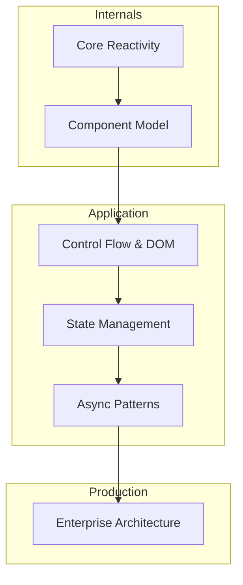

# Lộ Trình Học Tập SolidJS: Từ Cơ Bản Đến Chuyên Sâu (Enterprise-Ready)

Chào mừng bạn đến với series học tập SolidJS chuyên sâu. Series này được thiết kế theo cách tiếp cận khoa học, tập trung vào việc hiểu rõ bản chất (internals) của framework thay vì chỉ học cách sử dụng API.

## Mục Tiêu Khóa Học
- Hiểu rõ cơ chế **Fine-grained Reactivity** (Phản ứng chi tiết).
- Nắm vững sự khác biệt giữa SolidJS và Virtual DOM (React).
- Xây dựng kiến trúc ứng dụng có khả năng mở rộng (Scalable Architecture).
- Tối ưu hiệu suất ở mức tối đa cho các dự án thực tế.

## Danh Sách Các Bài Học

### 1. [Reactivity Internals](01-Reactivity-Internals.md)
- Khám phá Signal, Memo, Effect.
- Đồ thị phụ thuộc (Dependency Graph) và cơ chế Synchronous Scheduling.
- Tại sao Solid không cần Virtual DOM?

### 2. [Components và Props](02-Components-and-Props.md)
- Giải mã tại sao Component chỉ chạy một lần duy nhất (Only run once).
- Cách thức hoạt động của Proxy trong Props.
- Các lỗi thường gặp khi destructing props.

### 3. [Control Flow](03-Control-Flow.md)
- Tại sao không nên dùng `.map()`?
- Chi tiết về `<For>`, `<Show>`, `<Index>`, `<Switch>`.
- Cơ chế tối ưu hóa việc tái sử dụng DOM.

### 4. [Store Management](04-Store-Management.md)
- Quản lý State lồng nhau sâu với `createStore`.
- So sánh Store vs Signals.
- Các mô hình quản lý state cho ứng dụng lớn.

### 5. [Async và Suspense](05-Async-and-Suspense.md)
- Làm việc với dữ liệu không đồng bộ qua `createResource`.
- Cơ chế `Suspense` và `Transition`.
- Error Boundary và quản lý lỗi trong luồng async.

### 6. [Enterprise Architecture](06-Enterprise-Architecture.md)
- Tổ chức thư mục theo Module.
- Tối ưu hóa Context API để tránh re-render không cần thiết.
- Chiến lược Code Splitting và Lazy Loading.

## Sơ Đồ Tổng Quan

---
*Series này được thực hiện với mục tiêu cung cấp kiến thức nền tảng vững chắc cho các kỹ sư muốn làm chủ SolidJS trong môi trường doanh nghiệp.*
