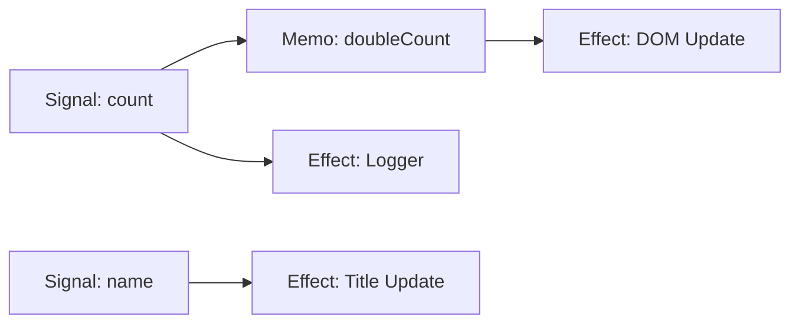

# Bài 1: Nội Tại Của Hệ Thống Phản Ứng (Reactivity Internals)

SolidJS không sử dụng Virtual DOM. Thay vào đó, nó dựa trên một hệ thống **Fine-grained Reactivity** (Hệ thống phản ứng chi tiết) để cập nhật trực tiếp các node DOM.

## 1. Ba Trụ Cột Chính

### A. Signal (Nguồn dữ liệu)
`createSignal` trả về một cặp getter và setter. Getter không chỉ đơn thuần trả về giá trị, mà còn thực hiện một nhiệm vụ quan trọng: **Dependency Tracking** (Theo dõi phụ thuộc).

```javascript
const [count, setCount] = createSignal(0);
```

### B. Effect (Người tiêu thụ)
`createEffect` tự động đăng ký mình là "người đăng ký" (subscriber) của bất kỳ Signal nào được gọi bên trong thân hàm của nó.

```javascript
createEffect(() => {
  console.log("Count hiện tại là:", count());
});
```

### C. Memo (Dữ liệu phái sinh)
`createMemo` là sự kết hợp giữa Signal và Effect. Nó quan sát các Signal khác và chỉ tính toán lại khi cần thiết, đồng thời thông báo cho các "người tiêu thụ" của chính nó.

## 2. Đồ Thị Phụ Thuộc (The Dependency Graph)

Hệ thống reactivity của Solid hoạt động như một đồ thị có hướng (Directed Acyclic Graph - DAG). Khi một Signal thay đổi, nó sẽ "đẩy" (push) sự thay đổi đó qua các node phụ thuộc.



## 3. Cơ Chế Hoạt Động Chi Tiết (Under the Hood)

1. **Context Stack**: Solid duy trì một stack toàn cục của các "listeners" hiện tại. Khi một Effect chạy, nó tự đẩy mình vào stack này.
2. **Getter Execution**: Khi `count()` được gọi, nó kiểm tra listener ở đỉnh stack. Nếu có, nó sẽ thêm listener đó vào danh sách `subscribers` của nó.
3. **Setter Execution**: Khi `setCount(1)` được gọi, Signal sẽ duyệt qua danh sách `subscribers` và kích hoạt chúng.

### Tại sao nó lại "Fine-grained"?
Khác với React (nơi toàn bộ component re-render), Solid chỉ kích hoạt đúng hàm nhỏ nhất đang bao quanh cái Signal đó. Nếu bạn chỉ dùng Signal trong một thuộc tính `class`, chỉ đúng thuộc tính đó được cập nhật.

## 4. Ví Dụ Thực Tế Chuyên Sâu

Hãy xem xét cách Solid biên dịch mã JSX:

```javascript
// Trước khi biên dịch
<span>{count()}</span>

// Sau khi biên dịch (Đơn giản hóa)
const span = document.createElement("span");
createRenderEffect(() => span.textContent = count());
```

Bạn có thể thấy, cái "Effect" được gắn chặt vào đúng node DOM. Không có sự so sánh (diffing) nào ở đây cả.

## 5. Quy Tắc Vàng (The Golden Rule)
> **Đừng bao giờ truy cập Signal bên ngoài một "Tracking Scope" (Effect, Memo, hoặc JSX) nếu bạn muốn nó có tính phản ứng.**

Nếu bạn gọi `count()` ở cấp độ top-level của component mà không bọc trong effect, bạn chỉ nhận được giá trị tĩnh tại thời điểm đó.
