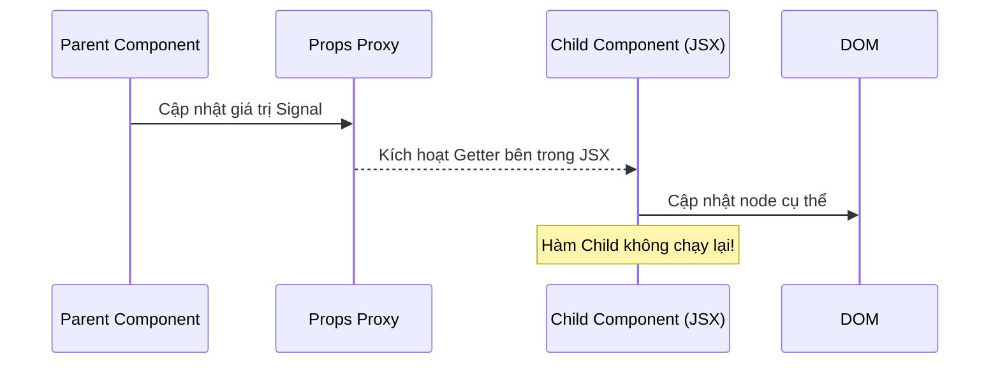

# Bài 2: Components và Props - Bí Mật Của Sự Hiệu Quả

Sự khác biệt lớn nhất giữa SolidJS và React nằm ở vòng đời của Component. Trong Solid, một Component thực chất chỉ là một hàm thiết lập (setup function).

## 1. Thành Phần Chỉ Chạy Một Lần (Only Runs Once)

Trong React, hàm component chạy lại mỗi khi state thay đổi. Trong SolidJS, hàm component **chỉ chạy một lần duy nhất** khi nó được khởi tạo.

### Sự khác biệt về tư duy:
- **React**: Component là một hàm render (được gọi liên tục).
- **SolidJS**: Component là một hàm xây dựng đồ thị reactivity (chỉ gọi để kết nối các dây tín hiệu).

```javascript
function MyComponent() {
  console.log("Dòng này chỉ in ra một lần!");
  
  const [count, setCount] = createSignal(0);
  
  return <button onClick={() => setCount(c => c + 1)}>{count()}</button>;
}
```

## 2. Props và Cơ Chế Proxy

Vì component chỉ chạy một lần, làm thế nào để component con nhận được dữ liệu mới khi cha thay đổi? Câu trả lời là: **Props là một đối tượng Proxy**.

Khi bạn truy cập `props.something`, thực chất bạn đang gọi một getter trên Proxy. Điều này cho phép Solid theo dõi sự phụ thuộc ngay cả khi dữ liệu đi qua nhiều tầng component.

### Cảnh báo quan trọng: Đừng Destructure Props!

Nếu bạn làm thế này trong Solid:
```javascript
// SAI - Làm mất tính phản ứng
function Child({ name }) {
  return <div>{name}</div>;
}
```
Tại sao sai? Bởi vì khi bạn viết `{ name } = props`, bạn đã lấy giá trị tại thời điểm đó và gán nó vào một biến cục bộ. Biến này không có cơ chế theo dõi sự thay đổi.

**Cách đúng:**
```javascript
// ĐÚNG
function Child(props) {
  return <div>{props.name}</div>;
}
```

## 3. Quản lý Props với `splitProps` và `mergeProps`

Trong môi trường Enterprise, việc quản lý props phức tạp là điều không tránh khỏi. Solid cung cấp các utility để xử lý mà không làm mất tính phản ứng.

- **`mergeProps`**: Kết hợp nhiều đối tượng props (bao gồm cả mặc định) một cách reactive.
- **`splitProps`**: Tách props thành các nhóm khác nhau mà vẫn giữ nguyên các Proxy getters.

```javascript
function Button(props) {
  const merged = mergeProps({ type: "button" }, props);
  const [local, others] = splitProps(merged, ["children", "class"]);
  
  return <button class={local.class} {...others}>{local.children}</button>;
}
```

## 4. Sơ Đồ Luồng Dữ Liệu Props



## 5. Kết Luận
Việc hiểu rằng component chỉ chạy một lần giúp bạn tránh được rất nhiều lỗi logic. Bạn có thể thoải mái sử dụng `setInterval` hoặc các side-effect trực tiếp trong thân hàm component (setup) mà không sợ chúng bị khởi tạo lại vô tận như trong React (nếu không dùng `useEffect`).
