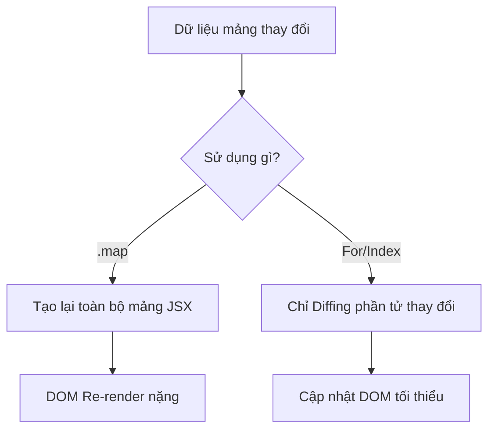

# Bài 3: Control Flow - Tối Ưu Hóa Render Danh Sách

Trong SolidJS, việc điều khiển luồng hiển thị (vòng lặp, điều kiện) không đơn giản là dùng các câu lệnh JavaScript thuần túy nếu bạn muốn đạt hiệu suất tối đa.

## 1. Tại sao không nên dùng `.map()`?

Trong React, bạn thường dùng `list.map(item => <Component />)`. Trong Solid, điều này vẫn hoạt động nhưng **kém hiệu quả**.

**Vấn đề:** Khi `list` thay đổi, toàn bộ mảng sẽ được tính toán lại và các component bên trong có thể bị khởi tạo lại không cần thiết. Solid cần một cách để biết chính xác phần tử nào được thêm, xóa hoặc di chuyển mà không phải chạy lại toàn bộ vòng lặp.

## 2. Component `<For>`

`<For>` là giải pháp tiêu chuẩn cho danh sách có các phần tử có thể thay đổi vị trí hoặc ID.

```javascript
<For each={users()}>
  {(user, i) => (
    <div>{i()}. {user.name}</div>
  )}
</For>
```

### Đặc điểm kỹ thuật:
- **Referential Integrity**: Nếu chỉ một phần tử trong mảng thay đổi, Solid chỉ cập nhật đúng node DOM tương ứng.
- **Index là một Signal**: Chú ý rằng `i` trong `(user, i)` là một hàm `i()`. Điều này giúp Solid cập nhật số thứ tự mà không cần re-render chính cái `user` đó khi danh sách bị sắp xếp lại.

## 3. Component `<Index>`

Dùng `<Index>` khi bạn làm việc với mảng các kiểu dữ liệu nguyên thủy (string, number) hoặc khi vị trí (index) quan trọng hơn danh tính của phần tử.

```javascript
<Index each={colors()}>
  {(color, i) => <li>{i}. {color()}</li>}
</Index>
```
*Lưu ý: Trong `<Index>`, `color` là một Signal, còn `i` là một số tĩnh.*

## 4. Component `<Show>` và `<Switch>`

Thay vì dùng toán tử tam phân `condition ? A : B`, Solid khuyến khích dùng `<Show>`.

```javascript
<Show when={loggedIn()} fallback={<button>Login</button>}>
  <UserProfile />
</Show>
```

**Tại sao?** Vì `<Show>` được tối ưu để chỉ render `fallback` hoặc `children` một lần duy nhất và ghi nhớ (memoize) kết quả đó cho đến khi điều kiện thay đổi hoàn toàn.

## 5. So sánh Hiệu năng



## 6. Mẹo cho Chuyên Gia (Enterprise Tip)

Khi xử lý danh sách cực lớn trong ứng dụng doanh nghiệp:
1. Luôn ưu tiên `<For>` nếu dữ liệu có ID duy nhất.
2. Tránh thực hiện các tính toán phức tạp ngay trong hàm callback của `<For>`. Hãy bọc chúng trong `createMemo` ở cấp component con.
3. Sử dụng `keyed` rendering một cách tự nhiên thông qua cơ chế của `<For>`.

---
**Ghi chú**: SolidJS Control Flow không phải là "cú pháp thay thế", nó là một công cụ tối ưu hóa hiệu suất bắt buộc phải nắm vững.
