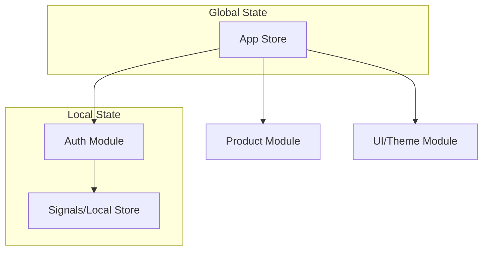

# Bài 4: Store Management - Quản Lý State Phức Tạp

Khi ứng dụng phát triển, việc sử dụng quá nhiều `createSignal` riêng lẻ sẽ khiến code trở nên khó quản lý. SolidJS cung cấp `createStore` để xử lý các đối tượng state lồng nhau một cách hiệu quả.

## 1. Tại sao cần Store?

Signal rất tốt cho các giá trị đơn giản (primitive) hoặc mảng/đối tượng mà bạn muốn thay thế hoàn toàn. Tuy nhiên, nếu bạn chỉ muốn cập nhật một thuộc tính sâu bên trong một đối tượng lớn, Signal sẽ buộc bạn phải clone lại toàn bộ đối tượng đó (immutability).

**Store** cho phép cập nhật **mutable-style** nhưng vẫn đảm bảo tính phản ứng **fine-grained**.

## 2. Cách hoạt động của `createStore`

`createStore` tạo ra một Proxy sâu. Khi bạn cập nhật một thuộc tính, chỉ các Effect đang lắng nghe thuộc tính cụ thể đó mới bị kích hoạt.

```javascript
const [state, setState] = createStore({
  user: { name: "An", age: 25 },
  settings: { theme: "dark" }
});

// Chỉ cập nhật theme, không ảnh hưởng đến user
setState("settings", "theme", "light");
```

## 3. Cú pháp Path Syntax (Cực kỳ mạnh mẽ)

Solid Store hỗ trợ cú pháp đường dẫn để cập nhật hàng loạt hoặc cập nhật có điều kiện:

```javascript
// Cập nhật tất cả user có tuổi > 20
setState("users", user => user.age > 20, "active", true);
```

## 4. So sánh Signal vs Store

| Đặc điểm | Signal | Store |
| :--- | :--- | :--- |
| **Cấu trúc** | Phẳng (Flat) | Lồng nhau (Nested) |
| **Cập nhật** | Thay thế toàn bộ | Cập nhật từng phần (Fine-grained) |
| **Hiệu suất** | Tốt cho giá trị đơn | Tốt cho Object/Array lớn |
| **Truy cập** | `value()` (Hàm) | `state.prop` (Property) |

## 5. Kiến trúc State trong Ứng dụng Lớn

Trong môi trường Enterprise, chúng ta thường kết hợp Store với mô hình **Context API** để tạo ra các "Global Stores".



## 6. Best Practices

1. **Không lạm dụng Store cho state đơn giản**: Nếu chỉ là một biến boolean `isOpen`, hãy dùng Signal.
2. **Read-only State**: Khi truyền Store xuống component con, nếu con không cần sửa, hãy truyền dưới dạng read-only để tránh side-effect khó kiểm soát.
3. **Reconcile**: Khi nhận dữ liệu mới từ API và muốn cập nhật Store mà không làm mất các tham chiếu cũ, hãy dùng `reconcile`.

```javascript
import { reconcile } from "solid-js/store";

// Cập nhật dữ liệu từ API mà không làm re-render những phần không thay đổi
setState("data", reconcile(apiResponse));
```

## 7. Kết luận
Store là vũ khí tối thượng của SolidJS để đối đầu với các bài toán quản lý state phức tạp trong doanh nghiệp. Nó mang lại sự tiện lợi của "Mutation" nhưng vẫn giữ được sức mạnh của "Reactivity".
