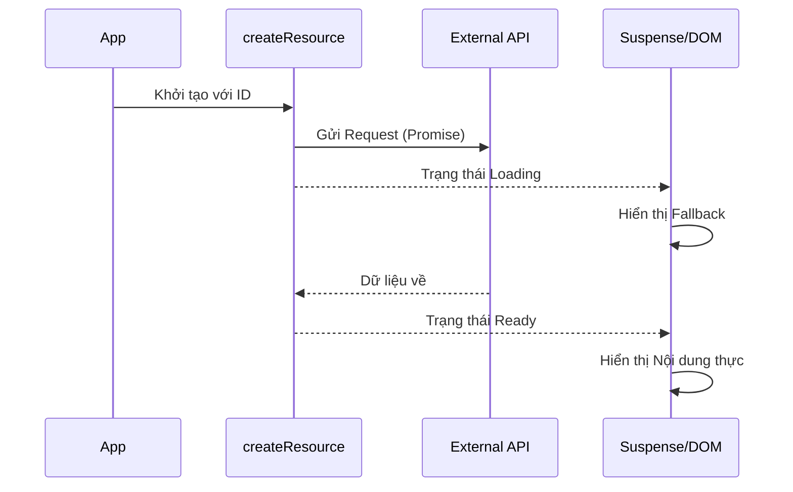

# Bài 5: Async và Suspense - Xử Lý Dữ Liệu Bất Đồng Bộ

Xử lý async là một trong những thách thức lớn của Frontend. SolidJS cung cấp các công cụ mạnh mẽ để biến các luồng dữ liệu async thành các tín hiệu (signals) mượt mà.

## 1. `createResource`

Đây là công cụ chính để fetch dữ liệu. Nó nhận vào một hàm fetcher (trả về Promise) và trả về một Signal đặc biệt có thêm các trạng thái `.loading` và `.error`.

```javascript
const [user] = createResource(userId, fetchUser);

return (
  <span>{user.loading ? "Loading..." : user().name}</span>
);
```

### Tại sao nên dùng `createResource` thay vì `createSignal` + `useEffect`?
- Tự động hủy các request cũ nếu source thay đổi.
- Tích hợp sẵn với `Suspense`.
- Hỗ trợ SSR (Server Side Rendering) tốt hơn.

## 2. Cơ chế `Suspense`

`Suspense` cho phép bạn trì hoãn việc hiển thị một phần của cây component cho đến khi dữ liệu được tải xong.

```javascript
<Suspense fallback={<p>Đang tải dữ liệu...</p>}>
  <UserProfile id={currentId()} />
</Suspense>
```

### Cách hoạt động (Internals):
Khi một `createResource` bên trong `Suspense` đang ở trạng thái loading, nó sẽ "ném" (throw) một lời hứa (Promise) lên trên. `Suspense` bắt lấy Promise này và hiển thị `fallback`. Khi Promise hoàn thành, nó sẽ render lại nội dung chính.

## 3. `ErrorBoundary`

Trong môi trường thực tế, API có thể chết bất cứ lúc nào. `ErrorBoundary` giúp ứng dụng của bạn không bị trắng trang (white screen of death).

```javascript
<ErrorBoundary fallback={(err) => <ErrorMessage error={err} />}>
  <MyAsyncComponent />
</ErrorBoundary>
```

## 4. Mô hình Fetch-then-Render

SolidJS khuyến khích mô hình nơi việc tải dữ liệu bắt đầu càng sớm càng tốt, thường là ngay khi route bắt đầu được kích hoạt.



## 5. Transition API

Khi bạn chuyển đổi giữa các tab, bạn có thể không muốn hiện loading spinner ngay lập tức (gây cảm giác giật lag). `useTransition` giúp giữ lại UI cũ trong khi UI mới đang tải ngầm.

```javascript
const [pending, start] = useTransition();

const updateTab = (id) => {
  start(() => setTabId(id));
};
```

## 6. Chiến lược Enterprise (Advanced)

1. **Prefetching**: Bắt đầu fetch dữ liệu ngay khi người dùng hover vào một link hoặc nút bấm.
2. **Caching**: Sử dụng các thư viện như `solid-query` (tương tự TanStack Query) để quản lý cache chuyên nghiệp cho các dự án lớn.
3. **Optimistic Updates**: Cập nhật Store ngay lập tức trước khi API phản hồi để tạo cảm giác ứng dụng "siêu nhanh".

---
**Kết luận**: Hệ thống Async của SolidJS không chỉ là về việc gọi API, mà là về việc quản lý trải nghiệm người dùng một cách tinh tế thông qua Suspense và Transition.
