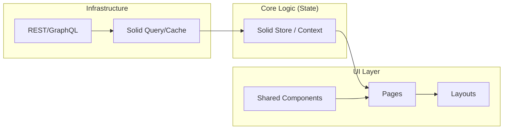

# Bài 6: Enterprise Architecture - Kiến Trúc Ứng Dụng Quy Mô Lớn

Để xây dựng một ứng dụng có thể bảo trì và mở rộng trong môi trường doanh nghiệp, chúng ta cần một kiến trúc vững chắc. SolidJS, với tính linh hoạt của mình, cho phép chúng ta áp dụng nhiều mô hình thiết kế hiện đại.

## 1. Cấu trúc Thư mục theo Module

Thay vì chia theo loại file (components, hooks, services), hãy chia theo tính năng (features/modules).

```text
src/
  features/
    auth/
      components/
      store/
      services/
      index.ts
    products/
      components/
      store/
      types.ts
  shared/
    components/
    utils/
  App.tsx
```

## 2. Tối ưu hóa Context API

Context API trong SolidJS rất mạnh mẽ vì nó không gây ra re-render toàn bộ cây component con như React. Tuy nhiên, nếu bạn để quá nhiều dữ liệu vào một Context duy nhất, việc quản lý sẽ trở nên khó khăn.

### Pattern: Multiple Specialized Contexts
Thay vì một `GlobalContext`, hãy chia nhỏ thành `AuthContext`, `ThemeContext`, `CartContext`.

```javascript
// Tối ưu: Chỉ bọc các phần cần thiết
<AuthProvider>
  <ThemeStub>
    <AppRoutes />
  </ThemeStub>
</AuthProvider>
```

## 3. Kiến trúc "Headless" Components

Trong môi trường Enterprise, UI có thể thay đổi liên tục nhưng logic nghiệp vụ (business logic) thường ổn định. Hãy tách logic ra khỏi UI.

```javascript
// useCounter.ts (Logic)
export function createCounter() {
  const [count, setCount] = createSignal(0);
  const increment = () => setCount(c => c + 1);
  return { count, increment };
}

// CounterUI.tsx (View)
function CounterUI() {
  const { count, increment } = createCounter();
  return <button onClick={increment}>{count()}</button>;
}
```

## 4. Hiệu suất và Tối ưu hóa (Performance)

### A. Lazy Loading
Sử dụng `lazy()` để chia nhỏ bundle. Điều này cực kỳ quan trọng cho các ứng dụng lớn để giảm thời gian tải trang đầu tiên.

```javascript
const AdminPanel = lazy(() => import("./features/admin/Panel"));
```

### B. Tránh tạo hàm trong vòng lặp JSX
Mặc dù Solid hiệu quả, nhưng việc tạo hàm mới bên trong `<For>` vẫn tốn bộ nhớ. Hãy định nghĩa hàm bên ngoài nếu có thể.

### C. Batching Updates
Sử dụng `batch()` khi bạn cần cập nhật nhiều Signal cùng lúc để giảm số lượng Effect kích hoạt trung gian.

```javascript
batch(() => {
  setFirstName("An");
  setLastName("Nguyen");
});
```

## 5. Sơ đồ Kiến trúc Tổng thể



## 6. Testing Strategy

Trong các dự án lớn, Testing là bắt buộc:
- **Unit Test**: Test các logic trong `createMemo` hoặc `createStore` (Dùng Vitest + `@solidjs/testing-library`).
- **Component Test**: Test các tương tác người dùng trên UI.
- **E2E Test**: Test luồng nghiệp vụ hoàn chỉnh (Dùng Playwright).

## 7. Tổng kết Series

Chúng ta đã đi từ những khái niệm cốt lõi nhất của **Fine-grained Reactivity** đến những kiến trúc phức tạp dành cho **Enterprise**. SolidJS không chỉ là một framework nhanh, nó là một tư duy mới về cách xây dựng ứng dụng web: **Trực tiếp, Minh bạch và Hiệu quả**.

---
*Chúc bạn thành công trên hành trình chinh phục SolidJS!*
