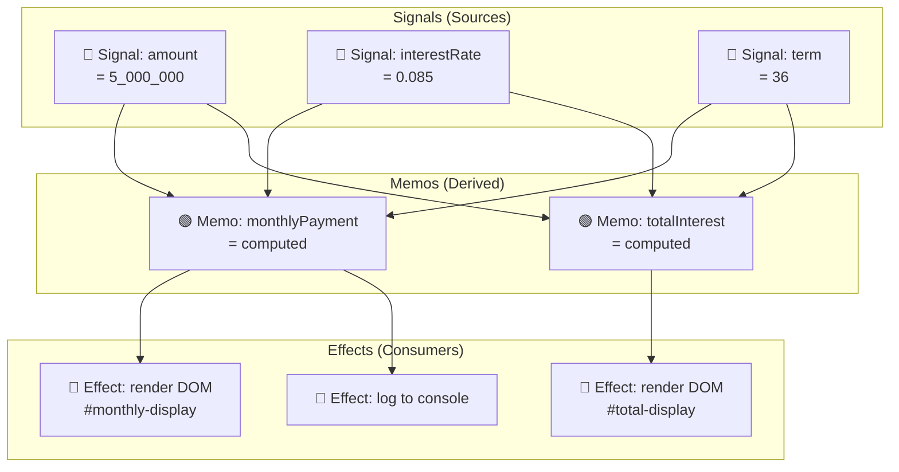
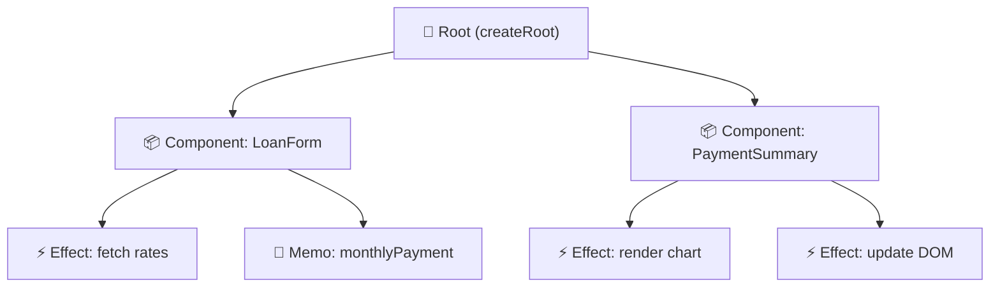
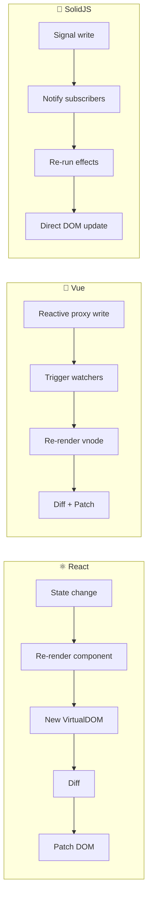

# SolidJS 01 — Reactivity Internals: Bản chất Fine-Grained Reactivity

#solidjs #frontend #reactivity #phase-1-core

> **Mục tiêu:** Hiểu được *tại sao* SolidJS không cần Virtual DOM, *cơ chế* reactive graph hoạt động thế nào, và *ownership model* khác gì với React/Vue. Đây là nền tảng bắt buộc trước khi học bất kỳ API nào.

---

## 🧠 Mental Model — Vấn đề mà Reactivity giải quyết

### React giải quyết "UI = f(state)" bằng cách nào?

React re-render toàn bộ component tree khi state thay đổi, sau đó dùng **Virtual DOM diffing** để tìm ra điểm khác biệt và patch DOM thực:

```
State thay đổi
  → Component function chạy lại (re-render)
  → Virtual DOM mới được tạo
  → Diff với Virtual DOM cũ
  → Patch vào Real DOM
```

Vấn đề: dù chỉ thay đổi 1 giá trị nhỏ, toàn bộ component subtree phải chạy lại. React dùng `memo`, `useMemo`, `useCallback` để tối ưu — nhưng đây là **opt-in optimization**, không phải default.

### SolidJS giải quyết khác hoàn toàn: Reactive Graph

SolidJS không có Virtual DOM. Thay vào đó, nó xây dựng một **dependency graph tĩnh** tại compile time + runtime, trong đó:
- **Signal** = nguồn dữ liệu reactive (leaf node)
- **Memo** = giá trị dẫn xuất (intermediate node)
- **Effect** = side effect khi graph thay đổi (consumer node)

Khi một Signal thay đổi, **chỉ các node đang subscribe vào Signal đó** được cập nhật — không có gì thêm.

```
Signal thay đổi
  → Chỉ những Effect/Memo đang đọc Signal này chạy lại
  → DOM được update trực tiếp
```

---

## ⚙️ Cơ chế hoạt động bên trong

### 1. Tracking Context — Cách subscription được đăng ký tự động

Đây là cơ chế cốt lõi và thần kỳ nhất của SolidJS. Câu hỏi: làm sao SolidJS biết Effect nào đang "đọc" Signal nào?

**Cơ chế:** SolidJS duy trì một **global variable** gọi là `currentObserver`. Khi một Effect bắt đầu chạy, nó set `currentObserver = itself`. Khi Signal's getter được gọi, Signal kiểm tra `currentObserver` và **tự động thêm currentObserver vào subscriber list của mình**.

```typescript
// Pseudocode nội bộ SolidJS (simplified)
let currentObserver: Computation | null = null;

function createSignal(value) {
  const subscribers = new Set();
  
  function read() {
    // AUTO-TRACKING: nếu đang trong tracking context, đăng ký
    if (currentObserver !== null) {
      subscribers.add(currentObserver);
      currentObserver.sources.add(subscribers); // bidirectional
    }
    return value;
  }
  
  function write(newValue) {
    value = newValue;
    // Notify tất cả subscribers
    for (const sub of subscribers) {
      sub.notify(); // trigger re-execution
    }
  }
  
  return [read, write];
}

function createEffect(fn) {
  const computation = {
    sources: new Set(),
    execute() {
      // Cleanup subscriptions cũ
      for (const src of this.sources) src.delete(this);
      this.sources.clear();
      
      // Set tracking context và chạy fn
      const prevObserver = currentObserver;
      currentObserver = this;
      fn();
      currentObserver = prevObserver; // restore
    }
  };
  computation.execute();
}
```

**Kết quả:** Subscription hoàn toàn tự động — không cần khai báo dependency array như React's `useEffect`.

### 2. Reactive Graph — Cấu trúc dữ liệu



Khi `interestRate` thay đổi: chỉ `M1`, `M2`, `E1`, `E2`, `E3` được cập nhật. `S1` và `S3` không bị đụng đến.

### 3. Ownership Tree — Memory Management tự động

SolidJS dùng **ownership tree** để quản lý lifetime của computations. Mỗi reactive computation (effect, memo) thuộc về một **owner** — thường là component hoặc createRoot.



Khi component bị unmount (owner bị dispose), **tất cả effects và memos con của nó tự động được cleanup** — không cần `useEffect(() => return () => cleanup())` như React.

### 4. So sánh kiến trúc: SolidJS vs React vs Vue



| Tiêu chí | React | Vue 3 | SolidJS |
|---|---|---|---|
| Cơ chế cập nhật | Virtual DOM diff | Proxy + Virtual DOM | Fine-grained reactive graph |
| Đơn vị re-render | Component function | Component vnode | Effect (DOM node level) |
| Dependency tracking | Manual (deps array) | Proxy auto-track | Tracking context auto-track |
| Runtime overhead | Diffing cost | Proxy overhead | Minimal (direct DOM) |
| Memory model | GC-dependent | GC-dependent | Ownership tree |
| Bundle size | ~45KB | ~40KB | ~7KB |

---

## 📐 API Foundation — createRoot & getOwner

### createRoot

Tạo một reactive scope độc lập. Components tự động tạo root riêng — bạn cần `createRoot` khi tạo reactive logic bên ngoài component tree.

```typescript
import { createRoot, createSignal } from "solid-js";

// Tạo reactive scope với manual cleanup
const dispose = createRoot((dispose) => {
  const [count, setCount] = createSignal(0);
  
  // Logic reactive...
  
  return dispose; // expose để cleanup sau
});

// Sau khi xong việc, cleanup toàn bộ scope
dispose();
```

### getOwner & runWithOwner

```typescript
import { getOwner, runWithOwner, createEffect } from "solid-js";

function createSharedEffect() {
  // Lấy owner của context hiện tại
  const owner = getOwner();
  
  setTimeout(() => {
    // Chạy effect trong context owner đúng
    // (tránh effect bị orphan, không được cleanup)
    runWithOwner(owner, () => {
      createEffect(() => {
        console.log("Effect in correct owner scope");
      });
    });
  }, 1000);
}
```

---

## 💡 Pattern thực chiến — Banking Domain

### Pattern: Reactive Loan Calculator State

```typescript
import { createRoot, createSignal, createMemo, createEffect, onCleanup } from "solid-js";

// Service layer: reactive loan state (outside components)
export function createLoanService() {
  return createRoot((dispose) => {
    // === SIGNALS (nguồn dữ liệu) ===
    const [principal, setPrincipal] = createSignal(500_000_000); // VND
    const [annualRate, setAnnualRate] = createSignal(0.085);      // 8.5%
    const [termMonths, setTermMonths] = createSignal(120);         // 10 năm

    // === MEMOS (dẫn xuất - chỉ tính khi dependencies thay đổi) ===
    const monthlyRate = createMemo(() => annualRate() / 12);
    
    const monthlyPayment = createMemo(() => {
      const P = principal();
      const r = monthlyRate();
      const n = termMonths();
      // PMT formula
      if (r === 0) return P / n;
      return (P * r * Math.pow(1 + r, n)) / (Math.pow(1 + r, n) - 1);
    });

    const totalPayment = createMemo(() => monthlyPayment() * termMonths());
    const totalInterest = createMemo(() => totalPayment() - principal());

    // === EFFECT: sync với analytics ===
    createEffect(() => {
      const data = {
        principal: principal(),
        rate: annualRate(),
        term: termMonths(),
        monthly: monthlyPayment()
      };
      // Chỉ gọi khi bất kỳ giá trị trên thay đổi
      analyticsService.trackLoanCalc(data);
    });

    return {
      // Signals
      principal, setPrincipal,
      annualRate, setAnnualRate,
      termMonths, setTermMonths,
      // Memos
      monthlyRate,
      monthlyPayment,
      totalPayment,
      totalInterest,
      // Cleanup
      dispose
    };
  });
}
```

---

## ⚠️ Pitfalls & Anti-patterns

### ❌ Pitfall 1: Destructure Signal — mất reactivity

```typescript
// ❌ SAI: destructure làm mất reactive reference
const { count } = createSignal(0); // count là giá trị tĩnh!

// ✅ ĐÚNG: giữ tuple
const [count, setCount] = createSignal(0); // count() là getter function
```

### ❌ Pitfall 2: Đọc Signal ngoài tracking context

```typescript
const [amount, setAmount] = createSignal(1000);

// ❌ SAI: đọc trong setTimeout không được track
setTimeout(() => {
  console.log(amount()); // đọc nhưng không subscribe — stale value
}, 1000);

// ✅ ĐÚNG: đọc bên trong effect
createEffect(() => {
  const val = amount(); // được track, re-run khi amount thay đổi
  setTimeout(() => console.log(val), 1000);
});
```

### ❌ Pitfall 3: Tạo Effect ngoài reactive root

```typescript
// ❌ SAI: effect không có owner → memory leak, không được cleanup
function initService() {
  createEffect(() => { /* ... */ }); // orphan effect!
}

// ✅ ĐÚNG: wrap trong createRoot
function initService() {
  createRoot(() => {
    createEffect(() => { /* ... */ });
  });
}
```

---

## 🔗 Liên kết

← [[SolidJS-Series/SolidJS-00-Overview|00 · Overview & Setup]]
→ [[SolidJS-Series/SolidJS-02-Signals-Deep-Dive|02 · Signals Deep Dive]]

**Xem thêm:**
- [[SolidJS-Series/SolidJS-03-Effects-And-Lifecycle|03 · Effects & Lifecycle]] — tracking context chi tiết hơn
- [[SolidJS-Series/SolidJS-06-Stores-Nested-State|06 · Stores]] — reactive object phức tạp

---

*Series: [[SolidJS-Series/SolidJS-MOC|SolidJS Master Index]]*
