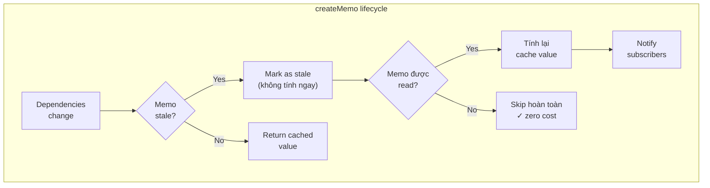
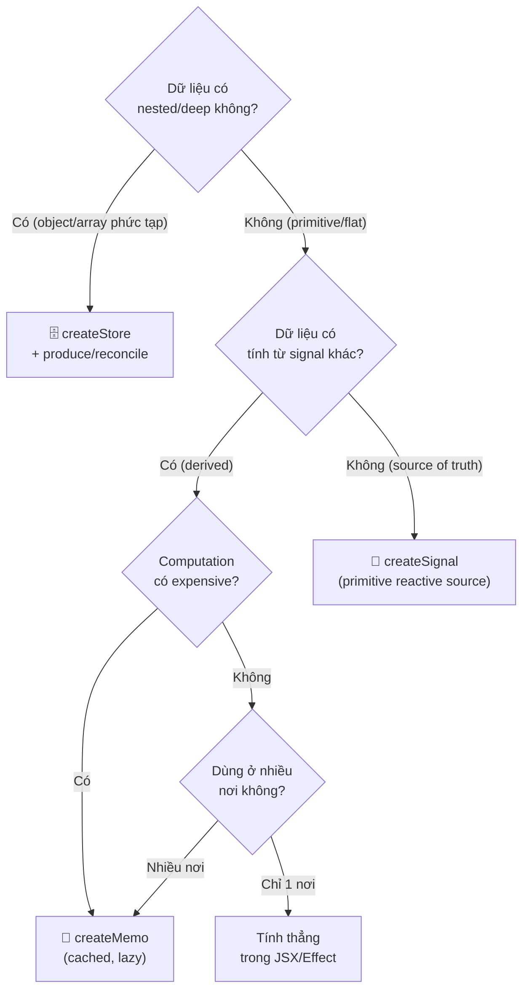

# SolidJS 02 — Signals Deep Dive: createSignal, createMemo, batch

#solidjs #frontend #signals #phase-1-core

> **Mục tiêu:** Nắm vững anatomy của Signal — getter/setter pattern, lazy evaluation trong Memo, batching update, và `untrack`. Biết khi nào chọn Signal vs Memo vs Store cho từng use case enterprise.

---

## 🧠 Mental Model — Signal là gì thực chất?

Signal không phải chỉ là "biến có thể watch". Signal là một **reactive cell** trong dependency graph:

```
Signal = { value: T, subscribers: Set<Computation> }
getter() → value (+ đăng ký subscriber nếu trong tracking context)
setter(v) → value = v + notify tất cả subscribers
```

Khác với React's `useState`:
- `useState` → trigger re-render **toàn component**
- `createSignal` → trigger chỉ **những computation đang subscribe vào signal đó**

### Signal vs useState: granularity khác nhau hoàn toàn

```
React:
  const [form, setForm] = useState({ name: '', amount: 0, rate: 0 });
  // Thay đổi bất kỳ field → toàn bộ component re-render

SolidJS:
  const [name, setName] = createSignal('');
  const [amount, setAmount] = createSignal(0);
  const [rate, setRate] = createSignal(0);
  // Thay đổi rate → CHỈ những thứ đọc rate() được cập nhật
```

---

## ⚙️ createSignal — Cơ chế chi tiết

### Signature

```typescript
function createSignal<T>(
  value: T,
  options?: {
    equals?: false | ((prev: T, next: T) => boolean);
    name?: string;      // debug label
    internal?: boolean;
  }
): [get: () => T, set: (v: T | ((prev: T) => T)) => T];
```

### equals — Kiểm soát khi nào notify subscribers

Mặc định SolidJS dùng `===` để so sánh. Có thể tuỳ chỉnh:

```typescript
// Không bao giờ skip notification (luôn notify dù value giống)
const [data, setData] = createSignal([], { equals: false });

// Custom equality: object sâu
const [filter, setFilter] = createSignal(
  { status: 'PENDING', branch: 'HN' },
  { equals: (prev, next) => 
      prev.status === next.status && prev.branch === next.branch 
  }
);

// Functional setter: cập nhật dựa trên giá trị trước
setFilter(prev => ({ ...prev, status: 'APPROVED' }));
// → chỉ notify nếu status thực sự thay đổi
```

### Getter là function — không phải value

```typescript
const [loanAmount, setLoanAmount] = createSignal(500_000_000);

// ❌ KHÔNG dùng:
loanAmount  // giá trị tĩnh tại thời điểm destructure

// ✅ LUÔN gọi như function:
loanAmount()  // giá trị hiện tại + đăng ký subscription nếu trong tracking context
```

---

## ⚙️ createMemo — Lazy Derived State

### Tại sao cần Memo thay vì tính thẳng trong Signal?

```typescript
// ❌ Không có Memo: tính toán lặp lại mỗi lần đọc
const [rate, setRate] = createSignal(0.085);
const [principal, setPrincipal] = createSignal(500_000_000);

// Mỗi nơi gọi sẽ tính lại:
function ComponentA() { return <div>{(rate() * principal()).toFixed(0)}</div>; }
function ComponentB() { return <div>{(rate() * principal()).toFixed(0)}</div>; }
// → tính 2 lần, subscribe 2 lần vào cả rate và principal

// ✅ Có Memo: tính 1 lần, cache, share kết quả
const annualInterest = createMemo(() => rate() * principal());
// ComponentA và B đều đọc annualInterest() → 1 subscription, 1 computation
```

### Memo là lazy và cached



### Signature và options

```typescript
function createMemo<T>(
  fn: (prev: T | undefined) => T,
  value?: T,              // initial value (trước lần chạy đầu)
  options?: {
    equals?: false | ((prev: T, next: T) => boolean);
    name?: string;
  }
): () => T;
```

### Memo chain — computed từ computed

```typescript
// Domain: tính các chỉ số khoản vay
const [principal, setPrincipal] = createSignal(500_000_000);
const [annualRate, setAnnualRate] = createSignal(0.085);
const [termMonths, setTermMonths] = createSignal(120);

// Level 1 Memo
const monthlyRate = createMemo(() => annualRate() / 12);

// Level 2 Memo: dùng memo khác
const monthlyPayment = createMemo(() => {
  const P = principal();
  const r = monthlyRate(); // subscribe vào memo, không phải signal trực tiếp
  const n = termMonths();
  return (P * r * Math.pow(1 + r, n)) / (Math.pow(1 + r, n) - 1);
});

// Level 3 Memo
const totalPayment = createMemo(() => monthlyPayment() * termMonths());
const totalInterest = createMemo(() => totalPayment() - principal());

// Khi annualRate thay đổi:
// annualRate → monthlyRate (recompute) → monthlyPayment (recompute)
// → totalPayment (recompute) → totalInterest (recompute)
// principal và termMonths KHÔNG re-read nếu không thay đổi
```

---

## ⚙️ batch — Gộp nhiều update thành 1

### Vấn đề khi update nhiều signal liên tiếp

```typescript
const [name, setName] = createSignal('');
const [amount, setAmount] = createSignal(0);
const [status, setStatus] = createSignal('DRAFT');

// ❌ Không có batch: 3 signal update → effect/memo re-run 3 lần
function submitForm(data) {
  setName(data.name);    // Effect re-run #1
  setAmount(data.amount); // Effect re-run #2
  setStatus('PENDING');   // Effect re-run #3
}
```

### batch() gộp updates, notify 1 lần

```typescript
import { batch } from "solid-js";

function submitForm(data) {
  batch(() => {
    setName(data.name);
    setAmount(data.amount);
    setStatus('PENDING');
  }); 
  // → Sau khi batch kết thúc, tất cả effects/memos chạy 1 lần duy nhất
}
```

### batch tự động trong event handlers

SolidJS tự động batch trong event handlers của JSX. `batch()` chỉ cần dùng khi update ngoài event handlers (setTimeout, Promise callbacks, WebSocket handlers):

```typescript
// JSX event handler: tự động batched ✓
<button onClick={() => { setA(1); setB(2); setC(3); }}>OK</button>

// Promise callback: cần batch thủ công
fetchLoanData().then(data => {
  batch(() => {
    setPrincipal(data.principal);
    setRate(data.rate);
    setTerm(data.term);
  });
});
```

---

## ⚙️ untrack — Đọc signal không subscribe

Đôi khi cần đọc giá trị signal hiện tại nhưng **không muốn subscribe** (không muốn effect re-run khi signal đó thay đổi):

```typescript
import { createEffect, untrack } from "solid-js";

const [userId, setUserId] = createSignal('user-001');
const [sessionToken, setSessionToken] = createSignal('token-abc');

createEffect(() => {
  const id = userId(); // subscribe: re-run khi userId thay đổi
  
  // Đọc sessionToken để dùng, nhưng KHÔNG subscribe
  // Effect này chỉ re-run khi userId thay đổi, không phải sessionToken
  const token = untrack(() => sessionToken());
  
  fetchUserProfile(id, { Authorization: `Bearer ${token}` });
});
```

### Diagram: tracked vs untracked reads

```
createEffect(() => {
  const a = signalA();          ← TRACKED: subscribed ✓
  const b = untrack(signalB);   ← NOT TRACKED: just reads value
  const c = signalC();          ← TRACKED: subscribed ✓
})

Re-run triggers: signalA changes | signalC changes
NOT re-run when: signalB changes (chỉ đọc giá trị lúc chạy)
```

---

## ⚙️ createSignal với Reference Types

Signal dùng `===` equality → object/array mới luôn trigger notify:

```typescript
// Object signal: luôn pass new reference để trigger
const [filters, setFilters] = createSignal({
  status: 'PENDING',
  branch: 'HCM',
  dateFrom: null
});

// ✅ Spread để tạo object mới
setFilters(prev => ({ ...prev, status: 'APPROVED' }));

// ❌ Mutate in place: không trigger vì reference không đổi
const f = filters();
f.status = 'APPROVED'; // SolidJS KHÔNG detect thay đổi này
setFilters(f);         // f === f → equals true → không notify
```

> **Lưu ý:** Nếu cần reactive nested object, dùng [[SolidJS-Series/SolidJS-06-Stores-Nested-State|createStore]] thay vì Signal.

---

## 📐 Decision Matrix — Signal vs Memo vs Store



---

## 💡 Pattern thực chiến — Credit Application Form State

```typescript
import { createSignal, createMemo, batch } from "solid-js";

// Domain: Credit Application form (Hồ sơ tín dụng)
export function createCreditApplicationSignals() {
  // === PRIMITIVE SIGNALS ===
  const [applicantId, setApplicantId] = createSignal('');
  const [loanProduct, setLoanProduct] = createSignal<'PERSONAL' | 'MORTGAGE' | 'AUTO'>('PERSONAL');
  const [requestAmount, setRequestAmount] = createSignal(0);
  const [annualIncome, setAnnualIncome] = createSignal(0);
  const [tenor, setTenor] = createSignal(12); // months

  // === DERIVED MEMOS ===
  const dti = createMemo(() => {
    // Debt-to-Income ratio: monthlyPayment / monthlyIncome
    const monthlyIncome = annualIncome() / 12;
    if (monthlyIncome === 0) return 0;
    // Ước tính monthly payment đơn giản
    const estimatedMonthly = requestAmount() / tenor();
    return estimatedMonthly / monthlyIncome;
  });

  const maxEligibleAmount = createMemo(() => {
    // Ngân hàng cho vay tối đa khi DTI <= 40%
    const monthlyIncome = annualIncome() / 12;
    return monthlyIncome * 0.4 * tenor();
  });

  const eligibilityStatus = createMemo(() => {
    if (requestAmount() <= 0 || annualIncome() <= 0) return 'INCOMPLETE';
    if (requestAmount() > maxEligibleAmount()) return 'OVER_LIMIT';
    if (dti() > 0.4) return 'HIGH_DTI';
    return 'ELIGIBLE';
  });

  // === BATCH UPDATE: load saved draft ===
  function loadDraft(draft: CreditApplicationDraft) {
    batch(() => {
      setApplicantId(draft.applicantId);
      setLoanProduct(draft.loanProduct);
      setRequestAmount(draft.requestAmount);
      setAnnualIncome(draft.annualIncome);
      setTenor(draft.tenor);
    }); // → memos tính lại 1 lần sau khi tất cả signals updated
  }

  return {
    // Signals (source of truth)
    applicantId, setApplicantId,
    loanProduct, setLoanProduct,
    requestAmount, setRequestAmount,
    annualIncome, setAnnualIncome,
    tenor, setTenor,
    // Memos (derived, read-only)
    dti,
    maxEligibleAmount,
    eligibilityStatus,
    // Actions
    loadDraft,
  };
}
```

---

## ⚠️ Pitfalls & Anti-patterns

### ❌ Pitfall 1: Tạo Signal trong Memo

```typescript
// ❌ SAI: Signal tạo trong Memo không ổn định
const bad = createMemo(() => {
  const [inner, setInner] = createSignal(0); // re-tạo mỗi lần Memo chạy!
  return inner;
});

// ✅ ĐÚNG: Signal luôn ở top-level scope
const [inner, setInner] = createSignal(0);
const derived = createMemo(() => inner() * 2);
```

### ❌ Pitfall 2: Memo không cần thiết

```typescript
// ❌ Over-memoize: computation đơn giản không cần Memo
const doubled = createMemo(() => count() * 2); // không cần

// ✅ Tính thẳng trong JSX nếu chỉ dùng 1 nơi
<div>{count() * 2}</div>

// ✅ Memo hợp lý khi: expensive + dùng nhiều nơi
const loanMetrics = createMemo(() => calculatePMT(principal(), rate(), term()));
```

### ❌ Pitfall 3: Quên gọi getter

```typescript
// ❌ So sánh với function reference thay vì giá trị
if (status === 'APPROVED') { ... }    // status là function!

// ✅ Gọi getter trước khi so sánh
if (status() === 'APPROVED') { ... }
```

---

## 🔗 Liên kết

← [[SolidJS-Series/SolidJS-01-Reactivity-Internals|01 · Reactivity Internals]]
→ [[SolidJS-Series/SolidJS-03-Effects-And-Lifecycle|03 · Effects & Lifecycle]]

**Xem thêm:**
- [[SolidJS-Series/SolidJS-06-Stores-Nested-State|06 · Stores]] — khi signal không đủ cho nested state
- [[SolidJS-Series/SolidJS-10-Complex-UI-Patterns|10 · Complex UI]] — form patterns với signals

---

*Series: [[SolidJS-Series/SolidJS-MOC|SolidJS Master Index]]*
