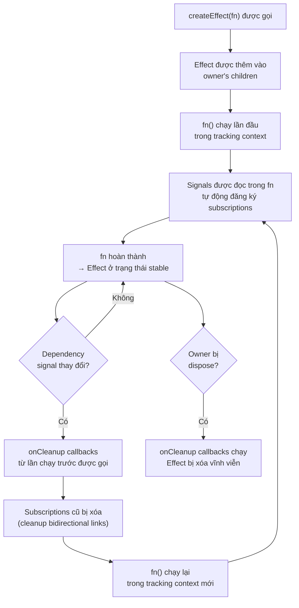
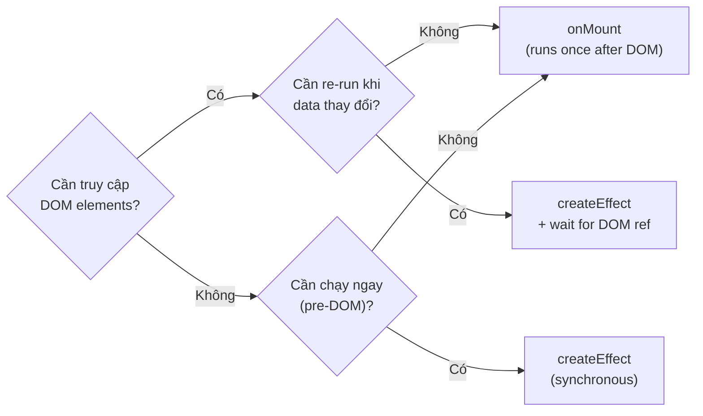

# SolidJS 03 — Effects & Lifecycle: createEffect, onMount, onCleanup

#solidjs #frontend #effects #lifecycle #phase-1-core

> **Mục tiêu:** Nắm vững cơ chế tracking context trong effect, phân biệt các loại effect API, và pattern quản lý side effects (WebSocket, timer, event listener) mà không gây memory leak trong enterprise app.

---

## 🧠 Mental Model — Effect là gì?

Effect là **reactive computation với side effects** — code chạy lại khi dependencies thay đổi, và được dọn dẹp tự động khi owner bị dispose.

```
Effect = {
  fn: () => void,         // code có side effect
  sources: Set<Signal>,   // được track tự động khi fn chạy
  owner: Computation,     // parent trong ownership tree
}
```

So sánh với `useEffect` của React:

| Tiêu chí | React `useEffect` | SolidJS `createEffect` |
|---|---|---|
| Dependency array | Manual `[dep1, dep2]` | Tự động qua tracking context |
| Thời điểm chạy | Sau mỗi render | Khi dependency thực sự thay đổi |
| Cleanup | `return () => cleanup()` | `onCleanup(() => cleanup())` |
| Chạy đầu tiên | Sau mount (DOM ready) | Ngay khi tạo (synchronous) |
| Re-run granularity | Mỗi lần component render | Chỉ khi signal đang subscribe thay đổi |

---

## ⚙️ createEffect — Cơ chế tracking và re-execution

### Lifecycle của một Effect



### Effect tự động cleanup subscriptions giữa các lần chạy

```typescript
const [mode, setMode] = createSignal<'simple' | 'advanced'>('simple');
const [simpleData, setSimpleData] = createSignal(0);
const [advancedData, setAdvancedData] = createSignal(0);

createEffect(() => {
  if (mode() === 'simple') {
    console.log('Simple:', simpleData()); // subscribe simpleData
    // advancedData KHÔNG được subscribe trong lần chạy này
  } else {
    console.log('Advanced:', advancedData()); // subscribe advancedData
    // simpleData KHÔNG được subscribe trong lần chạy này
  }
});

// Ban đầu: subscribed to [mode, simpleData]
// Sau setMode('advanced'): subscribed to [mode, advancedData]
// → simpleData tự động bị unsubscribed ✓
```

---

## ⚙️ onCleanup — Dọn dẹp side effects

`onCleanup` đăng ký một callback chạy khi:
1. Effect sắp re-run (cleanup lần chạy trước)
2. Hoặc khi owner bị dispose (component unmount)

```typescript
import { createEffect, onCleanup } from "solid-js";

// Pattern: WebSocket connection
function createLoanStatusEffect(loanId: () => string) {
  createEffect(() => {
    const id = loanId(); // tracked
    
    const ws = new WebSocket(`wss://api.vpbank.com/loans/${id}/status`);
    
    ws.onmessage = (event) => {
      const status = JSON.parse(event.data);
      // update store...
    };
    
    // Cleanup: đóng connection khi loanId thay đổi HOẶC component unmount
    onCleanup(() => {
      ws.close();
      console.log(`WebSocket closed for loan ${id}`);
    });
  });
}

// Pattern: polling với interval
function createPollingEffect(url: () => string, intervalMs: number) {
  createEffect(() => {
    const endpoint = url(); // tracked
    
    const poll = async () => {
      const data = await fetch(endpoint).then(r => r.json());
      // handle data...
    };
    
    poll(); // chạy ngay lần đầu
    const timerId = setInterval(poll, intervalMs);
    
    onCleanup(() => clearInterval(timerId));
  });
}

// Pattern: event listener
function createScrollEffect(handler: () => void) {
  createEffect(() => {
    window.addEventListener('scroll', handler, { passive: true });
    onCleanup(() => window.removeEventListener('scroll', handler));
  });
}
```

---

## ⚙️ onMount — Sau khi DOM ready

`onMount` chạy **một lần duy nhất** sau khi component được mount vào DOM. Không reactive, không re-run, không tracking.

```typescript
import { onMount, onCleanup } from "solid-js";

function DataTable() {
  let tableRef!: HTMLTableElement;
  
  onMount(() => {
    // DOM đã sẵn sàng → có thể truy cập DOM elements
    console.log('Table dimensions:', tableRef.getBoundingClientRect());
    
    // Khởi tạo third-party library
    const dtInstance = initDataTable(tableRef, { ...options });
    
    onCleanup(() => {
      dtInstance.destroy(); // cleanup khi component unmount
    });
  });
  
  return <table ref={tableRef}>...</table>;
}
```

### onMount vs createEffect — khi nào dùng gì?



---

## ⚙️ Phân biệt các Effect API

### createEffect vs createRenderEffect vs createComputed

```typescript
// 1. createEffect: sau khi DOM updates (microtask queue)
// Dùng cho: side effects không liên quan DOM (fetch, log, analytics)
createEffect(() => {
  console.log('After DOM update:', count());
});

// 2. createRenderEffect: TRONG quá trình render (synchronous)
// Dùng cho: side effects phải sync với DOM render
// ⚠️ Cẩn thận: chạy sớm hơn, có thể chưa có DOM
import { createRenderEffect } from "solid-js";
createRenderEffect(() => {
  // Chạy đồng thời với reactive DOM updates
  element.style.color = color();
});

// 3. createComputed: deprecated alias của createRenderEffect
// Không dùng trong code mới

// 4. createReaction: chạy tracking lần đầu, notify thủ công
import { createReaction } from "solid-js";
const track = createReaction(() => {
  console.log('Signal changed!'); // chạy khi signal thay đổi
});
track(() => someSignal()); // đăng ký tracking lần đầu
```

### Timeline so sánh

```
Signal change
  │
  ├─ createRenderEffect   ← chạy NGAY (synchronous, trong render)
  │
  ├─ [DOM updates happen]
  │
  └─ createEffect         ← chạy SAU (microtask, DOM đã update)
```

---

## ⚙️ Nested Effects và Ownership

Effects có thể tạo effects con — nhưng cần hiểu ownership:

```typescript
createEffect(() => {
  const userId = currentUser();
  
  // Effect con: lifecycle gắn với effect cha
  // Khi currentUser thay đổi → effect cha re-run → effect con cũ bị dispose
  createEffect(() => {
    const profile = userProfiles.get(userId);
    console.log('Profile updated:', profile?.name);
  });
});
```

### Pattern: Dynamic subscriptions

```typescript
// Ứng dụng banking: subscribe nhiều loan status theo list
createEffect(() => {
  const loanIds = activeLoanIds(); // tracked: re-run khi list thay đổi
  
  // Tạo effect cho từng loan (mỗi effect được cleanup khi cha re-run)
  for (const id of loanIds) {
    createEffect(() => {
      const status = loanStatuses.get(id)?.();
      if (status === 'DISBURSED') {
        notifyDisbursement(id);
      }
    });
  }
});
```

---

## ⚙️ defer — Bỏ qua lần chạy đầu tiên

```typescript
import { createEffect, on } from "solid-js";

const [count, setCount] = createSignal(0);

// on() tạo effect chỉ re-run khi dependency cụ thể thay đổi
// defer: true → bỏ qua lần chạy đầu tiên
createEffect(
  on(count, (current, prev) => {
    console.log(`Changed from ${prev} to ${current}`);
    // Không chạy khi khởi tạo, chỉ khi count thực sự thay đổi
  }, { defer: true })
);

// on() với multiple dependencies
createEffect(
  on([count, status], ([c, s], [prevC, prevS]) => {
    // Chạy khi count HOẶC status thay đổi
    console.log('Either changed');
  })
);
```

---

## 💡 Pattern thực chiến — Banking Enterprise Patterns

### Pattern 1: Auto-save draft với debounce

```typescript
import { createSignal, createEffect, onCleanup, batch } from "solid-js";

function createAutoSaveDraft(draftId: string) {
  const [formData, setFormData] = createSignal<LoanDraft>({
    applicantName: '',
    amount: 0,
    purpose: '',
  });
  const [saveStatus, setSaveStatus] = createSignal<'idle' | 'saving' | 'saved' | 'error'>('idle');

  createEffect(() => {
    const data = formData(); // tracked: re-run khi form thay đổi
    
    // Debounce: delay 1s sau lần thay đổi cuối
    const timerId = setTimeout(async () => {
      setSaveStatus('saving');
      try {
        await saveDraftAPI(draftId, data);
        setSaveStatus('saved');
      } catch {
        setSaveStatus('error');
      }
    }, 1000);
    
    onCleanup(() => {
      clearTimeout(timerId); // Hủy timer nếu formData thay đổi trước khi save
    });
  });

  return { formData, setFormData, saveStatus };
}
```

### Pattern 2: Real-time transaction feed với WebSocket

```typescript
import { createSignal, createEffect, onCleanup } from "solid-js";

function createTransactionFeed(branchId: () => string) {
  const [transactions, setTransactions] = createSignal<Transaction[]>([]);
  const [wsStatus, setWsStatus] = createSignal<'connecting' | 'connected' | 'disconnected'>('disconnected');

  createEffect(() => {
    const branch = branchId(); // tracked
    setWsStatus('connecting');
    
    const ws = new WebSocket(`wss://api.vpbank.com/branches/${branch}/transactions`);
    
    ws.onopen = () => setWsStatus('connected');
    ws.onclose = () => setWsStatus('disconnected');
    
    ws.onmessage = (e) => {
      const tx: Transaction = JSON.parse(e.data);
      setTransactions(prev => [tx, ...prev].slice(0, 100)); // keep last 100
    };
    
    onCleanup(() => {
      ws.close();
      setTransactions([]); // clear khi switch branch
    });
  });

  return { transactions, wsStatus };
}

// Sử dụng trong component:
function TransactionFeedComponent() {
  const [selectedBranch, setSelectedBranch] = createSignal('HN-001');
  const { transactions, wsStatus } = createTransactionFeed(selectedBranch);
  
  return (
    <div>
      <span>Status: {wsStatus()}</span>
      <For each={transactions()}>
        {tx => <TransactionRow tx={tx} />}
      </For>
    </div>
  );
}
```

### Pattern 3: Permission-based effect

```typescript
// Chỉ fetch sensitive data khi user có permission
createEffect(() => {
  const user = currentUser();
  const role = user?.role;
  
  if (role !== 'CREDIT_OFFICER' && role !== 'BRANCH_MANAGER') {
    // Không đọc sensitiveData signal → không subscribe
    return;
  }
  
  const caseId = selectedCaseId(); // chỉ tracked khi có permission
  fetchCreditCaseDetails(caseId).then(setDetails);
});
```

---

## ⚠️ Pitfalls & Anti-patterns

### ❌ Pitfall 1: Infinite loop — signal trong effect tự ghi vào mình

```typescript
const [count, setCount] = createSignal(0);

// ❌ SAI: đọc và ghi cùng signal → infinite loop!
createEffect(() => {
  setCount(count() + 1); // đọc count() → subscribe → set lại → re-run → lặp vô tận
});

// ✅ ĐÚNG: dùng untrack để đọc không subscribe
createEffect(() => {
  const current = untrack(count); // đọc không subscribe
  // Dùng trigger signal khác để trigger effect
});
```

### ❌ Pitfall 2: Async trong Effect — stale closure

```typescript
// ❌ SAI: sau await, tracking context đã mất
createEffect(async () => {
  const id = loanId(); // tracked ✓
  const data = await fetchLoan(id); // sau đây: không còn tracking context
  setLoanData(data);
  // update data() đây KHÔNG được track nếu đọc sau await
});

// ✅ ĐÚNG: tách async logic ra ngoài tracking
createEffect(() => {
  const id = loanId(); // tracked ✓
  
  // Gọi async nhưng không await trong effect
  fetchLoan(id).then(data => {
    // setters không cần tracking context
    setLoanData(data);
  });
});
```

### ❌ Pitfall 3: onCleanup ngoài reactive scope

```typescript
// ❌ SAI: onCleanup chỉ hoạt động bên trong Effect/Component
function badUtility() {
  onCleanup(() => console.log('cleanup')); // không có owner → silently ignored
}

// ✅ ĐÚNG: onCleanup chỉ trong Effect hoặc Component body
createEffect(() => {
  startSomething();
  onCleanup(() => stopSomething()); // ✓
});
```

---

## 🔗 Liên kết

← [[SolidJS-Series/SolidJS-02-Signals-Deep-Dive|02 · Signals Deep Dive]]
→ [[SolidJS-Series/SolidJS-04-JSX-Component-Model|04 · JSX & Component Model]]

**Xem thêm:**
- [[SolidJS-Series/SolidJS-08-Async-Resources|08 · Async & Resources]] — createResource thay thế fetch-in-effect
- [[SolidJS-Series/SolidJS-07-Context-DI|07 · Context]] — chia sẻ effect logic qua context

---

*Series: [[SolidJS-Series/SolidJS-MOC|SolidJS Master Index]]*
