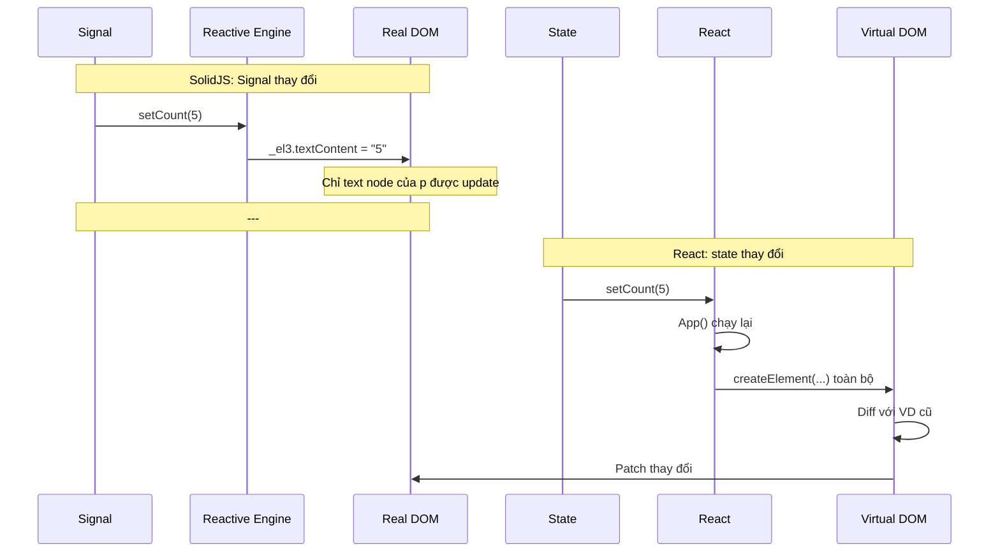

# SolidJS 04 — JSX & Component Model: Cơ chế biên dịch

#solidjs #frontend #jsx #components #phase-1-core

> **Mục tiêu:** Hiểu SolidJS JSX compile ra gì khác React, tại sao component function chỉ chạy 1 lần (không re-render), cách xử lý props đúng cách với `mergeProps`/`splitProps`, và tại sao `children` là signal.

---

## 🧠 Mental Model — Sự khác biệt căn bản với React

### React component: function chạy lại mỗi lần render

```
React component = () => JSX_description
  → React runtime gọi function này mỗi lần render
  → Virtual DOM mới được trả về
  → Diff + patch DOM
  → Hooks track state qua call order (closure magic)
```

### SolidJS component: function chạy **một lần duy nhất**

```
SolidJS component = () => DOM_setup_instructions
  → Hàm này chạy 1 lần để "setup" DOM và reactive bindings
  → JSX compile thành code tạo DOM nodes trực tiếp
  → Reactive bindings (Signal getters trong JSX) tự cập nhật DOM
  → Không có re-render, không có VDOM
```

**Metaphor:** React component giống **template engine** — mỗi lần data thay đổi, render lại template. SolidJS component giống **builder** — build xong một lần, sau đó reactive bindings tự maintain.

---

## ⚙️ Cơ chế JSX Compilation

### React JSX compile → React.createElement calls

```tsx
// Source
const App = () => (
  <div class="container">
    <h1>{title}</h1>
    <p>{count}</p>
  </div>
);

// React compile output (simplified):
const App = () => React.createElement(
  'div', { className: 'container' },
  React.createElement('h1', null, title),
  React.createElement('p', null, count)
);
// → VDOM objects, recreated mỗi lần render
```

### SolidJS JSX compile → DOM instructions + reactive bindings

```tsx
// Source (giống syntax nhưng khác hoàn toàn output)
const App = () => (
  <div class="container">
    <h1>{title()}</h1>
    <p>{count()}</p>
  </div>
);

// SolidJS compile output (simplified):
const App = () => {
  // Template cloning (static structure)
  const _tmpl = template(`<div class="container"><h1></h1><p></p></div>`);
  
  return (() => {
    const _el = _tmpl.cloneNode(true);  // Clone DOM structure
    const _el2 = _el.firstChild;        // h1
    const _el3 = _el2.nextSibling;      // p
    
    // Reactive bindings: chỉ update TEXT NODE khi signal thay đổi
    insert(_el2, title);     // createEffect(() => _el2.textContent = title())
    insert(_el3, count);     // createEffect(() => _el3.textContent = count())
    
    return _el;  // Return DOM node trực tiếp (không phải VDOM)
  })();
};
```

### Diagram: React vs SolidJS update flow



---

## ⚙️ Template Cloning — Tối ưu static structure

SolidJS parse JSX tại compile time và tách **static HTML** ra khỏi **dynamic bindings**:

```tsx
// Component với mixed static/dynamic content
function LoanCard(props) {
  return (
    <div class="loan-card">          {/* static */}
      <div class="header">           {/* static */}
        <h2>{props.title}</h2>       {/* dynamic */}
        <span class="badge">         {/* static */}
          {props.status}             {/* dynamic */}
        </span>
      </div>
      <div class="amount">           {/* static */}
        {formatVND(props.amount())}  {/* dynamic (signal) */}
      </div>
    </div>
  );
}

// Compiled: HTML template được tạo 1 lần, clone N lần
// Template: <div class="loan-card"><div class="header"><h2></h2>...
// Bindings: chỉ những điểm dynamic được track và update
```

**Lợi ích:** Với danh sách 1000 items, structure DOM clone từ template (fast), chỉ bindings mới cần setup.

---

## ⚙️ Component chỉ chạy 1 lần — Implications

### Không có hooks call order rules

```tsx
// ✅ SolidJS: OK để điều kiện, không vi phạm gì
function Component(props) {
  if (props.advanced) {
    const [extra, setExtra] = createSignal(0); // OK: component chạy 1 lần
  }
  
  const [base, setBase] = createSignal(0);
  return <div>...</div>;
}

// ❌ React: hooks không được dùng trong điều kiện
function BadReactComponent(props) {
  if (props.advanced) {
    const [extra, setExtra] = useState(0); // ERROR: Rules of Hooks
  }
}
```

### Props là live — không destructure trực tiếp

```tsx
// ❌ SAI: destructure props mất reactivity
function LoanInfo({ amount, status }) {
  // amount và status là giá trị tại thời điểm chạy (một lần)
  // KHÔNG reactive khi parent thay đổi props
  return <div>{amount} - {status}</div>;
}

// ✅ ĐÚNG: giữ props object nguyên vẹn
function LoanInfo(props) {
  // props.amount và props.status là getters → reactive ✓
  return <div>{props.amount} - {props.status}</div>;
}
```

**Tại sao?** SolidJS dùng `Proxy` cho props object. `props.amount` thực ra là getter function trả về giá trị hiện tại. Khi destructure, bạn lấy giá trị tĩnh ra khỏi proxy.

---

## ⚙️ mergeProps — Default props an toàn

```tsx
import { mergeProps } from "solid-js";

interface ButtonProps {
  variant?: 'primary' | 'secondary' | 'danger';
  size?: 'sm' | 'md' | 'lg';
  disabled?: boolean;
  onClick?: () => void;
  children: any;
}

function Button(props: ButtonProps) {
  // mergeProps: merge defaults với props, kết quả vẫn reactive
  const merged = mergeProps(
    { variant: 'primary', size: 'md', disabled: false },
    props
  );
  
  return (
    <button
      class={`btn btn-${merged.variant} btn-${merged.size}`}
      disabled={merged.disabled}
      onClick={merged.onClick}
    >
      {merged.children}
    </button>
  );
}

// ❌ Không dùng destructure với defaults:
function BadButton({ variant = 'primary', ...props }) {
  // variant mất reactivity nếu parent thay đổi
}
```

---

## ⚙️ splitProps — Tách props để forward

Pattern phổ biến khi wrap component library: lấy một số props để dùng local, forward phần còn lại:

```tsx
import { splitProps } from "solid-js";

interface InputProps extends JSX.InputHTMLAttributes<HTMLInputElement> {
  label: string;
  error?: string;
  helper?: string;
}

function FormInput(props: InputProps) {
  // Tách props local ra, forward phần còn lại xuống <input>
  const [local, inputProps] = splitProps(props, ['label', 'error', 'helper']);
  
  return (
    <div class="form-field">
      <label>{local.label}</label>
      <input
        {...inputProps}          {/* type, value, onChange, placeholder, etc. */}
        class={`input ${local.error ? 'input-error' : ''}`}
      />
      <Show when={local.error}>
        <span class="error-msg">{local.error}</span>
      </Show>
      <Show when={local.helper}>
        <span class="helper-text">{local.helper}</span>
      </Show>
    </div>
  );
}

// Sử dụng:
<FormInput
  label="Số tiền vay"
  type="number"
  value={amount()}
  onChange={e => setAmount(+e.target.value)}
  error={errors.amount}
  helper="Nhập số tiền bằng VND"
/>
```

---

## ⚙️ children — Là signal, không phải giá trị

```tsx
import { children, JSX } from "solid-js";

// children() trả về resolved children (signal)
function Card(props: { children: JSX.Element; title: string }) {
  // children() resolve children và track chúng reactively
  const c = children(() => props.children);
  
  // c() là mảng hoặc element đã được resolve
  // Reactive: nếu children thay đổi, c() cập nhật
  
  return (
    <div class="card">
      <div class="card-header">{props.title}</div>
      <div class="card-body">{c()}</div>
    </div>
  );
}
```

### Dynamic children manipulation

```tsx
import { children } from "solid-js";

function AnimatedList(props: { children: JSX.Element }) {
  const resolved = children(() => props.children);
  
  // Lấy DOM elements từ resolved children
  createEffect(() => {
    const els = resolved.toArray();
    // Có thể manipulate DOM elements trực tiếp
    els.forEach((el, i) => {
      if (el instanceof HTMLElement) {
        el.style.animationDelay = `${i * 50}ms`;
      }
    });
  });
  
  return <div class="animated-list">{resolved()}</div>;
}
```

---

## ⚙️ JSX Attributes — Khác biệt với React

```tsx
// Class (không phải className)
<div class="container">...</div>

// Style object hoặc string
<div style={{ color: 'red', 'font-size': '16px' }}>...</div>
<div style="color: red; font-size: 16px">...</div>

// for (không phải htmlFor)
<label for="email">Email</label>

// Event handlers: lowercase on*
<button onClick={handler}>Click</button>
<input onInput={handler} />   // onInput (không phải onChange cho live input)
<input onChange={handler} />  // onChange: fire khi blur (khác React!)

// Ref: trực tiếp, không cần useRef
let inputEl!: HTMLInputElement;
<input ref={inputEl} />
// Hoặc callback ref:
<input ref={(el) => { inputEl = el; }} />

// Spread attributes
<input {...inputProps} />

// Boolean attributes
<input disabled />              // disabled={true}
<input disabled={false} />     // attribute bị remove

// innerHTML (cẩn thận XSS)
<div innerHTML={rawHtml} />
```

---

## 💡 Pattern thực chiến — Banking UI Components

### Pattern 1: Form Field component tái sử dụng

```tsx
import { splitProps, mergeProps, Show } from "solid-js";
import type { JSX } from "solid-js";

interface FieldProps {
  label: string;
  required?: boolean;
  error?: string;
  hint?: string;
}

// Currency Input field (VND format)
function CurrencyField(props: FieldProps & JSX.InputHTMLAttributes<HTMLInputElement>) {
  const [field, input] = splitProps(
    mergeProps({ required: false }, props),
    ['label', 'required', 'error', 'hint']
  );
  
  return (
    <div class="field-wrapper">
      <label class="field-label">
        {field.label}
        <Show when={field.required}>
          <span class="required-mark" aria-label="bắt buộc">*</span>
        </Show>
      </label>
      <div class="input-prefix-wrapper">
        <span class="prefix">VND</span>
        <input
          {...input}
          type="number"
          class={`input currency-input ${field.error ? 'is-error' : ''}`}
          aria-invalid={!!field.error}
          aria-describedby={field.error ? 'field-error' : undefined}
        />
      </div>
      <Show when={field.error}>
        <p id="field-error" class="field-error" role="alert">{field.error}</p>
      </Show>
      <Show when={field.hint && !field.error}>
        <p class="field-hint">{field.hint}</p>
      </Show>
    </div>
  );
}
```

### Pattern 2: Polymorphic component (as prop)

```tsx
import { Dynamic } from "solid-js/web";
import { splitProps } from "solid-js";

interface TextProps {
  as?: 'h1' | 'h2' | 'h3' | 'p' | 'span' | 'label';
  variant?: 'heading' | 'body' | 'caption' | 'amount';
  children: JSX.Element;
}

function Text(props: TextProps & JSX.HTMLAttributes<HTMLElement>) {
  const [local, rest] = splitProps(
    mergeProps({ as: 'p', variant: 'body' }, props),
    ['as', 'variant', 'children']
  );
  
  return (
    <Dynamic
      component={local.as}
      class={`text-${local.variant}`}
      {...rest}
    >
      {local.children}
    </Dynamic>
  );
}

// Usage:
<Text as="h2" variant="heading">Thông tin khoản vay</Text>
<Text as="p" variant="amount">{formatVND(loanAmount())}</Text>
```

---

## ⚠️ Pitfalls & Anti-patterns

### ❌ Pitfall 1: Early return trong component body

```tsx
// ❌ SAI: early return trước reactive bindings → bindings không được setup
function Component(props) {
  if (!props.data) return null; // Return trước khi setup reactive bindings
  
  const [count, setCount] = createSignal(0);
  createEffect(() => { ... });
  
  return <div>...</div>;
}

// ✅ ĐÚNG: dùng Show component để handle conditional
function Component(props) {
  const [count, setCount] = createSignal(0);
  createEffect(() => { ... });
  
  return (
    <Show when={props.data} fallback={<div>Loading...</div>}>
      <div>...</div>
    </Show>
  );
}
```

### ❌ Pitfall 2: Expensive computation trực tiếp trong JSX

```tsx
// ❌ SAI: tính lại mỗi lần bất kỳ signal nào thay đổi
function Component(props) {
  return (
    <div>
      {/* calculateComplexMetrics chạy lại mỗi lần render area này */}
      {calculateComplexMetrics(props.data())}
    </div>
  );
}

// ✅ ĐÚNG: wrap trong Memo
function Component(props) {
  const metrics = createMemo(() => calculateComplexMetrics(props.data()));
  return <div>{metrics()}</div>;
}
```

### ❌ Pitfall 3: Spread signal object vào props

```tsx
const [user, setUser] = createSignal({ name: '', role: '' });

// ❌ SAI: spread đọc signal một lần, props không reactive
<UserCard {...user()} />

// ✅ ĐÚNG: truyền accessor
<UserCard name={user().name} role={user().role} />
// Hoặc dùng Store thay vì Signal object
```

---

## 🔗 Liên kết

← [[SolidJS-Series/SolidJS-03-Effects-And-Lifecycle|03 · Effects & Lifecycle]]
→ [[SolidJS-Series/SolidJS-05-Control-Flow-Primitives|05 · Control Flow Primitives]]

**Xem thêm:**
- [[SolidJS-Series/SolidJS-10-Complex-UI-Patterns|10 · Complex UI Patterns]] — component patterns enterprise
- [[SolidJS-Series/SolidJS-06-Stores-Nested-State|06 · Stores]] — props với nested data

---

*Series: [[SolidJS-Series/SolidJS-MOC|SolidJS Master Index]]*
