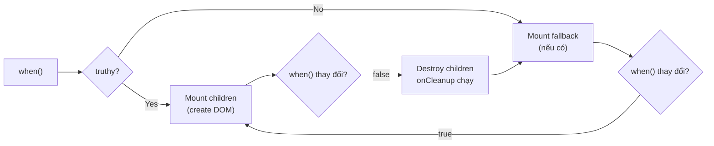
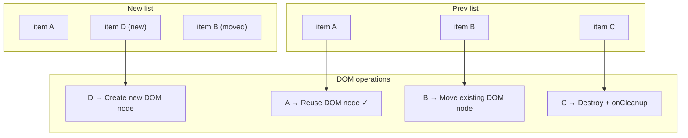

# SolidJS 05 — Control Flow Primitives: Show, For, Index, Switch

#solidjs #frontend #control-flow #phase-1-core

> **Mục tiêu:** Hiểu tại sao SolidJS cần control flow components thay vì JS thuần, nắm vững sự khác biệt giữa `<For>` (keyed) và `<Index>` (by-position), và biết cách xây dựng danh sách phức tạp enterprise không lag.

---

## 🧠 Mental Model — Tại sao không dùng `if` và `map` thông thường?

### Vấn đề với JS control flow trong SolidJS JSX

Trong React, mỗi lần state thay đổi, component function chạy lại toàn bộ — kể cả `array.map()`, `if/else`. Điều này chấp nhận được vì React có VDOM diffing.

**SolidJS không có VDOM.** Component function chỉ chạy **một lần**. Nếu dùng JS control flow thuần:

```tsx
// ❌ VẤN ĐỀ:
function LoanList(props) {
  return (
    <div>
      {/* array.map chạy 1 lần khi component setup */}
      {loans().map(loan => <LoanRow loan={loan} />)}
      {/* → Nếu loans thay đổi sau đó, KHÔNG có gì re-render! */}
    </div>
  );
}
```

SolidJS giải quyết bằng các **reactive control flow components** — chúng wrap logic conditional/iteration bên trong reactive effects, tự động cập nhật DOM khi data thay đổi.

### Control flow là reactive wrappers, không phải sugar syntax

```
<For each={loans()}>
  → Bên trong: createEffect(() => diffList(prev, current))
  → Chỉ create/update/remove DOM nodes bị thay đổi
  → Không re-render toàn bộ list khi 1 item thay đổi
```

---

## ⚙️ Show — Conditional rendering

### Cơ chế: lazy evaluation + optional keying

```tsx
import { Show } from "solid-js";

// Cú pháp cơ bản
<Show when={condition()} fallback={<LoadingSpinner />}>
  <ExpensiveComponent />
</Show>
```

**Cơ chế bên trong:**



### Keyed Show — tránh destroy/recreate

```tsx
// Mặc định: khi when thay đổi từ truthy → falsy → truthy
// → children bị destroy rồi create lại

// Keyed: khi `keyed` prop, khi when thay đổi giữa các truthy values
// → truyền current value vào children callback (type-narrowed)
<Show when={selectedLoan()} keyed>
  {(loan) => (
    // loan ở đây là Loan (không phải Loan | undefined)
    // keyed: khi selectedLoan thay đổi sang loan khác,
    // component này được recreate với data mới
    <LoanDetailPanel loan={loan} />
  )}
</Show>
```

### Pattern: Show với access pattern

```tsx
// Truyền accessor vào children để access giá trị không cần optional chaining
<Show when={currentUser()}>
  {(user) => (
    // user() là accessor → luôn truthy tại đây, type-safe
    <UserProfile
      name={user().name}
      role={user().role}
      branch={user().branchCode}
    />
  )}
</Show>

// Fallback phức tạp
<Show
  when={!isLoading() && loanData()}
  fallback={
    <Switch>
      <Match when={isLoading()}>
        <Skeleton lines={5} />
      </Match>
      <Match when={error()}>
        <ErrorMessage message={error()!.message} />
      </Match>
    </Switch>
  }
>
  <LoanDetailView data={loanData()!} />
</Show>
```

---

## ⚙️ For — Keyed list rendering

### Cơ chế: keyed reconciliation

`<For>` so sánh items bằng **reference equality** (hoặc key function), chỉ update/create/delete items thực sự thay đổi:



### Signature và callback

```tsx
import { For } from "solid-js";

<For each={items()} fallback={<EmptyState />}>
  {(item, index) => (
    // item: T — the item (reactive: object reference stable)
    // index: () => number — SIGNAL: vị trí trong list (reactive)
    <ItemComponent
      item={item}
      position={index() + 1}
    />
  )}
</For>
```

**Quan trọng:** `index` là **signal** (function), không phải number — vì khi reorder, index của item thay đổi nhưng item reference giữ nguyên.

### Pattern banking: Loan list với sort/filter

```tsx
import { For, createMemo, createSignal } from "solid-js";

function LoanListView() {
  const [loans] = useLoanStore();
  const [sortField, setSortField] = createSignal<'amount' | 'date' | 'status'>('date');
  const [filterStatus, setFilterStatus] = createSignal<string>('ALL');

  // Memo: computed, cache, chỉ tính lại khi loans/sort/filter thay đổi
  const displayLoans = createMemo(() => {
    let list = loans.items;
    
    if (filterStatus() !== 'ALL') {
      list = list.filter(l => l.status === filterStatus());
    }
    
    return [...list].sort((a, b) => {
      switch (sortField()) {
        case 'amount': return b.amount - a.amount;
        case 'date': return new Date(b.createdAt).getTime() - new Date(a.createdAt).getTime();
        case 'status': return a.status.localeCompare(b.status);
      }
    });
  });

  return (
    <div>
      <SortFilterBar 
        onSort={setSortField}
        onFilter={setFilterStatus}
      />
      <For each={displayLoans()} fallback={<EmptyLoanState />}>
        {(loan, index) => (
          <LoanRow
            loan={loan}
            rank={index() + 1}
            onSelect={() => setSelectedLoan(loan.id)}
          />
        )}
      </For>
    </div>
  );
}
```

---

## ⚙️ Index — Position-based rendering

### Khi nào dùng Index thay vì For?

```
For   → item reference stable → DOM node gắn với item object
         Phù hợp: objects with unique identity (có id, UUID)
         Khi reorder: move DOM nodes

Index → position stable → DOM node gắn với vị trí index
         Phù hợp: arrays of primitives (numbers, strings)
         Khi reorder: update values in-place (không move DOM)
```

### Index signature — item là signal, index là number

```tsx
import { Index } from "solid-js";

// Ngược với For:
// For:   item là giá trị, index là signal
// Index: item là signal, index là number

<Index each={items()}>
  {(item, index) => (
    // item: () => T — SIGNAL (reactive, value có thể thay đổi)
    // index: number — static position
    <span>{index + 1}. {item()}</span>
  )}
</Index>
```

### So sánh For vs Index với example

```tsx
const [scores, setScores] = createSignal([85, 92, 78, 96]);

// For: mỗi số được gắn DOM node riêng theo value reference
// Khi update scores()[1] từ 92 → 95:
//   For → tìm "92" trong old list → không match "95" → create new DOM
<For each={scores()}>
  {(score) => <ScoreCell score={score} />}
</For>

// Index: DOM node tại position 1 được update in-place
// Khi update scores()[1] từ 92 → 95:
//   Index → DOM node tại index 1 vẫn đó, score signal cập nhật → 95
<Index each={scores()}>
  {(score, i) => <ScoreCell score={score()} position={i} />}
</Index>
```

### Diagram: For vs Index reconciliation

```
Initial: [85, 92, 78]
Update:  [85, 95, 78]  (index 1: 92→95)

<For> behavior:
  [85] → same ref → reuse
  [92] → removed, [95] → created (new DOM node)
  [78] → same ref → reuse

<Index> behavior:
  pos[0] = 85 → same → no change
  pos[1] signal = 95 → update existing DOM node (score() changes)
  pos[2] = 78 → same → no change
```

**Rule of thumb:**
- Array of **objects with id** → `<For>`
- Array of **primitives** (numbers, strings) → `<Index>`
- Table rows với editable cells → `<Index>` (position stable)

---

## ⚙️ Switch & Match — Multi-branch conditional

Tương đương `switch` statement nhưng reactive:

```tsx
import { Switch, Match } from "solid-js";

<Switch fallback={<DefaultView />}>
  <Match when={loanStatus() === 'DRAFT'}>
    <DraftEditor loan={loan()} />
  </Match>
  <Match when={loanStatus() === 'PENDING_APPROVAL'}>
    <ApprovalQueue loan={loan()} approvers={approvers()} />
  </Match>
  <Match when={loanStatus() === 'APPROVED'}>
    <DisbursementSchedule loan={loan()} />
  </Match>
  <Match when={loanStatus() === 'DISBURSED'}>
    <RepaymentTracker loan={loan()} />
  </Match>
  <Match when={['REJECTED', 'CANCELLED'].includes(loanStatus())}>
    <ClosedCaseView loan={loan()} reason={closureReason()} />
  </Match>
</Switch>
```

### Switch là lazy — chỉ evaluate match đang active

```
loanStatus() = 'APPROVED'
  → Chỉ Match when={loanStatus() === 'APPROVED'} được render
  → Các Match khác KHÔNG được evaluate
  → DisbursementSchedule được mount
  → DraftEditor, ApprovalQueue, etc. KHÔNG tồn tại trong DOM
```

---

## ⚙️ ErrorBoundary — Catch rendering errors

```tsx
import { ErrorBoundary } from "solid-js";

<ErrorBoundary
  fallback={(err, reset) => (
    <div class="error-panel">
      <h3>Có lỗi xảy ra</h3>
      <p>{err.message}</p>
      <button onClick={reset}>Thử lại</button>
    </div>
  )}
>
  <LoanDetailPanel loanId={selectedId()} />
</ErrorBoundary>
```

---

## ⚙️ Dynamic — Runtime component selection

```tsx
import { Dynamic } from "solid-js/web";

// Chọn component dựa trên data (không phải conditional)
const STEP_COMPONENTS = {
  'PERSONAL_INFO': PersonalInfoStep,
  'LOAN_DETAILS': LoanDetailsStep,
  'DOCUMENTS': DocumentUploadStep,
  'REVIEW': ReviewStep,
} as const;

<Dynamic
  component={STEP_COMPONENTS[currentStep()]}
  onNext={handleNext}
  onPrev={handlePrev}
  data={stepData()}
/>
```

---

## 💡 Pattern thực chiến — Banking List Patterns

### Pattern 1: Paginated data table với <For>

```tsx
import { For, Show, createMemo } from "solid-js";

function CreditCaseTable() {
  const [cases, { refetch }] = createResource(fetchCreditCases);
  const [page, setPage] = createSignal(1);
  const PAGE_SIZE = 20;

  const paginatedCases = createMemo(() => {
    const all = cases() ?? [];
    const start = (page() - 1) * PAGE_SIZE;
    return all.slice(start, start + PAGE_SIZE);
  });

  const totalPages = createMemo(() =>
    Math.ceil((cases()?.length ?? 0) / PAGE_SIZE)
  );

  return (
    <div class="data-table-wrapper">
      <Show when={!cases.loading} fallback={<TableSkeleton rows={PAGE_SIZE} />}>
        <table class="credit-case-table">
          <thead>
            <tr>
              <th>Mã hồ sơ</th>
              <th>Khách hàng</th>
              <th>Số tiền</th>
              <th>Trạng thái</th>
              <th>Ngày tạo</th>
            </tr>
          </thead>
          <tbody>
            <For each={paginatedCases()} fallback={
              <tr><td colspan="5" class="empty-cell">Không có hồ sơ</td></tr>
            }>
              {(caseItem, index) => (
                <CreditCaseRow
                  case={caseItem}
                  rowNumber={(page() - 1) * PAGE_SIZE + index() + 1}
                />
              )}
            </For>
          </tbody>
        </table>
        <Pagination
          currentPage={page()}
          totalPages={totalPages()}
          onPageChange={setPage}
        />
      </Show>
    </div>
  );
}
```

### Pattern 2: Kanban với Switch/Match per status

```tsx
function LoanKanbanBoard() {
  const [loans] = useLoanStore();
  
  const byStatus = createMemo(() => {
    const grouped: Record<string, Loan[]> = {};
    for (const loan of loans.items) {
      (grouped[loan.status] ??= []).push(loan);
    }
    return grouped;
  });

  return (
    <div class="kanban-board">
      <For each={LOAN_STATUSES}>
        {(status) => (
          <div class="kanban-column">
            <h3 class="column-header">{STATUS_LABELS[status]}</h3>
            <For each={byStatus()[status] ?? []} fallback={<EmptyColumn />}>
              {(loan) => (
                <KanbanCard
                  loan={loan}
                  urgency={
                    <Switch>
                      <Match when={isOverdue(loan)}>
                        <UrgencyBadge level="critical" />
                      </Match>
                      <Match when={isDueSoon(loan)}>
                        <UrgencyBadge level="warning" />
                      </Match>
                    </Switch>
                  }
                />
              )}
            </For>
          </div>
        )}
      </For>
    </div>
  );
}
```

---

## ⚠️ Pitfalls & Anti-patterns

### ❌ Pitfall 1: `.map()` thay vì `<For>` cho reactive list

```tsx
// ❌ SAI: map chạy 1 lần, không reactive sau đó
function BadList() {
  return <ul>{items().map(item => <li>{item.name}</li>)}</ul>;
  // Nếu items() thay đổi sau mount → không update!
}

// ✅ ĐÚNG:
function GoodList() {
  return <ul><For each={items()}>{item => <li>{item.name}</li>}</For></ul>;
}
```

### ❌ Pitfall 2: Dùng For cho primitive arrays

```tsx
const [values, setValues] = createSignal([1, 2, 3]);

// ❌ Suboptimal: For tạo/xóa DOM nodes khi value thay đổi
<For each={values()}>{v => <span>{v}</span>}</For>

// ✅ ĐÚNG: Index update in-place
<Index each={values()}>{(v, i) => <span>{v()}</span>}</Index>
```

### ❌ Pitfall 3: Heavy component trong fallback không lazy

```tsx
// ❌ VẤN ĐỀ: fallback được render ngay khi Show mount
// Nếu fallback là component expensive...
<Show when={data()} fallback={<HeavyEmptyState />}>
  <DataView />
</Show>

// ✅ ĐÚNG nếu fallback cần lazy: dùng Show lồng nhau hoặc Suspense
<Show when={data()} fallback={<SimpleSpinner />}>
  <DataView />
</Show>
```

### ❌ Pitfall 4: Quên rằng For index là signal

```tsx
// ❌ SAI: index là function, không phải number
<For each={items()}>
  {(item, index) => <Row position={index} />}  // truyền function, không phải value!
</For>

// ✅ ĐÚNG: gọi index()
<For each={items()}>
  {(item, index) => <Row position={index()} />}
</For>
```

---

## 🔗 Liên kết

← [[SolidJS-Series/SolidJS-04-JSX-Component-Model|04 · JSX & Component Model]]
→ [[SolidJS-Series/SolidJS-06-Stores-Nested-State|06 · Stores & Nested State]]

**Xem thêm:**
- [[SolidJS-Series/SolidJS-08-Async-Resources|08 · Async & Resources]] — Suspense với control flow
- [[SolidJS-Series/SolidJS-10-Complex-UI-Patterns|10 · Complex UI]] — virtual list cho 100k+ rows

---

*Series: [[SolidJS-Series/SolidJS-MOC|SolidJS Master Index]]*
