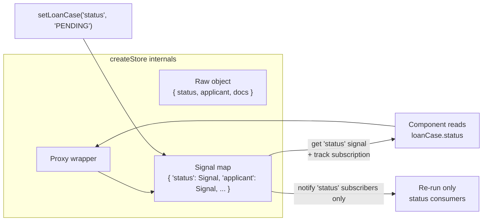
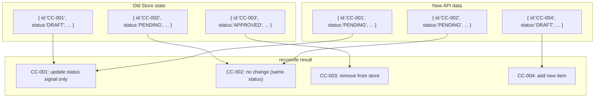

# SolidJS 06 — Stores & Nested State: createStore, produce, reconcile

#solidjs #frontend #store #state-management #phase-2-state

> **Mục tiêu:** Hiểu tại sao Signal không đủ cho nested object, cơ chế Proxy-based reactivity của Store, cách dùng `produce()` cho immutable-style mutation, và `reconcile()` để sync server data — áp dụng vào state management phức tạp banking domain.

---

## 🧠 Mental Model — Vấn đề Signal không giải quyết được

### Signal vs Store: granularity của reactivity

```typescript
// ❌ Signal với nested object: all-or-nothing reactivity
const [loanCase, setLoanCase] = createSignal({
  id: 'LC-001',
  applicant: { name: 'Nguyễn Văn A', income: 50_000_000 },
  documents: [{ type: 'CMND', verified: false }],
  status: 'DRAFT'
});

// Cập nhật 1 field → phải replace toàn bộ object
setLoanCase(prev => ({ ...prev, status: 'PENDING' }));
// → MỌI subscriber của loanCase() đều re-run
// → kể cả những nơi chỉ đọc loanCase().applicant.name

// ✅ Store: fine-grained reactivity tận field level
const [loanCase, setLoanCase] = createStore({
  id: 'LC-001',
  applicant: { name: 'Nguyễn Văn A', income: 50_000_000 },
  documents: [{ type: 'CMND', verified: false }],
  status: 'DRAFT'
});

setLoanCase('status', 'PENDING');
// → CHỈ những subscriber đọc loanCase.status re-run
// → loanCase.applicant.name, loanCase.documents → KHÔNG bị đụng đến
```

### Store dùng Proxy để intercept reads



Mỗi property path trong Store là một Signal ẩn. Khi đọc `store.a.b.c`, SolidJS tạo và track signal cho path `a → b → c`. Khi set path đó, chỉ signal đó notify.

---

## ⚙️ createStore — API và cơ chế

### Signature

```typescript
function createStore<T extends object>(
  store: T | Store<T>,
  options?: { name?: string }
): [get: Store<T>, set: SetStoreFunction<T>];

// Store<T> = deep readonly proxy
// SetStoreFunction có nhiều overload:
type SetStoreFunction<T> = {
  // Set by path (string keys)
  (key: keyof T, value: T[keyof T]): void;
  (key: keyof T, key2: ..., value: ...): void;
  
  // Set bằng function (nhận draft)
  (fn: (state: T) => void): void;
  
  // Set bằng produce (Immer-like)
  ...
}
```

### Path-based setter — nhiều cấp độ

```typescript
const [creditCase, setCreditCase] = createStore({
  id: 'CC-2024-001',
  applicant: {
    personalInfo: {
      name: 'Trần Thị B',
      dob: '1990-05-15',
      idNumber: '001090012345'
    },
    financialInfo: {
      monthlyIncome: 25_000_000,
      otherIncome: 5_000_000,
      existingDebts: 2_000_000
    }
  },
  collaterals: [
    { type: 'REAL_ESTATE', value: 2_000_000_000, verified: false }
  ],
  status: 'DRAFT',
  reviewNotes: ''
});

// Set nested path với spread path args:
setCreditCase('applicant', 'financialInfo', 'monthlyIncome', 30_000_000);
// Chỉ monthlyIncome signal thay đổi

// Set by key:
setCreditCase('status', 'PENDING_APPROVAL');

// Set array item by index:
setCreditCase('collaterals', 0, 'verified', true);

// Set array item dùng filter function:
setCreditCase(
  'collaterals',
  c => c.type === 'REAL_ESTATE', // filter
  'verified',
  true
);

// Set nhiều fields cùng lúc (merge):
setCreditCase('applicant', 'personalInfo', {
  name: 'Trần Thị Bích',
  dob: '1990-05-15',
});
```

### Array mutations

```typescript
const [loanList, setLoanList] = createStore({ items: [] as Loan[] });

// Thêm item:
setLoanList('items', prev => [...prev, newLoan]);

// Remove item:
setLoanList('items', prev => prev.filter(l => l.id !== loanId));

// Update item by condition:
setLoanList(
  'items',
  item => item.id === targetId,  // predicate
  'status',
  'APPROVED'
);

// Update item by index:
setLoanList('items', 2, 'amount', 800_000_000);
```

---

## ⚙️ produce — Immer-style mutations

`produce()` cho phép viết mutation code theo style mutable nhưng thực ra là immutable update — quen thuộc với developer đã dùng Immer/Redux Toolkit:

```typescript
import { produce } from "solid-js/store";

// Thay vì path-based:
setCreditCase('applicant', 'financialInfo', 'monthlyIncome', 30_000_000);

// Dùng produce để viết như mutate trực tiếp:
setCreditCase(produce(draft => {
  draft.applicant.financialInfo.monthlyIncome = 30_000_000;
  draft.applicant.financialInfo.otherIncome += 2_000_000;
  draft.status = 'UNDER_REVIEW';
  draft.reviewNotes = 'Income verified by RM';
}));
// SolidJS detect những gì thực sự thay đổi và chỉ notify đúng signals
```

### produce với array operations

```typescript
setCreditCase(produce(draft => {
  // Thêm collateral
  draft.collaterals.push({
    type: 'VEHICLE',
    value: 500_000_000,
    verified: false
  });
  
  // Remove collateral
  const idx = draft.collaterals.findIndex(c => c.type === 'VEHICLE');
  if (idx >= 0) draft.collaterals.splice(idx, 1);
  
  // Update tất cả collaterals chưa verified
  draft.collaterals
    .filter(c => !c.verified)
    .forEach(c => { c.verified = true; });
}));
```

---

## ⚙️ reconcile — Sync với server data

`reconcile()` so sánh deep và chỉ update những gì thực sự thay đổi — rất quan trọng khi nhận data mới từ API (tránh trigger tất cả subscribers khi chỉ một phần data thay đổi):

```typescript
import { reconcile } from "solid-js/store";

const [cases, setCases] = createStore({ items: [] as CreditCase[] });

// Sau khi fetch từ API:
async function refreshCases() {
  const newData = await fetchCreditCases();
  
  // ❌ Không dùng: thay toàn bộ array → mọi subscriber re-run
  setCases('items', newData);
  
  // ✅ Dùng reconcile: deep diff, chỉ update phần thay đổi
  setCases('items', reconcile(newData, {
    key: 'id',      // identify items by id
    merge: true     // merge thay vì replace (giữ fields không có trong newData)
  }));
}
```

### reconcile diff logic



---

## ⚙️ Store trong component vs outside component

### Shared store (module-level singleton)

```typescript
// store/creditCaseStore.ts
import { createStore } from "solid-js/store";

// Singleton: shared across toàn app
const [creditCases, setCreditCases] = createStore({
  items: [] as CreditCase[],
  loading: false,
  error: null as string | null,
  selectedId: null as string | null,
});

// Selectors (dùng như computed, nhưng không cần Memo vì Store đã fine-grained)
export const selectedCase = () =>
  creditCases.items.find(c => c.id === creditCases.selectedId);

export const pendingCases = () =>
  creditCases.items.filter(c => c.status === 'PENDING_APPROVAL');

// Actions
export function selectCase(id: string) {
  setCreditCases('selectedId', id);
}

export async function loadCases(branchId: string) {
  setCreditCases('loading', true);
  try {
    const data = await fetchCreditCasesByBranch(branchId);
    setCreditCases('items', reconcile(data, { key: 'id' }));
  } catch (e) {
    setCreditCases('error', (e as Error).message);
  } finally {
    setCreditCases('loading', false);
  }
}

export { creditCases, setCreditCases };
```

### Store với Context (per-feature scope)

```typescript
// Dùng khi cần isolate state theo feature, không muốn global
// → Xem [[SolidJS-Series/SolidJS-07-Context-DI|07 · Context]] để kết hợp Store + Context
```

---

## 💡 Pattern thực chiến — Credit Case Management Store

```typescript
// store/loanApplicationStore.ts
import { createStore, produce, reconcile } from "solid-js/store";
import { createMemo, batch } from "solid-js";

export type LoanApplicationState = {
  // Form data
  form: {
    applicantId: string;
    productCode: string;
    requestedAmount: number;
    tenor: number;
    purpose: string;
    collaterals: Collateral[];
  };
  
  // Validation errors per field
  errors: Partial<Record<string, string>>;
  
  // Workflow state
  currentStep: number;
  completedSteps: number[];
  
  // Submission state
  isSubmitting: boolean;
  submittedCaseId: string | null;
};

const INITIAL_STATE: LoanApplicationState = {
  form: {
    applicantId: '',
    productCode: 'PERSONAL_UNSECURED',
    requestedAmount: 0,
    tenor: 12,
    purpose: '',
    collaterals: [],
  },
  errors: {},
  currentStep: 0,
  completedSteps: [],
  isSubmitting: false,
  submittedCaseId: null,
};

const [state, setState] = createStore<LoanApplicationState>(INITIAL_STATE);

// === COMPUTED (dùng trực tiếp — Store đã fine-grained) ===
export const isCurrentStepValid = () =>
  Object.keys(state.errors).length === 0;

export const progressPercent = () =>
  Math.round((state.completedSteps.length / TOTAL_STEPS) * 100);

// === ACTIONS ===
export function updateFormField<K extends keyof LoanApplicationState['form']>(
  field: K,
  value: LoanApplicationState['form'][K]
) {
  setState('form', field, value);
  // Clear error khi user sửa field
  if (state.errors[field]) {
    setState('errors', field as string, undefined!);
  }
}

export function addCollateral(collateral: Collateral) {
  setState('form', 'collaterals', prev => [...prev, collateral]);
}

export function removeCollateral(index: number) {
  setState('form', 'collaterals', prev => prev.filter((_, i) => i !== index));
}

export function setValidationErrors(errors: Record<string, string>) {
  setState('errors', reconcile(errors));
}

export async function submitApplication() {
  setState('isSubmitting', true);
  try {
    const result = await loanAPI.submit(state.form);
    setState(produce(draft => {
      draft.isSubmitting = false;
      draft.submittedCaseId = result.caseId;
    }));
  } catch (e) {
    setState('isSubmitting', false);
    // handle error...
  }
}

export function resetForm() {
  setState(reconcile(INITIAL_STATE));
}

export { state as loanApplicationState };
```

---

## ⚠️ Pitfalls & Anti-patterns

### ❌ Pitfall 1: Destructure store — mất reactivity (giống props!)

```typescript
const [store, setStore] = createStore({ count: 0, name: '' });

// ❌ SAI: destructure store
const { count, name } = store;
// count và name là giá trị tại thời điểm destructure — KHÔNG reactive

// ✅ ĐÚNG: đọc trực tiếp từ store object
store.count  // reactive getter
store.name   // reactive getter
```

### ❌ Pitfall 2: Mutate store trực tiếp (ngoài produce)

```typescript
// ❌ SAI: bypass setter, SolidJS không detect
store.status = 'APPROVED'; // mutation trực tiếp, KHÔNG notify

// ✅ ĐÚNG:
setStore('status', 'APPROVED');
// hoặc:
setStore(produce(d => { d.status = 'APPROVED'; }));
```

### ❌ Pitfall 3: createStore với primitive — dùng Signal thay vì

```typescript
// ❌ Không hợp lý: store cho primitive
const [count, setCount] = createStore(0); // Store cần object

// ✅ ĐÚNG: Signal cho primitive
const [count, setCount] = createSignal(0);

// ✅ Store cho objects:
const [state, setState] = createStore({ count: 0, name: '' });
```

### ❌ Pitfall 4: Không dùng reconcile khi update từ server

```typescript
// ❌ Thay toàn bộ list → tất cả <For> items re-mount
setStore('items', serverData);

// ✅ reconcile: chỉ update phần thực sự thay đổi
setStore('items', reconcile(serverData, { key: 'id' }));
```

---

## 🔗 Liên kết

← [[SolidJS-Series/SolidJS-05-Control-Flow-Primitives|05 · Control Flow Primitives]]
→ [[SolidJS-Series/SolidJS-07-Context-DI|07 · Context & DI]]

**Xem thêm:**
- [[SolidJS-Series/SolidJS-07-Context-DI|07 · Context]] — kết hợp Store + Context thành service layer
- [[SolidJS-Series/SolidJS-10-Complex-UI-Patterns|10 · Complex UI]] — form state management với Store

---

*Series: [[SolidJS-Series/SolidJS-MOC|SolidJS Master Index]]*
