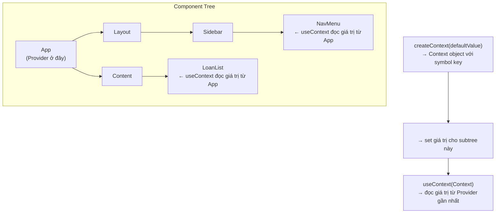
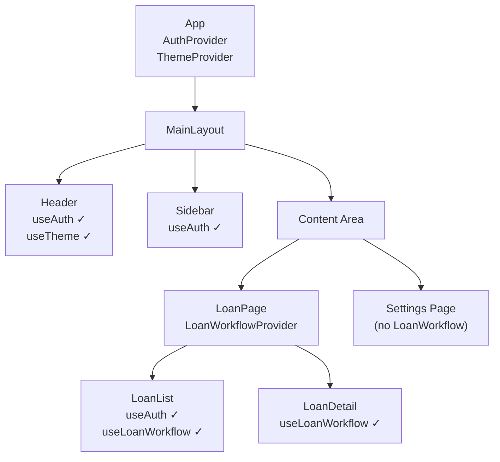

# SolidJS 07 — Context & Dependency Injection: createContext, Provider, Service Layer

#solidjs #frontend #context #dependency-injection #phase-2-state

> **Mục tiêu:** Nắm vững `createContext` để truyền reactive value qua component tree không cần prop drilling, xây dựng **service layer pattern** (Context + Store + custom hook), và áp dụng vào hệ thống phân quyền đa vai trò banking.

---

## 🧠 Mental Model — Vấn đề Context giải quyết

### Prop drilling — anti-pattern trong app lớn

```tsx
// Không có Context: phải truyền data qua mọi cấp
function AppRoot() {
  const [currentUser] = createSignal<User>({ role: 'CREDIT_OFFICER', branchId: 'HN-001' });
  
  return <MainLayout user={currentUser()} />;
}

function MainLayout(props: { user: User }) {
  return <Sidebar user={props.user} />;  // không dùng user, chỉ truyền tiếp
}

function Sidebar(props: { user: User }) {
  return <NavMenu user={props.user} />;  // không dùng user, chỉ truyền tiếp
}

function NavMenu(props: { user: User }) {
  // Cuối cùng mới dùng
  return <div>{props.user.role}</div>;
}
```

### Context — reactive value xuyên suốt component tree

```tsx
// Với Context: component bất kỳ có thể access trực tiếp
function NavMenu() {
  const { currentUser } = useAuthContext(); // lấy từ context, không cần props
  return <div>{currentUser().role}</div>;
}
```

---

## ⚙️ createContext — Cơ chế

### Cơ chế hoạt động



### Signature

```typescript
// Tạo context với default value (dùng khi không có Provider)
function createContext<T>(defaultValue?: T): Context<T>;

// Context object có:
interface Context<T> {
  id: symbol;
  Provider: (props: { value: T; children: JSX.Element }) => JSX.Element;
  defaultValue: T;
}

// Consume:
function useContext<T>(context: Context<T>): T;
```

### createContext với default value vs không

```typescript
// Cách 1: có default (an toàn, không cần Provider)
const ThemeContext = createContext<'light' | 'dark'>('light');

// Cách 2: không có default (throw khi quên Provider — fail-fast)
const AuthContext = createContext<AuthService>();
// → useContext trả về undefined nếu không có Provider
// → Nên bọc check:

function useAuthContext() {
  const ctx = useContext(AuthContext);
  if (!ctx) throw new Error('useAuthContext phải dùng bên trong <AuthProvider>');
  return ctx;
}
```

---

## ⚙️ Service Layer Pattern — Context + Store + Hook

Pattern này là backbone của enterprise SolidJS app: tách logic khỏi UI hoàn toàn.

```
Context = "service locator" (dependency injection container)
Store   = reactive state (single source of truth)
Hook    = API surface (encapsulates access patterns)
```

### Ví dụ: AuthService

```typescript
// services/auth/AuthContext.tsx
import { createContext, useContext, createSignal, createMemo } from "solid-js";
import { createStore, produce } from "solid-js/store";
import type { JSX } from "solid-js";

// 1. Định nghĩa shape của service
type AuthState = {
  user: User | null;
  permissions: Set<string>;
  isLoading: boolean;
};

type AuthService = {
  // State (reactive)
  state: AuthState;
  // Computed
  isAuthenticated: () => boolean;
  hasPermission: (perm: string) => boolean;
  // Actions
  login: (credentials: Credentials) => Promise<void>;
  logout: () => Promise<void>;
};

// 2. Tạo Context
const AuthContext = createContext<AuthService>();

// 3. Provider component — nơi state sống
export function AuthProvider(props: { children: JSX.Element }) {
  const [state, setState] = createStore<AuthState>({
    user: null,
    permissions: new Set(),
    isLoading: true,
  });

  // Computed
  const isAuthenticated = () => state.user !== null;
  const hasPermission = (perm: string) => state.permissions.has(perm);

  // Actions
  async function login(credentials: Credentials) {
    setState('isLoading', true);
    try {
      const { user, permissions } = await authAPI.login(credentials);
      setState(produce(draft => {
        draft.user = user;
        draft.permissions = new Set(permissions);
        draft.isLoading = false;
      }));
    } catch (e) {
      setState('isLoading', false);
      throw e;
    }
  }

  async function logout() {
    await authAPI.logout();
    setState(produce(draft => {
      draft.user = null;
      draft.permissions = new Set();
    }));
  }

  // Khởi tạo: load session từ storage
  onMount(async () => {
    try {
      const session = await authAPI.getSession();
      if (session) {
        setState(produce(draft => {
          draft.user = session.user;
          draft.permissions = new Set(session.permissions);
        }));
      }
    } finally {
      setState('isLoading', false);
    }
  });

  const service: AuthService = {
    state,
    isAuthenticated,
    hasPermission,
    login,
    logout,
  };

  return (
    <AuthContext.Provider value={service}>
      {props.children}
    </AuthContext.Provider>
  );
}

// 4. Hook để consume — fail-fast nếu quên Provider
export function useAuth(): AuthService {
  const ctx = useContext(AuthContext);
  if (!ctx) throw new Error('<AuthProvider> is required');
  return ctx;
}
```

### Sử dụng trong components

```tsx
// Trong bất kỳ component con nào:
function NavBar() {
  const { state, isAuthenticated, hasPermission, logout } = useAuth();
  
  return (
    <nav>
      <Show when={isAuthenticated()}>
        <span>{state.user?.fullName}</span>
        <span class="badge">{state.user?.role}</span>
        
        <Show when={hasPermission('APPROVE_LOAN')}>
          <a href="/approval-queue">Duyệt hồ sơ</a>
        </Show>
        
        <button onClick={logout}>Đăng xuất</button>
      </Show>
    </nav>
  );
}
```

---

## ⚙️ Multi-Context Architecture

Thực tế enterprise app có nhiều service contexts. Tổ chức theo layers:

```tsx
// app.tsx — nest providers theo dependency order
export function App() {
  return (
    <ErrorBoundary fallback={AppErrorFallback}>
      <AuthProvider>               {/* 1. Auth (không depend gì) */}
        <ThemeProvider>            {/* 2. Theme */}
          <NotificationProvider>  {/* 3. Notifications (depend auth) */}
            <LoanWorkflowProvider>{/* 4. Business (depend auth) */}
              <RouterProvider>    {/* 5. Router (outermost) */}
                <AppRoutes />
              </RouterProvider>
            </LoanWorkflowProvider>
          </NotificationProvider>
        </ThemeProvider>
      </AuthProvider>
    </ErrorBoundary>
  );
}
```

### Diagram: Context scope theo component tree



---

## ⚙️ Context chỉ reactive khi value là Signal/Store

Lỗi thường gặp: truyền plain object vào Context — không reactive.

```tsx
// ❌ SAI: plain object không reactive
function BadProvider(props) {
  const user = { name: 'A', role: 'OFFICER' }; // static!
  
  return (
    <UserContext.Provider value={user}>
      {props.children}
    </UserContext.Provider>
  );
}

// ✅ ĐÚNG: value là Signal/Store getter → reactive
function GoodProvider(props) {
  const [user, setUser] = createSignal({ name: 'A', role: 'OFFICER' });
  
  return (
    <UserContext.Provider value={{ user, setUser }}>
      {/* user là getter function → consumers nhận updates */}
      {props.children}
    </UserContext.Provider>
  );
}
```

---

## 💡 Pattern thực chiến — Banking Permission System

### BranchContext: scope theo chi nhánh

```typescript
// contexts/BranchContext.tsx
type BranchService = {
  currentBranch: () => Branch;
  switchBranch: (branchId: string) => Promise<void>;
  canAccessBranch: (branchId: string) => boolean;
  branchLoans: Store<{ items: Loan[]; loading: boolean }>;
};

const BranchContext = createContext<BranchService>();

export function BranchProvider(props: { children: JSX.Element }) {
  const { state: authState, hasPermission } = useAuth(); // consume AuthContext
  
  const [currentBranchId, setCurrentBranchId] = createSignal(
    authState.user?.defaultBranchId ?? ''
  );
  const [branchLoans, setBranchLoans] = createStore({
    items: [] as Loan[],
    loading: false,
  });
  
  // Fetch loans khi branch thay đổi
  createEffect(() => {
    const branchId = currentBranchId();
    if (!branchId) return;
    
    setBranchLoans('loading', true);
    fetchLoansByBranch(branchId)
      .then(loans => setBranchLoans('items', reconcile(loans, { key: 'id' })))
      .finally(() => setBranchLoans('loading', false));
  });

  const currentBranch = createMemo(() =>
    BRANCHES_MAP.get(currentBranchId())!
  );

  // BRANCH_MANAGER có thể xem tất cả branches trong region
  const canAccessBranch = (branchId: string) => {
    if (hasPermission('VIEW_ALL_BRANCHES')) return true;
    return branchId === authState.user?.defaultBranchId;
  };

  async function switchBranch(branchId: string) {
    if (!canAccessBranch(branchId)) throw new Error('Không có quyền truy cập chi nhánh này');
    setCurrentBranchId(branchId);
  }

  return (
    <BranchContext.Provider value={{
      currentBranch,
      switchBranch,
      canAccessBranch,
      branchLoans,
    }}>
      {props.children}
    </BranchContext.Provider>
  );
}

export const useBranch = () => {
  const ctx = useContext(BranchContext);
  if (!ctx) throw new Error('<BranchProvider> is required');
  return ctx;
};
```

### Permission guard HOC pattern

```tsx
// components/PermissionGuard.tsx
function PermissionGuard(props: {
  permission: string;
  fallback?: JSX.Element;
  children: JSX.Element;
}) {
  const { hasPermission } = useAuth();
  
  return (
    <Show
      when={hasPermission(props.permission)}
      fallback={props.fallback ?? <AccessDenied />}
    >
      {props.children}
    </Show>
  );
}

// Sử dụng:
<PermissionGuard permission="APPROVE_LOAN">
  <ApprovalButton onApprove={handleApprove} />
</PermissionGuard>

<PermissionGuard
  permission="VIEW_CREDIT_SCORE"
  fallback={<span class="redacted">* * * * *</span>}
>
  <CreditScoreDisplay score={applicant.creditScore} />
</PermissionGuard>
```

### useNotification — context-based toast service

```typescript
// contexts/NotificationContext.tsx
type Notification = {
  id: string;
  type: 'success' | 'error' | 'warning' | 'info';
  message: string;
  duration?: number;
};

type NotificationService = {
  notifications: Notification[];
  toast: {
    success: (msg: string) => void;
    error: (msg: string) => void;
    warning: (msg: string) => void;
  };
};

const NotificationContext = createContext<NotificationService>();

export function NotificationProvider(props: { children: JSX.Element }) {
  const [notifications, setNotifications] = createStore<Notification[]>([]);

  function addNotification(type: Notification['type'], message: string, duration = 4000) {
    const id = crypto.randomUUID();
    setNotifications(prev => [...prev, { id, type, message }]);
    
    setTimeout(() => {
      setNotifications(prev => prev.filter(n => n.id !== id));
    }, duration);
  }

  const service: NotificationService = {
    notifications,
    toast: {
      success: msg => addNotification('success', msg),
      error: msg => addNotification('error', msg, 6000),
      warning: msg => addNotification('warning', msg),
    },
  };

  return (
    <NotificationContext.Provider value={service}>
      {props.children}
      {/* Render toast container ở đây */}
      <ToastContainer notifications={notifications} />
    </NotificationContext.Provider>
  );
}

export const useNotification = () => useContext(NotificationContext)!;

// Sử dụng ở bất kỳ đâu:
function LoanApprovalAction() {
  const { toast } = useNotification();
  
  async function approve() {
    try {
      await loanAPI.approve(loanId);
      toast.success('Hồ sơ đã được phê duyệt thành công');
    } catch (e) {
      toast.error(`Lỗi phê duyệt: ${e.message}`);
    }
  }
  
  return <button onClick={approve}>Phê duyệt</button>;
}
```

---

## ⚠️ Pitfalls & Anti-patterns

### ❌ Pitfall 1: Context value thay đổi reference mỗi render

```tsx
// ❌ SAI: object literal mới mỗi lần Provider re-render
// → tất cả consumers re-run dù giá trị không đổi
function BadProvider(props) {
  const [count, setCount] = createSignal(0);
  
  return (
    // Object mới tạo mỗi lần Provider render!
    <Ctx.Provider value={{ count, setCount, version: '1.0' }}>
      {props.children}
    </Ctx.Provider>
  );
}

// ✅ ĐÚNG: tạo service object một lần
function GoodProvider(props) {
  const [count, setCount] = createSignal(0);
  
  // Service object tạo 1 lần (component chạy 1 lần)
  const service = { count, setCount, version: '1.0' };
  
  return (
    <Ctx.Provider value={service}>
      {props.children}
    </Ctx.Provider>
  );
}
```

### ❌ Pitfall 2: Một God Context cho toàn bộ app state

```typescript
// ❌ Anti-pattern: AppContext chứa mọi thứ
const AppContext = createContext<{
  auth: AuthState;
  loans: LoanState;
  notifications: Notification[];
  theme: Theme;
  // ... 20 more fields
}>();
// → Bất kỳ thay đổi nào cũng notify mọi consumer

// ✅ ĐÚNG: Context nhỏ, focused theo domain
const AuthContext = createContext<AuthService>();
const LoanContext = createContext<LoanService>();
const UIContext = createContext<UIService>(); // theme, notifications
```

### ❌ Pitfall 3: useContext ngoài component tree

```typescript
// ❌ SAI: gọi useContext ở module top-level
const auth = useContext(AuthContext); // undefined! Không có Provider

// ✅ ĐÚNG: luôn trong component body hoặc trong custom hook
function usePermission(perm: string) {
  const auth = useContext(AuthContext); // trong hook → OK
  return () => auth?.hasPermission(perm) ?? false;
}
```

---

## 🔗 Liên kết

← [[SolidJS-Series/SolidJS-06-Stores-Nested-State|06 · Stores & Nested State]]
→ [[SolidJS-Series/SolidJS-08-Async-Resources|08 · Async & Resources]]

**Xem thêm:**
- [[SolidJS-Series/SolidJS-06-Stores-Nested-State|06 · Stores]] — Store bên trong Context
- [[SolidJS-Series/SolidJS-10-Complex-UI-Patterns|10 · Complex UI]] — Context cho form wizard

---

*Series: [[SolidJS-Series/SolidJS-MOC|SolidJS Master Index]]*
