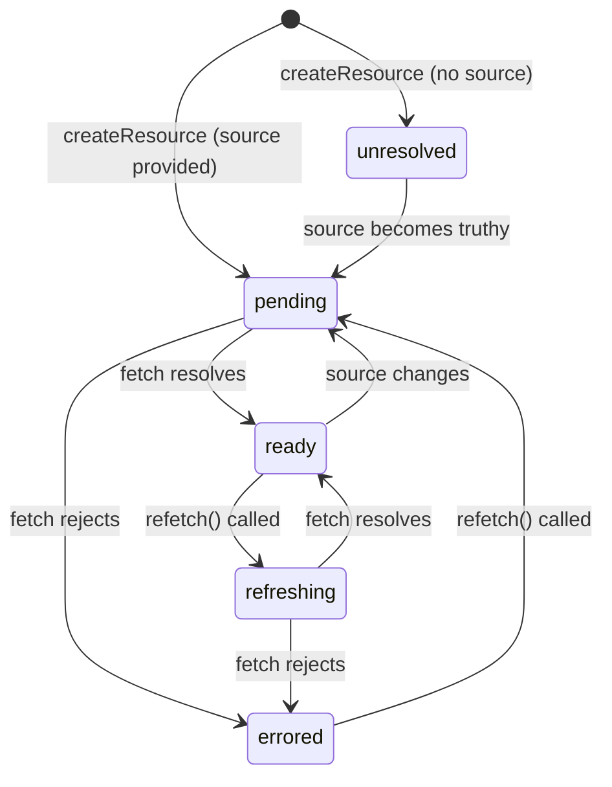

# SolidJS 08 — Async & Resources: createResource, Suspense, ErrorBoundary

#solidjs #frontend #async #resources #suspense #phase-2-state

> **Mục tiêu:** Nắm vững `createResource` để biến async fetching thành reactive source, cách `Suspense` boundary quản lý loading state declarative, `ErrorBoundary` cho error recovery, và các patterns async phức tạp (optimistic update, pagination, polling) trong banking UI.

---

## 🧠 Mental Model — Tại sao cần createResource thay vì fetch trong Effect?

### Vấn đề với fetch trong createEffect

```typescript
// ❌ Anti-pattern: async trong effect
const [loanData, setLoanData] = createSignal<Loan | null>(null);
const [isLoading, setIsLoading] = createSignal(false);
const [error, setError] = createSignal<Error | null>(null);

createEffect(() => {
  const id = selectedLoanId();
  setIsLoading(true);
  setError(null);
  
  fetchLoan(id)
    .then(data => { setLoanData(data); setIsLoading(false); })
    .catch(e => { setError(e); setIsLoading(false); });
  
  // Vấn đề 1: Race condition — request cũ có thể arrive sau request mới
  // Vấn đề 2: Boilerplate loading/error state mỗi nơi
  // Vấn đề 3: Không integrate với <Suspense>
  // Vấn đề 4: Không có refetch, mutate API
});
```

### createResource: first-class async primitive

```typescript
// ✅ createResource giải quyết tất cả:
const [loan, { refetch, mutate }] = createResource(selectedLoanId, fetchLoan);

loan()          // data (undefined khi loading)
loan.loading    // boolean
loan.error      // Error | undefined
loan.state      // 'unresolved' | 'pending' | 'ready' | 'refreshing' | 'errored'
```

---

## ⚙️ createResource — Cơ chế

### State machine của Resource



### Signature

```typescript
// Overload 1: không có source (chỉ fetcher, không reactive trigger)
function createResource<T>(
  fetcher: () => Promise<T>,
  options?: ResourceOptions<T>
): ResourceReturn<T>;

// Overload 2: có source signal (re-fetch khi source thay đổi)
function createResource<T, S>(
  source: () => S | false | null | undefined,
  fetcher: (source: S, info: { value: T | undefined; refetching: boolean }) => Promise<T>,
  options?: ResourceOptions<T>
): ResourceReturn<T>;

type ResourceOptions<T> = {
  initialValue?: T;
  name?: string;
  deferStream?: boolean; // SSR streaming
  ssrLoadFrom?: 'initial' | 'server';
  storage?: () => Signal<T | undefined>; // custom storage
  onHydrated?: (k: unknown, info: { value: T | undefined }) => void;
};

type ResourceReturn<T> = [
  Resource<T>,
  {
    mutate: (value: T | undefined) => T | undefined; // update local tanpa refetch
    refetch: (info?: unknown) => T | Promise<T | undefined> | undefined | null;
  }
];
```

### Source signal — re-fetch khi dependency thay đổi

```typescript
const [selectedLoanId, setSelectedLoanId] = createSignal<string | null>(null);

// source = () => selectedLoanId()
// fetcher nhận giá trị truthy của source
const [loan, { refetch }] = createResource(
  () => selectedLoanId(), // source: null → skip fetch; string → fetch
  async (loanId, { value: prevLoan }) => {
    // loanId: string (truthy, type-narrowed)
    // prevLoan: Loan | undefined (giá trị trước)
    return await loanAPI.getLoan(loanId);
  }
);

// Khi selectedLoanId() đổi từ null → 'LC-001':
// → Resource state: unresolved → pending → ready
// Khi selectedLoanId() đổi từ 'LC-001' → 'LC-002':
// → Resource state: ready → pending (với prevValue = loan cũ)
```

---

## ⚙️ Suspense — Declarative loading UI

`<Suspense>` là boundary bắt trạng thái pending của tất cả Resources bên trong nó. Khi bất kỳ Resource nào trong subtree đang `pending`, Suspense hiển thị `fallback`.

```tsx
import { Suspense } from "solid-js";

function LoanDetailPage(props: { loanId: string }) {
  const [loan] = createResource(
    () => props.loanId,
    loanAPI.getLoan
  );

  // KHÔNG cần check loan.loading — Suspense handle
  return (
    <Suspense fallback={<LoanDetailSkeleton />}>
      {/* Chỉ render khi loan() có data */}
      <LoanDetailView loan={loan()!} />
    </Suspense>
  );
}
```

### Suspense waterfall vs parallel loading

```tsx
// ❌ Waterfall: loan xong mới bắt đầu fetch documents
function WaterfallPage() {
  const [loan] = createResource(() => loanId(), fetchLoan);
  
  return (
    <Suspense fallback={<Skeleton />}>
      <div>
        <LoanHeader loan={loan()!} />
        <Suspense fallback={<DocSkeleton />}>
          {/* documents fetch BẮT ĐẦU sau khi loan ready */}
          <Documents loanId={loan()?.id} />
        </Suspense>
      </div>
    </Suspense>
  );
}

// ✅ Parallel: cả hai fetch cùng lúc
function ParallelPage() {
  const [loan] = createResource(() => loanId(), fetchLoan);
  const [documents] = createResource(() => loanId(), fetchDocuments);
  // Hai resource fetch song song ngay từ đầu
  
  return (
    <Suspense fallback={<FullPageSkeleton />}>
      {/* Chỉ show khi CẢ HAI ready */}
      <LoanHeader loan={loan()!} />
      <Documents docs={documents()!} />
    </Suspense>
  );
}
```

### Nested Suspense — independent loading zones

```tsx
function CreditCaseDashboard() {
  const [summary] = createResource(fetchDashboardSummary);
  
  return (
    <div class="dashboard">
      {/* Zone 1: summary load độc lập */}
      <Suspense fallback={<SummarySkeleton />}>
        <DashboardSummary data={summary()!} />
      </Suspense>

      <div class="dashboard-panels">
        {/* Zone 2 và 3 load song song, độc lập nhau */}
        <Suspense fallback={<PanelSkeleton />}>
          <PendingCasesPanel />
        </Suspense>
        
        <Suspense fallback={<PanelSkeleton />}>
          <RecentApprovalPanel />
        </Suspense>
      </div>
    </div>
  );
}
```

---

## ⚙️ ErrorBoundary — Error recovery

```tsx
import { ErrorBoundary } from "solid-js";

function LoanPage() {
  return (
    <ErrorBoundary
      fallback={(err, reset) => (
        <div class="error-state">
          <i class="icon-warning" />
          <h3>Không thể tải dữ liệu hồ sơ</h3>
          <p class="error-detail">{err.message}</p>
          <div class="error-actions">
            <button onClick={reset} class="btn-primary">
              Thử lại
            </button>
            <button onClick={() => navigate('/loans')} class="btn-secondary">
              Về danh sách
            </button>
          </div>
        </div>
      )}
    >
      <Suspense fallback={<LoanSkeleton />}>
        <LoanDetailContent />
      </Suspense>
    </ErrorBoundary>
  );
}
```

### Kết hợp ErrorBoundary + Suspense — thứ tự quan trọng

```tsx
// ✅ ĐÚNG: ErrorBoundary bao ngoài Suspense
<ErrorBoundary fallback={ErrorUI}>
  <Suspense fallback={LoadingUI}>
    <AsyncContent />
  </Suspense>
</ErrorBoundary>

// ❌ SAI: Suspense bao ngoài ErrorBoundary
// → loading state của ErrorBoundary fallback bị Suspense bắt
<Suspense fallback={LoadingUI}>
  <ErrorBoundary fallback={ErrorUI}>
    <AsyncContent />
  </ErrorBoundary>
</Suspense>
```

---

## ⚙️ refetch & mutate — Controlling resource lifecycle

### refetch — Trigger lại fetch

```typescript
const [loan, { refetch }] = createResource(() => loanId(), fetchLoan);

// Refetch manually (sau action, sau WebSocket event)
async function handleApprove() {
  await loanAPI.approve(loanId());
  refetch(); // re-fetch để lấy state mới nhất từ server
}

// Refetch với custom info (truyền xuống fetcher)
refetch({ reason: 'approval_completed' });
// fetcher nhận: (source, { refetching: { reason: 'approval_completed' } })
```

### mutate — Optimistic update

```typescript
const [loan, { mutate, refetch }] = createResource(
  () => loanId(),
  fetchLoan
);

// Optimistic update: cập nhật local trước, sync server sau
async function handleStatusChange(newStatus: LoanStatus) {
  const previousLoan = loan(); // backup
  
  // 1. Update UI ngay lập tức (optimistic)
  mutate(prev => prev ? { ...prev, status: newStatus } : undefined);
  
  try {
    // 2. Gọi API
    await loanAPI.updateStatus(loanId(), newStatus);
    // 3. Refetch để sync chính xác từ server
    refetch();
  } catch (e) {
    // 4. Rollback nếu lỗi
    mutate(previousLoan);
    toast.error('Cập nhật thất bại, đã hoàn tác');
  }
}
```

---

## ⚙️ lazy — Code splitting cho components

```typescript
import { lazy, Suspense } from "solid-js";

// lazy wrap: component chỉ load khi được render lần đầu
const LoanAnalyticsChart = lazy(() =>
  import('./components/LoanAnalyticsChart')
);

const DocumentViewer = lazy(() =>
  import('./components/DocumentViewer')
);

// Sử dụng: bọc trong Suspense để handle loading state
function LoanReportPage() {
  return (
    <div>
      <h1>Báo cáo hồ sơ</h1>
      <Suspense fallback={<ChartSkeleton />}>
        <LoanAnalyticsChart />
      </Suspense>
      <Suspense fallback={<ViewerSkeleton />}>
        <DocumentViewer />
      </Suspense>
    </div>
  );
}
```

---

## 💡 Pattern thực chiến — Banking Async Patterns

### Pattern 1: Infinite scroll / Load more

```tsx
function LoanListInfinite() {
  const [page, setPage] = createSignal(1);
  const [allLoans, setAllLoans] = createStore<Loan[]>([]);
  const [hasMore, setHasMore] = createSignal(true);

  const [pageData, { refetch }] = createResource(page, async (p) => {
    const { items, total } = await loanAPI.list({ page: p, size: 20 });
    return { items, hasMore: p * 20 < total };
  });

  // Append khi page data thay đổi
  createEffect(() => {
    const data = pageData();
    if (!data) return;
    
    if (page() === 1) {
      setAllLoans(reconcile(data.items, { key: 'id' }));
    } else {
      setAllLoans(prev => [...prev, ...data.items]);
    }
    setHasMore(data.hasMore);
  });

  return (
    <div>
      <For each={allLoans}>{loan => <LoanRow loan={loan} />}</For>
      
      <Show when={hasMore()}>
        <button
          onClick={() => setPage(p => p + 1)}
          disabled={pageData.loading}
          class="load-more-btn"
        >
          {pageData.loading ? 'Đang tải...' : 'Tải thêm'}
        </button>
      </Show>
    </div>
  );
}
```

### Pattern 2: Dependent resources (fetch theo sequence)

```tsx
function CreditCaseFullView(props: { caseId: string }) {
  // Resource 1: case header
  const [caseData] = createResource(
    () => props.caseId,
    caseAPI.getCase
  );

  // Resource 2: depend vào resource 1 (applicantId từ case)
  const [creditReport] = createResource(
    () => caseData()?.applicant?.cifCode, // source: undefined khi caseData chưa có
    creditAPI.getReport
  );

  // Resource 3: collateral valuation
  const [collaterals] = createResource(
    () => props.caseId,
    collateralAPI.getByCase
  );

  return (
    <>
      {/* Suspense 1: case header + credit report cùng zone */}
      <Suspense fallback={<HeaderSkeleton />}>
        <CaseHeader case={caseData()!} />
        <Suspense fallback={<ReportSkeleton />}>
          <CreditReport report={creditReport()!} />
        </Suspense>
      </Suspense>

      {/* Suspense 2: collaterals độc lập */}
      <Suspense fallback={<CollateralSkeleton />}>
        <CollateralList items={collaterals()!} />
      </Suspense>
    </>
  );
}
```

### Pattern 3: Resource với real-time polling

```typescript
function createPollingResource<T>(
  source: () => string | null,
  fetcher: (id: string) => Promise<T>,
  intervalMs: number = 5000
) {
  const [resource, { refetch }] = createResource(source, fetcher);

  // Setup polling khi resource ready
  createEffect(() => {
    if (!source() || resource.state === 'errored') return;
    
    const id = setInterval(() => refetch(), intervalMs);
    onCleanup(() => clearInterval(id));
  });

  return resource;
}

// Sử dụng: poll trạng thái disbursement mỗi 5s
const disbursementStatus = createPollingResource(
  () => activeDisbursementId(),
  disbursementAPI.getStatus,
  5000
);
```

### Pattern 4: createResource với cache layer

```typescript
// Simple in-memory cache để avoid refetch khi quay lại page
const loanCache = new Map<string, Loan>();

const [loan] = createResource(
  () => loanId(),
  async (id) => {
    // Trả cache nếu có
    if (loanCache.has(id)) return loanCache.get(id)!;
    
    const data = await loanAPI.getLoan(id);
    loanCache.set(id, data);
    return data;
  }
);

// Hoặc dùng createResource storage option với custom Signal:
// (cho phép persist resource state qua re-mounts)
const [loan] = createResource(
  () => loanId(),
  loanAPI.getLoan,
  { initialValue: loanCache.get(loanId()) }
);
```

---

## ⚠️ Pitfalls & Anti-patterns

### ❌ Pitfall 1: Đọc resource() ngoài Suspense mà không handle undefined

```tsx
// ❌ SAI: loan() là undefined khi loading → crash!
function LoanPage() {
  const [loan] = createResource(() => id(), fetchLoan);
  return <div>{loan().applicantName}</div>; // TypeError khi loading
}

// ✅ ĐÚNG: dùng Suspense hoặc check thủ công
function LoanPage() {
  const [loan] = createResource(() => id(), fetchLoan);
  return (
    <Suspense fallback={<Skeleton />}>
      <div>{loan()?.applicantName}</div>
    </Suspense>
  );
}
```

### ❌ Pitfall 2: Source trả về object mới mỗi lần

```typescript
// ❌ SAI: object literal mới → re-fetch liên tục dù giá trị giống
const [data] = createResource(
  () => ({ id: loanId(), branch: branchId() }), // new object mỗi lần
  fetchWithParams
);

// ✅ ĐÚNG: primitive source hoặc dùng createMemo
const sourceKey = createMemo(() => `${loanId()}-${branchId()}`);
const [data] = createResource(sourceKey, fetchWithKey);
```

### ❌ Pitfall 3: Async trong fetcher không cancel race conditions

```typescript
// SolidJS tự handle race condition: khi source thay đổi trước khi
// fetch trước đó hoàn thành, kết quả cũ bị ignore tự động ✓
// Bạn không cần AbortController cho race condition cơ bản.

// Tuy nhiên, để cancel network request (giải phóng resource):
const [data] = createResource(
  () => id(),
  async (id, { signal }) => { // signal: AbortSignal từ SolidJS v1.8+
    const res = await fetch(`/api/${id}`, { signal });
    return res.json();
  }
);
```

---

## 🔗 Liên kết

← [[SolidJS-Series/SolidJS-07-Context-DI|07 · Context & DI]]
→ [[SolidJS-Series/SolidJS-09-Routing|09 · Routing]]

**Xem thêm:**
- [[SolidJS-Series/SolidJS-09-Routing|09 · Routing]] — Route data loaders (alternative to createResource)
- [[SolidJS-Series/SolidJS-11-SolidStart-SSR|11 · SolidStart]] — server-side resource với `"use server"`

---

*Series: [[SolidJS-Series/SolidJS-MOC|SolidJS Master Index]]*
