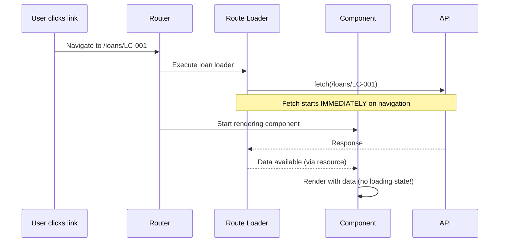

# SolidJS 09 — Routing: @solidjs/router, Nested Routes, Data Loaders

#solidjs #frontend #routing #solidjs-router #phase-2-state

> **Mục tiêu:** Nắm vững `@solidjs/router` — config-based và file-based routing, nested routes với `<Outlet>`, route data loaders chạy parallel, search params reactive, và navigation guards cho hệ thống phân quyền banking đa module.

---

## 🧠 Mental Model — Router trong SolidJS khác gì React Router?

### Điểm tương đồng
Cả hai đều dùng declarative route tree, nested routes, params, search params.

### Điểm khác biệt quan trọng

| Tiêu chí | React Router v6 | @solidjs/router |
|---|---|---|
| Loader execution | Parallel (Remix-style) | Parallel, tích hợp với Suspense |
| Params/search | Hooks, re-render component | Signals — fine-grained reactive |
| Navigation | `useNavigate()` hook | `useNavigate()` — nhưng không trigger re-render |
| Route component | Re-renders on nav | Chạy 1 lần, reactive updates |
| Data fetching | loader function | `createAsync` / `load()` trong route def |

### Router là reactive — params là signals

```typescript
// React Router: params thay đổi → component re-render toàn bộ
function LoanPage() {
  const { loanId } = useParams(); // string, component re-runs
}

// SolidJS: params là signal, chỉ những phần đọc params() re-run
function LoanPage() {
  const params = useParams<{ loanId: string }>();
  // params.loanId là reactive getter
  // Chỉ DOM nodes và effects đọc params.loanId sẽ update
}
```

---

## ⚙️ Setup và Route Definition

### Cài đặt

```bash
npm install @solidjs/router
```

### Config-based routing

```tsx
// app.tsx
import { Router, Route } from "@solidjs/router";
import { lazy } from "solid-js";

// Lazy load cho code splitting
const Dashboard = lazy(() => import('./pages/Dashboard'));
const LoanListPage = lazy(() => import('./pages/loans/LoanList'));
const LoanDetailPage = lazy(() => import('./pages/loans/LoanDetail'));
const CreditCasePage = lazy(() => import('./pages/credit/CreditCase'));
const ApprovalQueuePage = lazy(() => import('./pages/approval/ApprovalQueue'));
const NotFoundPage = lazy(() => import('./pages/NotFound'));

export function App() {
  return (
    <Router>
      <Route path="/" component={AppLayout}>
        {/* Index route */}
        <Route path="/" component={Dashboard} />

        {/* Loans module */}
        <Route path="/loans" component={LoanLayout}>
          <Route path="/" component={LoanListPage} />
          <Route path="/:loanId" component={LoanDetailPage} />
          <Route path="/:loanId/edit" component={LoanEditPage} />
        </Route>

        {/* Credit Cases module */}
        <Route path="/credit" component={CreditLayout}>
          <Route path="/" component={CreditCaseListPage} />
          <Route path="/new" component={NewCreditCasePage} />
          <Route path="/:caseId" component={CreditCasePage} />
        </Route>

        {/* Approval Queue */}
        <Route path="/approval" component={ApprovalQueuePage} />

        {/* Settings — nested */}
        <Route path="/settings" component={SettingsLayout}>
          <Route path="/profile" component={ProfilePage} />
          <Route path="/security" component={SecurityPage} />
        </Route>

        {/* 404 */}
        <Route path="*" component={NotFoundPage} />
      </Route>
    </Router>
  );
}
```

### Layout component với Outlet

```tsx
// layouts/AppLayout.tsx
import { Outlet } from "@solidjs/router";
import { Suspense } from "solid-js";

function AppLayout() {
  return (
    <div class="app-shell">
      <Navbar />
      <div class="app-body">
        <Sidebar />
        <main class="main-content">
          {/* Outlet: render child route component tại đây */}
          <Suspense fallback={<PageSkeleton />}>
            <Outlet />
          </Suspense>
        </main>
      </div>
    </div>
  );
}

// layouts/LoanLayout.tsx — sub-layout cho loans module
function LoanLayout() {
  return (
    <div class="loan-module">
      <LoanModuleHeader />
      <LoanModuleTabs />
      <Outlet />  {/* LoanList hoặc LoanDetail render ở đây */}
    </div>
  );
}
```

---

## ⚙️ Route Params — useParams

```typescript
import { useParams } from "@solidjs/router";

function LoanDetailPage() {
  // useParams trả về reactive object (Proxy)
  const params = useParams<{ loanId: string }>();
  
  // params.loanId là reactive getter — re-reads khi URL thay đổi
  const [loan] = createResource(
    () => params.loanId,  // tracked: re-fetch khi loanId thay đổi
    loanAPI.getLoan
  );

  return (
    <Suspense fallback={<LoanSkeleton />}>
      <LoanDetailView loan={loan()!} />
    </Suspense>
  );
}
```

---

## ⚙️ Search Params — useSearchParams

Search params là **reactive signal** trong SolidJS — thay đổi URL search → chỉ những phần đọc search param đó cập nhật.

```typescript
import { useSearchParams } from "@solidjs/router";

function LoanListPage() {
  const [searchParams, setSearchParams] = useSearchParams<{
    status?: string;
    branch?: string;
    page?: string;
    q?: string;
  }>();

  // Đọc params — reactive
  const currentPage = () => parseInt(searchParams.page ?? '1');
  const statusFilter = () => searchParams.status ?? 'ALL';

  // Update params — cập nhật URL (browser history entry)
  function handleStatusChange(status: string) {
    setSearchParams({ status, page: '1' }); // reset page khi filter thay đổi
  }

  function handleSearch(query: string) {
    setSearchParams({ q: query, page: '1' });
  }

  // Resource reactive theo search params
  const [loans] = createResource(
    () => ({
      status: statusFilter(),
      page: currentPage(),
      q: searchParams.q,
    }),
    async (params) => loanAPI.list(params)
  );

  return (
    <div>
      <SearchBar
        value={searchParams.q ?? ''}
        onSearch={handleSearch}
      />
      <StatusFilter
        value={statusFilter()}
        onChange={handleStatusChange}
      />
      <Suspense fallback={<TableSkeleton />}>
        <LoanTable loans={loans()!} />
        <Pagination
          page={currentPage()}
          onPageChange={p => setSearchParams({ page: String(p) })}
        />
      </Suspense>
    </div>
  );
}
```

### setSearchParams options

```typescript
// Mặc định: thêm vào browser history (back button hoạt động)
setSearchParams({ page: '2' });

// Replace: không thêm vào history (filter change không cần back)
setSearchParams({ status: 'PENDING' }, { replace: true });

// Merge: giữ params cũ, chỉ update params mới
setSearchParams({ page: '1' }); // merge tự động ✓
```

---

## ⚙️ Navigation — useNavigate

```typescript
import { useNavigate } from "@solidjs/router";

function LoanActions(props: { loanId: string }) {
  const navigate = useNavigate();

  function handleViewDetail() {
    navigate(`/loans/${props.loanId}`);
  }

  function handleEditWithState() {
    // Truyền state (không hiển thị trên URL)
    navigate(`/loans/${props.loanId}/edit`, {
      state: { returnUrl: '/loans' }
    });
  }

  function handleBackOrFallback() {
    navigate(-1); // browser back
    // Hoặc:
    navigate('/loans', { replace: true }); // replace current history entry
  }

  return (
    <div>
      <button onClick={handleViewDetail}>Xem chi tiết</button>
      <button onClick={handleEditWithState}>Chỉnh sửa</button>
    </div>
  );
}
```

---

## ⚙️ Route Data Loaders — Parallel Preloading

Data loaders cho phép bắt đầu fetch **trước khi** component render — giảm waterfall:



### Cách implement Route Loader

```typescript
// pages/loans/LoanDetail.tsx
import { createAsync, type RouteDefinition } from "@solidjs/router";

// 1. Khai báo preload function (chạy khi navigate đến route)
export const route = {
  preload: ({ params }) => {
    // Bắt đầu fetch ngay khi navigate, không đợi component mount
    void loanAPI.getLoan(params.loanId);          // preload loan
    void documentsAPI.getByLoan(params.loanId);   // preload docs parallel
  }
} satisfies RouteDefinition;

// 2. Trong component: dùng createAsync để consume preloaded data
function LoanDetailPage() {
  const params = useParams<{ loanId: string }>();
  
  // createAsync: tận dụng preloaded cache, không fetch lại nếu đã có
  const loan = createAsync(() => loanAPI.getLoan(params.loanId));
  const documents = createAsync(() => documentsAPI.getByLoan(params.loanId));

  return (
    <Suspense fallback={<LoanSkeleton />}>
      <LoanHeader loan={loan()!} />
      <Suspense fallback={<DocSkeleton />}>
        <DocumentList docs={documents()!} />
      </Suspense>
    </Suspense>
  );
}
```

---

## ⚙️ Navigation Guards — Route Protection

```tsx
// Route-level auth guard:
function AuthGuard(props: {
  permission?: string;
  children: JSX.Element;
}) {
  const { isAuthenticated, hasPermission } = useAuth();
  const navigate = useNavigate();
  const location = useLocation();

  // Reactive guard: re-check khi auth state thay đổi
  createEffect(() => {
    if (!isAuthenticated()) {
      navigate('/login', {
        replace: true,
        state: { returnUrl: location.pathname }
      });
      return;
    }
    
    if (props.permission && !hasPermission(props.permission)) {
      navigate('/403', { replace: true });
    }
  });

  return (
    <Show when={isAuthenticated()}>
      {props.children}
    </Show>
  );
}

// Áp dụng vào route:
<Route path="/approval" component={() => (
  <AuthGuard permission="APPROVE_LOAN">
    <ApprovalQueuePage />
  </AuthGuard>
)} />
```

### useBeforeLeave — Confirm khi rời trang có unsaved changes

```typescript
import { useBeforeLeave } from "@solidjs/router";

function LoanEditPage() {
  const [isDirty, setIsDirty] = createSignal(false);

  useBeforeLeave((e) => {
    if (isDirty() && !e.defaultPrevented) {
      e.preventDefault();
      
      // Show confirm dialog
      if (window.confirm('Bạn có thay đổi chưa lưu. Rời trang?')) {
        e.retry(true); // force navigate
      }
    }
  });

  return (
    <form onChange={() => setIsDirty(true)}>
      {/* form fields */}
    </form>
  );
}
```

---

## ⚙️ useLocation & useIsRouting

```typescript
import { useLocation, useIsRouting } from "@solidjs/router";

function Navbar() {
  const location = useLocation();
  const isRouting = useIsRouting(); // true trong khi transition

  // Highlight active nav item reactively
  const isLoansActive = () => location.pathname.startsWith('/loans');
  const isCreditActive = () => location.pathname.startsWith('/credit');

  return (
    <nav>
      {/* Global loading indicator khi navigate */}
      <Show when={isRouting()}>
        <div class="nav-progress-bar" />
      </Show>
      
      <a href="/loans" class={isLoansActive() ? 'active' : ''}>
        Khoản vay
      </a>
      <a href="/credit" class={isCreditActive() ? 'active' : ''}>
        Hồ sơ tín dụng
      </a>
    </nav>
  );
}
```

---

## 💡 Pattern thực chiến — Banking Multi-Module Router

### Full route tree cho PDMS-style app

```tsx
// app.tsx
export function App() {
  return (
    <Router>
      {/* Public routes — không cần auth */}
      <Route path="/login" component={LoginPage} />
      <Route path="/403" component={ForbiddenPage} />
      
      {/* Protected routes — cần auth */}
      <Route path="/" component={() => (
        <AuthGuard>
          <AppLayout />
        </AuthGuard>
      )}>
        <Route path="/" component={Dashboard} />

        {/* === LOAN MODULE === */}
        <Route path="/loans" component={LoanModuleLayout}>
          <Route path="/" component={LoanListPage} />
          <Route path="/new" component={() => (
            <AuthGuard permission="CREATE_LOAN">
              <NewLoanPage />
            </AuthGuard>
          )} />
          <Route path="/:loanId" component={LoanDetailPage} />
          <Route path="/:loanId/disbursement" component={() => (
            <AuthGuard permission="PROCESS_DISBURSEMENT">
              <DisbursementPage />
            </AuthGuard>
          )} />
        </Route>

        {/* === CREDIT CASE MODULE === */}
        <Route path="/credit-cases" component={CreditCaseLayout}>
          <Route path="/" component={CreditCaseListPage} />
          <Route path="/new" component={NewCreditCasePage} />
          <Route path="/:caseId" component={CreditCaseDetailPage} />
          <Route path="/:caseId/approval" component={() => (
            <AuthGuard permission="APPROVE_CREDIT_CASE">
              <ApprovalWorkflowPage />
            </AuthGuard>
          )} />
        </Route>

        {/* === REPORTS MODULE === */}
        <Route path="/reports" component={() => (
          <AuthGuard permission="VIEW_REPORTS">
            <ReportsLayout />
          </AuthGuard>
        )}>
          <Route path="/daily" component={DailyReportPage} />
          <Route path="/portfolio" component={PortfolioReportPage} />
          <Route path="/delinquency" component={DelinquencyReportPage} />
        </Route>

        <Route path="*" component={NotFoundPage} />
      </Route>
    </Router>
  );
}
```

### Breadcrumb reactive từ location

```tsx
function Breadcrumb() {
  const location = useLocation();
  const params = useParams();
  
  const breadcrumbs = createMemo(() => {
    const segments = location.pathname.split('/').filter(Boolean);
    return buildBreadcrumbs(segments, params);
  });

  return (
    <nav class="breadcrumb">
      <For each={breadcrumbs()}>
        {(crumb, index) => (
          <>
            <Show when={index() > 0}>
              <span class="separator">/</span>
            </Show>
            <Show
              when={index() < breadcrumbs().length - 1}
              fallback={<span class="current">{crumb.label}</span>}
            >
              <a href={crumb.path}>{crumb.label}</a>
            </Show>
          </>
        )}
      </For>
    </nav>
  );
}
```

---

## ⚠️ Pitfalls & Anti-patterns

### ❌ Pitfall 1: Navigate trong component body (ngoài effect)

```tsx
// ❌ SAI: navigate trong render phase
function BadPage() {
  const { isAuthenticated } = useAuth();
  if (!isAuthenticated()) navigate('/login'); // side effect trong render!
  return <div>...</div>;
}

// ✅ ĐÚNG: navigate trong effect
function GoodPage() {
  const { isAuthenticated } = useAuth();
  createEffect(() => {
    if (!isAuthenticated()) navigate('/login', { replace: true });
  });
  return <Show when={isAuthenticated()}><div>...</div></Show>;
}
```

### ❌ Pitfall 2: Hard-code path strings mà không type-safe

```typescript
// ❌ Dễ typo, khó refactor
navigate('/loans/' + loan.id + '/disbuursement'); // typo!

// ✅ ĐÚNG: helper functions cho paths
const ROUTES = {
  loans: {
    list: () => '/loans',
    detail: (id: string) => `/loans/${id}`,
    disbursement: (id: string) => `/loans/${id}/disbursement`,
  },
  creditCases: {
    list: () => '/credit-cases',
    detail: (id: string) => `/credit-cases/${id}`,
  },
} as const;

navigate(ROUTES.loans.disbursement(loan.id));
```

### ❌ Pitfall 3: Không wrap Outlet trong Suspense

```tsx
// ❌ lazy components trong route sẽ crash không có Suspense
function AppLayout() {
  return (
    <div>
      <Navbar />
      <Outlet />  {/* ❌ lazy routes throw nếu không có Suspense */}
    </div>
  );
}

// ✅ ĐÚNG: Suspense bao Outlet
function AppLayout() {
  return (
    <div>
      <Navbar />
      <Suspense fallback={<PageLoader />}>
        <Outlet />
      </Suspense>
    </div>
  );
}
```

---

## 🔗 Liên kết

← [[SolidJS-Series/SolidJS-08-Async-Resources|08 · Async & Resources]]
→ [[SolidJS-Series/SolidJS-10-Complex-UI-Patterns|10 · Complex UI Patterns]]

**Xem thêm:**
- [[SolidJS-Series/SolidJS-07-Context-DI|07 · Context]] — Auth context trong navigation guards
- [[SolidJS-Series/SolidJS-11-SolidStart-SSR|11 · SolidStart]] — file-based routing với SolidStart

---

*Series: [[SolidJS-Series/SolidJS-MOC|SolidJS Master Index]]*
