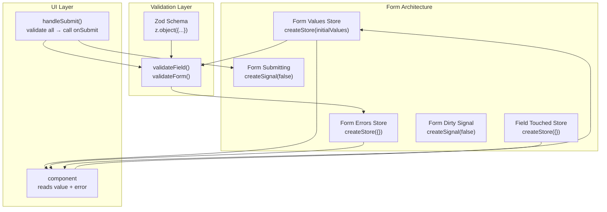
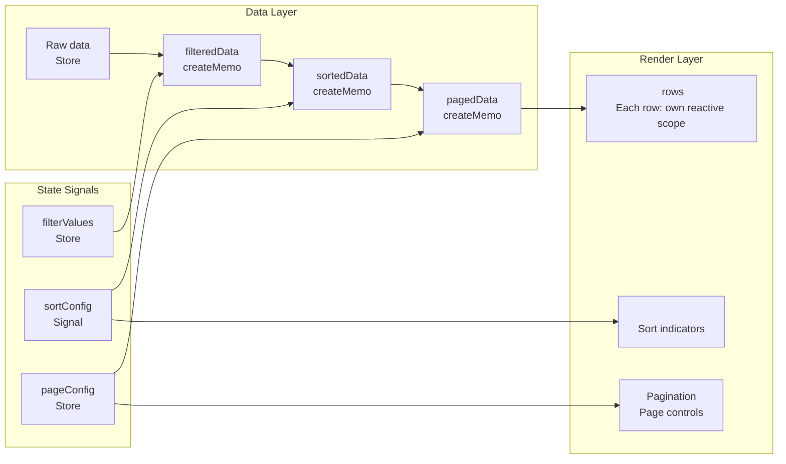
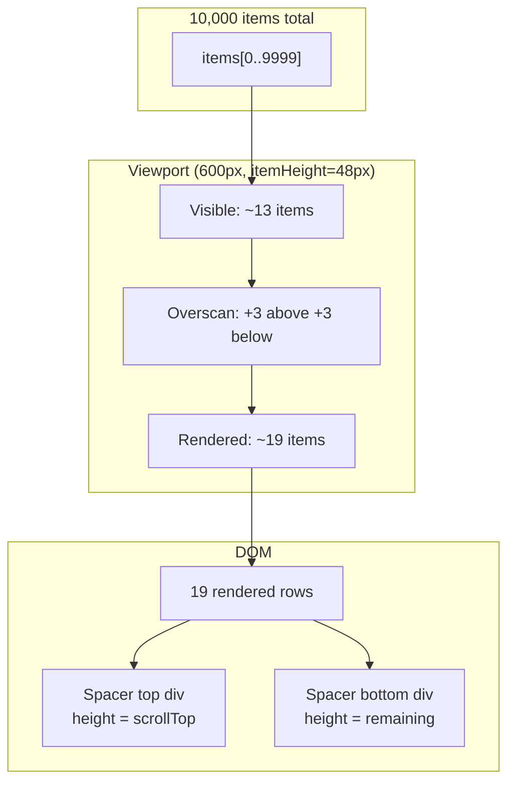

# SolidJS 10 — Complex UI Patterns: Forms, Data Tables, Virtual Scroll

#solidjs #frontend #forms #data-table #virtual-scroll #phase-3-enterprise

> **Mục tiêu:** Xây dựng các UI component phức tạp chuẩn enterprise — form validation schema-driven với Zod, data table sort/filter/pagination thuần signal không re-render toàn bảng, và virtual list windowing cho 100k+ rows — áp dụng trực tiếp vào banking domain với yêu cầu nghiệp vụ cao.

---

## 🧠 Mental Model — Enterprise UI khác gì tutorial UI?

Enterprise UI có 3 yêu cầu khác biệt:

```
1. COMPLEXITY   — Form 50+ fields, validation liên trường, conditional logic
2. PERFORMANCE  — Table 50k rows, filter realtime, không lag khi nhập liệu
3. CORRECTNESS  — Business rules phức tạp, validation phía client + server
```

SolidJS phù hợp đặc biệt vì fine-grained reactivity: thay đổi 1 cell trong bảng 1000 rows chỉ update đúng cell đó, không re-render gì thêm.

---

## ⚙️ Signal-Based Form Architecture

### Tại sao không dùng library form như React Hook Form?

React Hook Form dùng uncontrolled inputs + ref để tránh re-render. Trong SolidJS, **không có re-render vấn đề** — signal update chỉ update đúng DOM node đó. Có thể dùng controlled inputs với signal mà không lo performance.

### Form state architecture



### createForm — Custom hook

```typescript
// hooks/createForm.ts
import { createStore, produce } from "solid-js/store";
import { createSignal, batch } from "solid-js";
import { z } from "zod";

type FormConfig<T extends z.ZodObject<any>> = {
  schema: T;
  initialValues: z.infer<T>;
  onSubmit: (values: z.infer<T>) => Promise<void>;
};

export function createForm<T extends z.ZodObject<any>>(config: FormConfig<T>) {
  type Values = z.infer<T>;
  type Errors = Partial<Record<keyof Values, string>>;

  const [values, setValues] = createStore<Values>({ ...config.initialValues });
  const [errors, setErrors] = createStore<Errors>({});
  const [touched, setTouched] = createStore<Partial<Record<keyof Values, boolean>>>({});
  const [isSubmitting, setIsSubmitting] = createSignal(false);
  const [isDirty, setIsDirty] = createSignal(false);
  const [submitCount, setSubmitCount] = createSignal(0);

  // Validate single field
  function validateField(field: keyof Values) {
    const fieldSchema = config.schema.shape[field as string];
    if (!fieldSchema) return;

    const result = fieldSchema.safeParse(values[field]);
    if (!result.success) {
      setErrors(field as string, result.error.errors[0].message);
    } else {
      setErrors(field as string, undefined!);
    }
  }

  // Validate toàn bộ form
  function validateAll(): boolean {
    const result = config.schema.safeParse(values);
    if (result.success) {
      setErrors(produce(d => { Object.keys(d).forEach(k => delete (d as any)[k]); }));
      return true;
    }
    const newErrors: Errors = {};
    result.error.errors.forEach(err => {
      const field = err.path[0] as keyof Values;
      if (field && !newErrors[field]) {
        newErrors[field] = err.message;
      }
    });
    setErrors(produce(d => Object.assign(d, newErrors)));
    return false;
  }

  // Field handler factory
  function field<K extends keyof Values>(name: K) {
    return {
      name,
      value: values[name] as Values[K],
      error: errors[name as string] as string | undefined,
      touched: touched[name as string] ?? false,
      onChange(value: Values[K]) {
        setValues(name as string, value as any);
        setIsDirty(true);
        if (touched[name as string]) validateField(name);
      },
      onBlur() {
        setTouched(name as string, true);
        validateField(name);
      },
    };
  }

  // Submit handler
  async function handleSubmit(e?: Event) {
    e?.preventDefault();
    setSubmitCount(c => c + 1);

    // Mark all as touched
    const allTouched = Object.fromEntries(
      Object.keys(config.initialValues).map(k => [k, true])
    );
    setTouched(produce(d => Object.assign(d, allTouched)));

    if (!validateAll()) return;

    setIsSubmitting(true);
    try {
      await config.onSubmit(values as Values);
      setIsDirty(false);
    } finally {
      setIsSubmitting(false);
    }
  }

  function reset() {
    batch(() => {
      setValues(produce(d => Object.assign(d, config.initialValues)));
      setErrors(produce(d => { Object.keys(d).forEach(k => delete (d as any)[k]); }));
      setTouched(produce(d => { Object.keys(d).forEach(k => delete (d as any)[k]); }));
      setIsDirty(false);
      setSubmitCount(0);
    });
  }

  return {
    values,
    errors,
    touched,
    isSubmitting,
    isDirty,
    submitCount,
    field,
    handleSubmit,
    validateField,
    validateAll,
    reset,
    setValues,
  };
}
```

### Zod Schema cho Credit Application

```typescript
// schemas/creditApplicationSchema.ts
import { z } from "zod";

const VND_MIN = 10_000_000;
const VND_MAX = 50_000_000_000;

export const creditApplicationSchema = z.object({
  // Thông tin người vay
  applicantName: z.string()
    .min(2, 'Họ tên tối thiểu 2 ký tự')
    .max(100, 'Họ tên tối đa 100 ký tự'),

  idNumber: z.string()
    .regex(/^[0-9]{9,12}$/, 'CMND/CCCD phải là 9-12 số'),

  phoneNumber: z.string()
    .regex(/^(0[3-9])[0-9]{8}$/, 'Số điện thoại không hợp lệ'),

  email: z.string().email('Email không hợp lệ').optional(),

  // Thông tin tài chính
  monthlyIncome: z.number()
    .min(5_000_000, 'Thu nhập tối thiểu 5 triệu/tháng')
    .max(500_000_000, 'Giá trị không hợp lệ'),

  otherIncome: z.number().min(0).optional().default(0),

  existingMonthlyDebt: z.number().min(0).default(0),

  // Thông tin khoản vay
  loanProduct: z.enum(['PERSONAL', 'MORTGAGE', 'AUTO', 'BUSINESS']),

  requestedAmount: z.number()
    .min(VND_MIN, `Số tiền tối thiểu ${VND_MIN.toLocaleString('vi-VN')} VND`)
    .max(VND_MAX, `Số tiền tối đa ${VND_MAX.toLocaleString('vi-VN')} VND`),

  tenor: z.number()
    .int()
    .min(3, 'Kỳ hạn tối thiểu 3 tháng')
    .max(360, 'Kỳ hạn tối đa 360 tháng'),

  purpose: z.string().min(10, 'Mục đích vay tối thiểu 10 ký tự'),

  // Cross-field validation
}).refine(
  data => {
    const totalIncome = data.monthlyIncome + (data.otherIncome ?? 0);
    const estimatedMonthly = data.requestedAmount / data.tenor;
    const dti = (estimatedMonthly + data.existingMonthlyDebt) / totalIncome;
    return dti <= 0.5;
  },
  {
    message: 'Tỷ lệ nợ/thu nhập (DTI) vượt 50% — không đủ điều kiện vay',
    path: ['requestedAmount'],
  }
);

export type CreditApplicationValues = z.infer<typeof creditApplicationSchema>;
```

### Form component sử dụng createForm

```tsx
// pages/credit/NewCreditCasePage.tsx
function NewCreditCasePage() {
  const { toast } = useNotification();
  const navigate = useNavigate();

  const form = createForm({
    schema: creditApplicationSchema,
    initialValues: {
      applicantName: '', idNumber: '', phoneNumber: '',
      monthlyIncome: 0, otherIncome: 0, existingMonthlyDebt: 0,
      loanProduct: 'PERSONAL',
      requestedAmount: 0, tenor: 12, purpose: '',
    },
    onSubmit: async (values) => {
      const caseId = await creditCaseAPI.create(values);
      toast.success('Tạo hồ sơ thành công');
      navigate(`/credit-cases/${caseId}`);
    },
  });

  // Derived: hiển thị DTI realtime
  const dti = createMemo(() => {
    const income = form.values.monthlyIncome + (form.values.otherIncome ?? 0);
    if (income === 0) return 0;
    const monthly = form.values.requestedAmount / Math.max(form.values.tenor, 1);
    return ((monthly + form.values.existingMonthlyDebt) / income) * 100;
  });

  return (
    <form onSubmit={form.handleSubmit}>
      <FormSection title="Thông tin người vay">
        <FormField
          label="Họ và tên"
          required
          error={form.errors.applicantName}
          touched={form.touched.applicantName}
        >
          <input
            type="text"
            value={form.values.applicantName}
            onInput={e => form.field('applicantName').onChange(e.currentTarget.value)}
            onBlur={form.field('applicantName').onBlur}
            class={form.errors.applicantName ? 'input-error' : ''}
          />
        </FormField>

        <FormField label="CMND/CCCD" required error={form.errors.idNumber} touched={form.touched.idNumber}>
          <input
            type="text"
            value={form.values.idNumber}
            onInput={e => form.field('idNumber').onChange(e.currentTarget.value)}
            onBlur={form.field('idNumber').onBlur}
          />
        </FormField>
      </FormSection>

      <FormSection title="Thông tin tài chính">
        <CurrencyField
          label="Thu nhập hàng tháng"
          required
          error={form.errors.monthlyIncome}
          touched={form.touched.monthlyIncome}
          value={form.values.monthlyIncome}
          onChange={v => form.field('monthlyIncome').onChange(v)}
          onBlur={form.field('monthlyIncome').onBlur}
        />

        {/* DTI Indicator realtime */}
        <DTIIndicator value={dti()} />
      </FormSection>

      <FormSection title="Thông tin khoản vay">
        <LoanProductSelector
          value={form.values.loanProduct}
          onChange={v => form.field('loanProduct').onChange(v)}
        />
        <CurrencyField
          label="Số tiền đề nghị vay"
          required
          error={form.errors.requestedAmount}
          touched={form.touched.requestedAmount}
          value={form.values.requestedAmount}
          onChange={v => form.field('requestedAmount').onChange(v)}
          onBlur={form.field('requestedAmount').onBlur}
        />
      </FormSection>

      <div class="form-footer">
        <button type="button" onClick={form.reset} disabled={!form.isDirty()}>
          Đặt lại
        </button>
        <button type="submit" disabled={form.isSubmitting()} class="btn-primary">
          {form.isSubmitting() ? 'Đang gửi...' : 'Tạo hồ sơ'}
        </button>
      </div>
    </form>
  );
}
```

---

## ⚙️ Data Table — Fine-Grained Reactive

### Architecture: signal-driven, không re-render toàn bảng



### createDataTable hook

```typescript
// hooks/createDataTable.ts
import { createSignal, createMemo } from "solid-js";
import { createStore, produce } from "solid-js/store";

type SortDir = 'asc' | 'desc' | null;

type SortConfig<T> = {
  field: keyof T | null;
  dir: SortDir;
};

type FilterConfig<T> = Partial<Record<keyof T, string>>;

type PaginationConfig = {
  page: number;
  pageSize: number;
};

export function createDataTable<T extends Record<string, any>>(
  source: () => T[],
  options?: {
    defaultPageSize?: number;
    defaultSort?: SortConfig<T>;
    searchFields?: (keyof T)[];
  }
) {
  // State
  const [sortConfig, setSortConfig] = createSignal<SortConfig<T>>(
    options?.defaultSort ?? { field: null, dir: null }
  );
  const [filters, setFilters] = createStore<FilterConfig<T>>({});
  const [searchQuery, setSearchQuery] = createSignal('');
  const [pagination, setPagination] = createStore<PaginationConfig>({
    page: 1,
    pageSize: options?.defaultPageSize ?? 20,
  });

  // Pipeline: filter → sort → paginate
  const filtered = createMemo(() => {
    let data = source();

    // Global search
    const q = searchQuery().toLowerCase().trim();
    if (q && options?.searchFields?.length) {
      data = data.filter(row =>
        options.searchFields!.some(field =>
          String(row[field] ?? '').toLowerCase().includes(q)
        )
      );
    }

    // Column filters
    const activeFilters = Object.entries(filters) as [keyof T, string][];
    for (const [field, val] of activeFilters) {
      if (!val) continue;
      data = data.filter(row =>
        String(row[field] ?? '').toLowerCase().includes(val.toLowerCase())
      );
    }

    return data;
  });

  const sorted = createMemo(() => {
    const { field, dir } = sortConfig();
    if (!field || !dir) return filtered();

    return [...filtered()].sort((a, b) => {
      const av = a[field], bv = b[field];
      if (av == null) return 1;
      if (bv == null) return -1;
      const cmp = av < bv ? -1 : av > bv ? 1 : 0;
      return dir === 'asc' ? cmp : -cmp;
    });
  });

  const totalRows = createMemo(() => filtered().length);
  const totalPages = createMemo(() =>
    Math.max(1, Math.ceil(totalRows() / pagination.pageSize))
  );

  const paged = createMemo(() => {
    const start = (pagination.page - 1) * pagination.pageSize;
    return sorted().slice(start, start + pagination.pageSize);
  });

  // Actions
  function toggleSort(field: keyof T) {
    setSortConfig(prev => {
      if (prev.field !== field) return { field, dir: 'asc' };
      if (prev.dir === 'asc') return { field, dir: 'desc' };
      return { field: null, dir: null };
    });
    setPagination('page', 1);
  }

  function setFilter(field: keyof T, value: string) {
    setFilters(field as string, value);
    setPagination('page', 1);
  }

  function clearFilters() {
    setFilters(produce(d => {
      Object.keys(d).forEach(k => delete (d as any)[k]);
    }));
    setSearchQuery('');
    setPagination('page', 1);
  }

  function goToPage(page: number) {
    setPagination('page', Math.max(1, Math.min(page, totalPages())));
  }

  function getSortIcon(field: keyof T): '↑' | '↓' | '↕' {
    const { field: sf, dir } = sortConfig();
    if (sf !== field) return '↕';
    return dir === 'asc' ? '↑' : '↓';
  }

  return {
    // Data
    rows: paged,
    totalRows,
    totalPages,
    filtered,
    // State (reactive)
    sortConfig,
    filters,
    searchQuery,
    pagination,
    // Actions
    toggleSort,
    setFilter,
    setSearchQuery,
    clearFilters,
    goToPage,
    setPageSize: (size: number) => setPagination({ page: 1, pageSize: size }),
    getSortIcon,
  };
}
```

### Sử dụng trong CreditCase Table

```tsx
// components/CreditCaseTable.tsx
function CreditCaseTable() {
  const { creditCases } = useCreditCaseStore();

  const table = createDataTable(
    () => creditCases.items,
    {
      defaultPageSize: 25,
      defaultSort: { field: 'createdAt', dir: 'desc' },
      searchFields: ['caseCode', 'applicantName', 'applicantId'],
    }
  );

  return (
    <div class="data-table-container">
      {/* Toolbar */}
      <div class="table-toolbar">
        <input
          type="search"
          placeholder="Tìm theo mã hồ sơ, tên khách hàng..."
          value={table.searchQuery()}
          onInput={e => table.setSearchQuery(e.currentTarget.value)}
          class="search-input"
        />
        <StatusFilter
          value={table.filters.status ?? ''}
          onChange={v => table.setFilter('status', v)}
        />
        <Show when={table.searchQuery() || table.filters.status}>
          <button onClick={table.clearFilters} class="btn-ghost">
            Xóa bộ lọc
          </button>
        </Show>
        <span class="row-count">{table.totalRows()} hồ sơ</span>
      </div>

      {/* Table */}
      <table class="credit-case-table">
        <thead>
          <tr>
            <SortableHeader
              label="Mã hồ sơ"
              icon={table.getSortIcon('caseCode')}
              onClick={() => table.toggleSort('caseCode')}
            />
            <SortableHeader
              label="Khách hàng"
              icon={table.getSortIcon('applicantName')}
              onClick={() => table.toggleSort('applicantName')}
            />
            <SortableHeader
              label="Số tiền"
              icon={table.getSortIcon('requestedAmount')}
              onClick={() => table.toggleSort('requestedAmount')}
            />
            <th>Trạng thái</th>
            <SortableHeader
              label="Ngày tạo"
              icon={table.getSortIcon('createdAt')}
              onClick={() => table.toggleSort('createdAt')}
            />
            <th>Thao tác</th>
          </tr>
        </thead>
        <tbody>
          {/* For: mỗi row là reactive scope riêng */}
          <For each={table.rows()} fallback={<EmptyRow colSpan={6} />}>
            {(row, index) => (
              <CreditCaseRow
                case={row}
                rowIndex={(table.pagination.page - 1) * table.pagination.pageSize + index() + 1}
              />
            )}
          </For>
        </tbody>
      </table>

      {/* Pagination */}
      <TablePagination
        currentPage={table.pagination.page}
        totalPages={table.totalPages()}
        pageSize={table.pagination.pageSize}
        totalRows={table.totalRows()}
        onPageChange={table.goToPage}
        onPageSizeChange={table.setPageSize}
        pageSizeOptions={[10, 25, 50, 100]}
      />
    </div>
  );
}
```

---

## ⚙️ Virtual List — Windowing cho 100k+ Rows

### Cơ chế windowing



### createVirtualList hook

```typescript
// hooks/createVirtualList.ts
import { createSignal, createMemo, onCleanup } from "solid-js";

type VirtualListOptions = {
  itemHeight: number;        // fixed height per item
  containerHeight: number;   // visible viewport height
  overscan?: number;         // extra items above/below visible
};

export function createVirtualList<T>(
  items: () => T[],
  options: VirtualListOptions
) {
  const { itemHeight, containerHeight, overscan = 3 } = options;
  const [scrollTop, setScrollTop] = createSignal(0);

  // Derived: which items to render
  const visibleRange = createMemo(() => {
    const total = items().length;
    const scroll = scrollTop();

    const startIndex = Math.max(0, Math.floor(scroll / itemHeight) - overscan);
    const visibleCount = Math.ceil(containerHeight / itemHeight);
    const endIndex = Math.min(total - 1, startIndex + visibleCount + overscan * 2);

    return { startIndex, endIndex };
  });

  const visibleItems = createMemo(() => {
    const { startIndex, endIndex } = visibleRange();
    return items()
      .slice(startIndex, endIndex + 1)
      .map((item, i) => ({ item, index: startIndex + i }));
  });

  const totalHeight = createMemo(() => items().length * itemHeight);
  const offsetTop = createMemo(() => visibleRange().startIndex * itemHeight);
  const offsetBottom = createMemo(() => {
    const { endIndex } = visibleRange();
    return (items().length - endIndex - 1) * itemHeight;
  });

  function handleScroll(e: Event) {
    setScrollTop((e.currentTarget as HTMLElement).scrollTop);
  }

  return {
    visibleItems,
    totalHeight,
    offsetTop,
    offsetBottom,
    handleScroll,
    scrollTop,
  };
}
```

### Virtual List component

```tsx
// components/VirtualTransactionList.tsx
function VirtualTransactionList(props: { transactions: Transaction[] }) {
  const ITEM_HEIGHT = 56;
  const CONTAINER_HEIGHT = 600;

  const vl = createVirtualList(
    () => props.transactions,
    { itemHeight: ITEM_HEIGHT, containerHeight: CONTAINER_HEIGHT, overscan: 5 }
  );

  return (
    <div
      style={{ height: `${CONTAINER_HEIGHT}px`, overflow: 'auto' }}
      onScroll={vl.handleScroll}
    >
      {/* Total height spacer: giữ scroll track đúng */}
      <div style={{ height: `${vl.totalHeight()}px`, position: 'relative' }}>
        {/* Offset top: space for items above visible range */}
        <div style={{ height: `${vl.offsetTop()}px` }} />

        {/* Rendered items: chỉ ~20 items bất kể list có 100k */}
        <For each={vl.visibleItems()}>
          {({ item, index }) => (
            <div
              style={{ height: `${ITEM_HEIGHT}px` }}
              class="transaction-row"
            >
              <span class="tx-index">{index + 1}</span>
              <span class="tx-code">{item.transactionCode}</span>
              <span class="tx-amount">{formatVND(item.amount)}</span>
              <span class="tx-time">{formatDateTime(item.createdAt)}</span>
              <TxStatusBadge status={item.status} />
            </div>
          )}
        </For>

        {/* Offset bottom: space for items below visible range */}
        <div style={{ height: `${vl.offsetBottom()}px` }} />
      </div>
    </div>
  );
}
```

### Variable height virtual list (với @tanstack/virtual)

```tsx
import { createVirtualizer } from "@tanstack/solid-virtual";

function VariableHeightList(props: { cases: CreditCase[] }) {
  let containerRef!: HTMLDivElement;

  const virtualizer = createVirtualizer({
    count: () => props.cases.length,
    getScrollElement: () => containerRef,
    estimateSize: (index) => {
      // Estimate dựa trên content type
      const c = props.cases[index];
      return c.hasCollateral ? 96 : 64; // rows với collateral cao hơn
    },
    overscan: 5,
  });

  return (
    <div
      ref={containerRef}
      style={{ height: '700px', overflow: 'auto' }}
    >
      <div style={{ height: `${virtualizer.getTotalSize()}px`, position: 'relative' }}>
        <For each={virtualizer.getVirtualItems()}>
          {(virtualRow) => (
            <div
              style={{
                position: 'absolute',
                top: `${virtualRow.start}px`,
                width: '100%',
                height: `${virtualRow.size}px`,
              }}
              ref={el => virtualizer.measureElement(el)}
              data-index={virtualRow.index}
            >
              <CreditCaseCard case={props.cases[virtualRow.index]} />
            </div>
          )}
        </For>
      </div>
    </div>
  );
}
```

---

## 💡 Pattern thực chiến — Multi-Step Form Wizard

```tsx
// Wizard state với Context
type WizardService = {
  currentStep: () => number;
  totalSteps: number;
  canGoNext: () => boolean;
  canGoPrev: () => boolean;
  goNext: () => void;
  goPrev: () => void;
  goToStep: (n: number) => void;
  isStepCompleted: (n: number) => boolean;
  completedSteps: number[];
  formData: CreditApplicationValues;
  updateFormData: (partial: Partial<CreditApplicationValues>) => void;
};

const WizardContext = createContext<WizardService>();

export function CreditApplicationWizard() {
  const [currentStep, setCurrentStep] = createSignal(0);
  const [completedSteps, setCompletedSteps] = createStore<number[]>([]);
  const [formData, setFormData] = createStore<Partial<CreditApplicationValues>>({});

  const STEPS = [
    { label: 'Thông tin cá nhân', component: PersonalInfoStep },
    { label: 'Tài chính', component: FinancialInfoStep },
    { label: 'Khoản vay', component: LoanDetailsStep },
    { label: 'Tài sản đảm bảo', component: CollateralStep },
    { label: 'Xem lại & Nộp', component: ReviewStep },
  ];

  const canGoNext = () => completedSteps.includes(currentStep());
  const canGoPrev = () => currentStep() > 0;

  function goNext() {
    if (currentStep() < STEPS.length - 1) setCurrentStep(s => s + 1);
  }

  function goPrev() {
    if (currentStep() > 0) setCurrentStep(s => s - 1);
  }

  function markCompleted(step: number) {
    if (!completedSteps.includes(step)) {
      setCompletedSteps(prev => [...prev, step]);
    }
  }

  return (
    <WizardContext.Provider value={{
      currentStep,
      totalSteps: STEPS.length,
      canGoNext, canGoPrev, goNext, goPrev,
      goToStep: setCurrentStep,
      isStepCompleted: (n) => completedSteps.includes(n),
      completedSteps,
      formData: formData as CreditApplicationValues,
      updateFormData: (partial) =>
        setFormData(produce(d => Object.assign(d, partial))),
    }}>
      <div class="wizard-container">
        {/* Step indicator */}
        <WizardStepIndicator steps={STEPS} />

        {/* Step content — Dynamic component */}
        <div class="wizard-body">
          <Dynamic component={STEPS[currentStep()].component} />
        </div>

        {/* Navigation */}
        <WizardNavigation />
      </div>
    </WizardContext.Provider>
  );
}
```

---

## ⚠️ Pitfalls & Anti-patterns

### ❌ Pitfall 1: Validate trong JSX (re-validate mọi render)

```tsx
// ❌ SAI: validate gọi mỗi khi bất kỳ signal nào trong scope thay đổi
<span class="error">{validate(values.amount) ? 'Lỗi' : ''}</span>

// ✅ ĐÚNG: validate trong Memo hoặc dùng error Store
const amountError = createMemo(() => {
  const result = amountSchema.safeParse(values.amount);
  return result.success ? '' : result.error.errors[0].message;
});
<span class="error">{amountError()}</span>
```

### ❌ Pitfall 2: Re-tạo data table filter mỗi keystroke

```tsx
// ❌ SAI: filter chạy trên mỗi ký tự nhập ngay lập tức với 50k rows
<input onInput={e => setFilter(e.currentTarget.value)} />

// ✅ ĐÚNG: debounce filter cho large datasets
function createDebouncedSignal<T>(source: () => T, delay: number) {
  const [debounced, setDebounced] = createSignal(source());
  createEffect(() => {
    const val = source();
    const timer = setTimeout(() => setDebounced(() => val), delay);
    onCleanup(() => clearTimeout(timer));
  });
  return debounced;
}

const [rawSearch, setRawSearch] = createSignal('');
const debouncedSearch = createDebouncedSignal(rawSearch, 300);
// dùng debouncedSearch() trong filter Memo
```

### ❌ Pitfall 3: Virtual list với dynamic content làm sai offset

```tsx
// ❌ SAI: set fixed height nhưng content có thể overflow
<div style={{ height: `${ITEM_HEIGHT}px`, overflow: 'hidden' }}>
  {/* Content có thể cao hơn ITEM_HEIGHT */}
</div>

// ✅ ĐÚNG: dùng @tanstack/virtual với measureElement cho variable heights
// Hoặc đảm bảo content luôn fit vào fixed height với CSS
```

---

## 🔗 Liên kết

← [[SolidJS-Series/SolidJS-09-Routing|09 · Routing]]
→ [[SolidJS-Series/SolidJS-11-SolidStart-SSR|11 · SolidStart & SSR]]

**Xem thêm:**
- [[SolidJS-Series/SolidJS-06-Stores-Nested-State|06 · Stores]] — form state với createStore
- [[SolidJS-Series/SolidJS-07-Context-DI|07 · Context]] — wizard state qua Context

---

*Series: [[SolidJS-Series/SolidJS-MOC|SolidJS Master Index]]*
