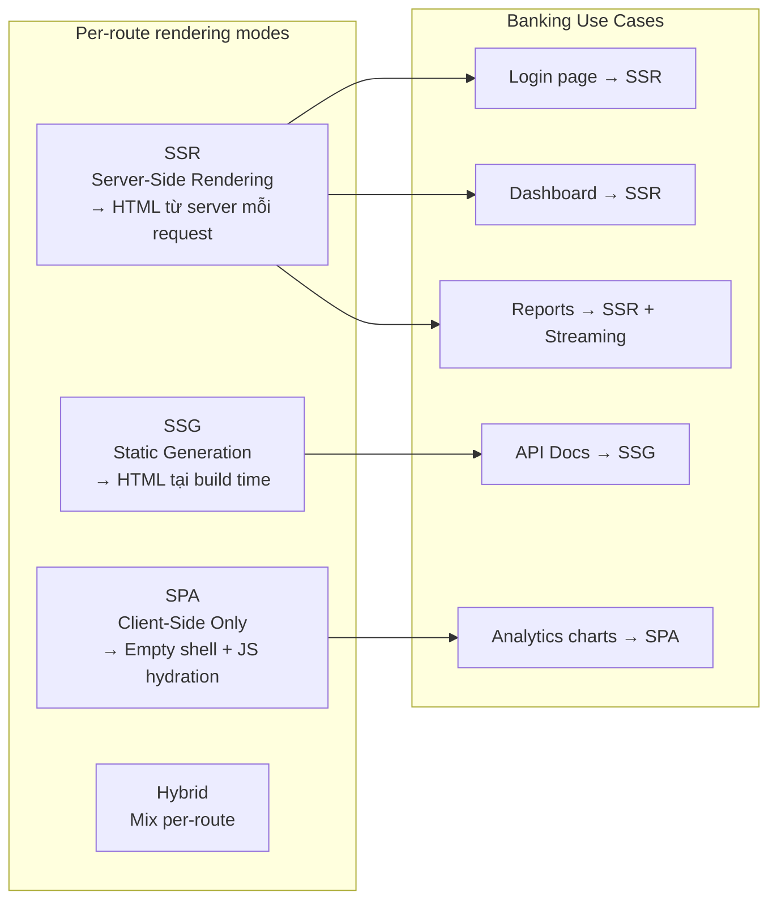
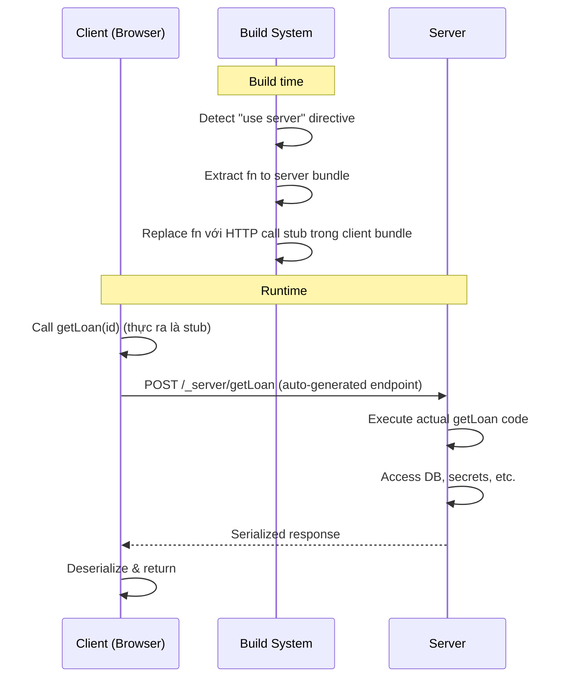
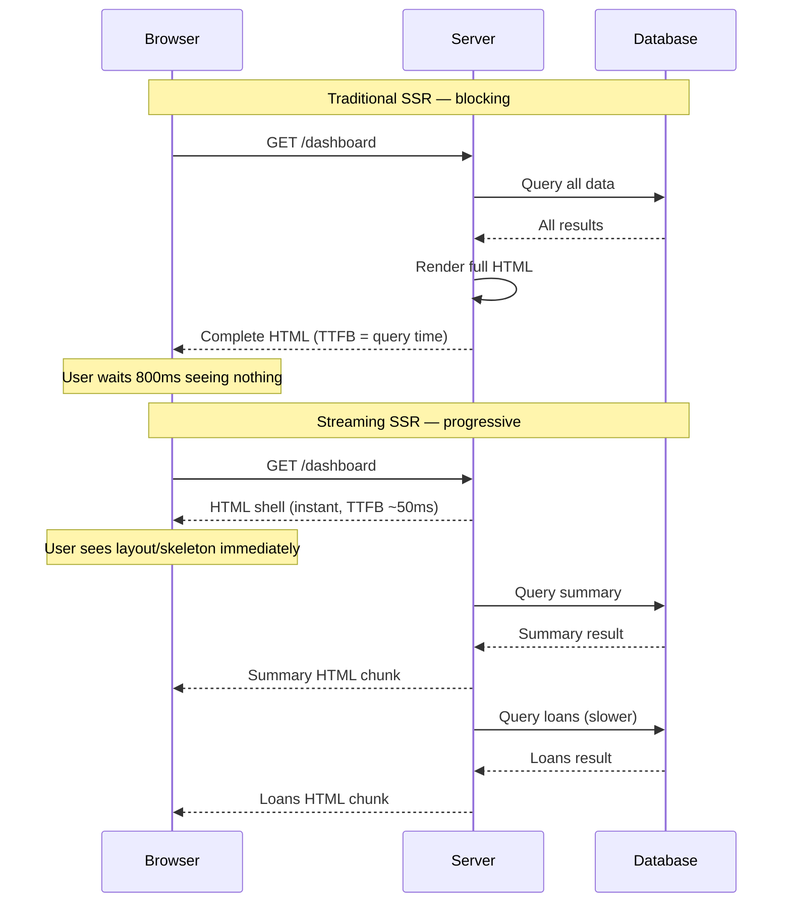
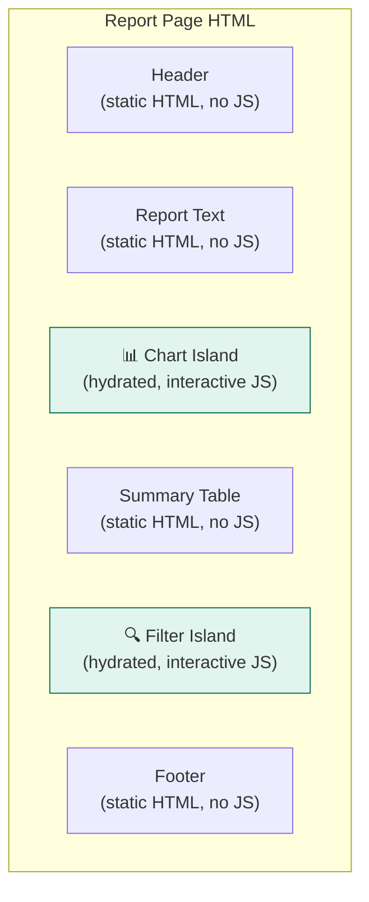

# SolidJS 11 — SolidStart & SSR: Server Functions, Streaming, Islands

#solidjs #frontend #solidstart #ssr #server-functions #phase-3-enterprise

> **Mục tiêu:** Nắm vững SolidStart — meta-framework của SolidJS — bao gồm file-based routing, `"use server"` directive cho server functions, streaming SSR, islands architecture, và lựa chọn rendering mode phù hợp cho từng loại trang banking enterprise.

---

## 🧠 Mental Model — SolidStart là gì?

SolidStart = SolidJS + meta-framework (giống Next.js cho React, Nuxt cho Vue).

```
SolidJS      = reactive UI library (client-side)
SolidStart   = SolidJS + routing + SSR + server functions + build pipeline

Tương tự:
React        → Next.js / Remix
Vue          → Nuxt
Svelte       → SvelteKit
Solid        → SolidStart
```

### Rendering modes SolidStart hỗ trợ



---

## ⚙️ File-Based Routing trong SolidStart

### Cấu trúc thư mục → Route tree

```
src/routes/
├── index.tsx                    → /
├── login.tsx                    → /login
├── loans/
│   ├── index.tsx                → /loans
│   ├── [loanId].tsx             → /loans/:loanId
│   ├── [loanId]/
│   │   ├── edit.tsx             → /loans/:loanId/edit
│   │   └── disbursement.tsx     → /loans/:loanId/disbursement
├── credit-cases/
│   ├── index.tsx                → /credit-cases
│   ├── new.tsx                  → /credit-cases/new
│   └── [caseId].tsx             → /credit-cases/:caseId
├── reports/
│   ├── (protected)/             → Route group (không ảnh hưởng URL)
│   │   ├── daily.tsx            → /reports/daily
│   │   └── portfolio.tsx        → /reports/portfolio
└── [...404].tsx                 → Catch-all 404
```

### Route entry file structure

```tsx
// src/routes/loans/[loanId].tsx

import { useParams } from "@solidjs/router";
import { createAsync, type RouteDefinition } from "@solidjs/router";

// 1. Route config (metadata, preload, SSR options)
export const route = {
  preload: ({ params }) => {
    // Preload bắt đầu fetch khi navigate đến route này
    getLoan(params.loanId);
  },
} satisfies RouteDefinition;

// 2. Server function (xem phần tiếp theo)
const getLoan = cache(async (loanId: string) => {
  "use server";
  return await db.loans.findById(loanId);
}, "loan");

// 3. Page component
export default function LoanDetailPage() {
  const params = useParams();
  const loan = createAsync(() => getLoan(params.loanId));

  return (
    <main>
      <Suspense fallback={<LoanSkeleton />}>
        <LoanDetail loan={loan()} />
      </Suspense>
    </main>
  );
}
```

---

## ⚙️ Server Functions — `"use server"`

### Cơ chế hoạt động

Server functions là code chạy **chỉ trên server** — không bao giờ ship xuống client bundle. Chúng được tự động convert thành HTTP endpoints tại build time.



### Khai báo server function

```typescript
// Cách 1: "use server" trong function body
import { cache, action } from "@solidjs/router";

// READ: dùng cache() để deduplicate + memoize
const getCreditCase = cache(async (caseId: string) => {
  "use server"; // directive: fn chỉ chạy trên server
  
  // Có thể access: DB, env vars, secrets, session
  const session = await getSession(); // server-only
  if (!session.userId) throw new Error('Unauthorized');

  return await db.creditCases.findById(caseId, {
    include: { applicant: true, collaterals: true }
  });
}, "credit-case"); // cache key

// WRITE: dùng action() cho mutations
const submitCreditCase = action(async (formData: FormData) => {
  "use server";
  
  const session = await getSession();
  const data = Object.fromEntries(formData);
  
  // Validate server-side
  const parsed = creditApplicationSchema.safeParse(data);
  if (!parsed.success) {
    return { error: parsed.error.flatten() };
  }
  
  const caseId = await db.creditCases.create({
    ...parsed.data,
    createdBy: session.userId,
    branchId: session.branchId,
  });
  
  // Invalidate cache sau mutation
  revalidate(getCreditCase.keyFor(caseId));
  
  return { success: true, caseId };
});
```

### Gọi server function trong component

```tsx
// Trong component (client-side):
function CreditCaseDetail(props: { caseId: string }) {
  // createAsync: gọi server fn, integrate với Suspense
  const caseData = createAsync(() => getCreditCase(props.caseId));
  
  return (
    <Suspense fallback={<Skeleton />}>
      <Show when={caseData()}>
        {(data) => <CaseView case={data()} />}
      </Show>
    </Suspense>
  );
}

// Gọi action:
function SubmitCaseButton() {
  const submit = useAction(submitCreditCase);
  const [result, setResult] = createSignal<any>(null);
  
  async function handleSubmit(formData: FormData) {
    const res = await submit(formData);
    if (res.error) {
      // Handle validation errors
      setResult(res);
    } else {
      navigate(`/credit-cases/${res.caseId}`);
    }
  }
  
  return <form action={submitCreditCase} method="post">...</form>;
}
```

### cache() — Deduplicate và invalidate

```typescript
import { cache, revalidate } from "@solidjs/router";

// cache(fn, key): memoize server fn calls
// Cùng arguments trong cùng request/render cycle → 1 DB call
const getLoansByBranch = cache(async (branchId: string, status?: string) => {
  "use server";
  return db.loans.findMany({ where: { branchId, status } });
}, "loans-by-branch");

// Tạo cache key cho specific args
const key = getLoansByBranch.keyFor('HN-001', 'PENDING');

// Invalidate cache sau mutation → trigger refetch
async function approveLoan(loanId: string) {
  "use server";
  await db.loans.update(loanId, { status: 'APPROVED' });
  revalidate(getLoansByBranch.keyFor('HN-001')); // invalidate branch cache
}
```

---

## ⚙️ Streaming SSR — Progressive HTML

### Traditional SSR vs Streaming SSR



### Implement với Suspense + streaming

```tsx
// SolidStart: Suspense boundaries tự động thành streaming chunks
export default function DashboardPage() {
  // Server functions — fetch song song
  const summary = createAsync(() => getDashboardSummary());
  const recentLoans = createAsync(() => getRecentLoans({ limit: 10 }));
  const pendingApprovals = createAsync(() => getPendingApprovals());

  return (
    <div class="dashboard">
      {/* Chunk 1: render ngay (không có async) */}
      <PageHeader title="Dashboard" />

      {/* Chunk 2: stream khi summary ready */}
      <Suspense fallback={<SummarySkeleton />}>
        <DashboardSummary data={summary()!} />
      </Suspense>

      <div class="dashboard-grid">
        {/* Chunk 3: stream khi recentLoans ready */}
        <Suspense fallback={<LoanListSkeleton />}>
          <RecentLoansList loans={recentLoans()!} />
        </Suspense>

        {/* Chunk 4: stream khi pendingApprovals ready */}
        <Suspense fallback={<ApprovalSkeleton />}>
          <PendingApprovalQueue items={pendingApprovals()!} />
        </Suspense>
      </div>
    </div>
  );
}
```

---

## ⚙️ Islands Architecture

Islands = phần lớn trang là static HTML (no JS), chỉ những "đảo" interactive mới hydrate JS.



### `client:*` directives trong SolidStart

```tsx
// Trang report: mostly static, chỉ chart và filter là islands
export default function MonthlyReportPage() {
  const report = createAsync(() => getMonthlyReport());

  return (
    <div class="report-page">
      {/* Static: render server-side, không hydrate */}
      <ReportHeader />
      <ReportSummaryTable data={report()?.summary} />

      {/* Island: chỉ hydrate khi user interact */}
      {/* client:visible = hydrate khi scroll vào viewport */}
      <InteractiveLoanChart
        data={report()?.chartData}
        client:visible
      />

      {/* Island: hydrate ngay khi trang load */}
      {/* client:load = hydrate ngay */}
      <ReportFilterPanel
        client:load
      />

      {/* Island: hydrate khi idle */}
      {/* client:idle = hydrate khi browser idle */}
      <ExportButton client:idle />
    </div>
  );
}
```

---

## ⚙️ Session và Authentication (Server-side)

```typescript
// lib/session.ts — server-only
import { useSession } from "vinxi/http";

type SessionData = {
  userId: string;
  branchId: string;
  role: string;
  permissions: string[];
};

export async function getSession() {
  "use server";
  return useSession<SessionData>({
    password: process.env.SESSION_SECRET!,
    maxAge: 8 * 60 * 60, // 8 giờ
  });
}

export async function requireAuth() {
  "use server";
  const session = await getSession();
  if (!session.data.userId) {
    throw redirect('/login');
  }
  return session.data;
}

export async function requirePermission(permission: string) {
  "use server";
  const user = await requireAuth();
  if (!user.permissions.includes(permission)) {
    throw redirect('/403');
  }
  return user;
}

// Login action:
export const loginAction = action(async (formData: FormData) => {
  "use server";
  const username = String(formData.get('username'));
  const password = String(formData.get('password'));

  const user = await authService.authenticate(username, password);
  if (!user) return { error: 'Sai tên đăng nhập hoặc mật khẩu' };

  const session = await getSession();
  await session.update(d => {
    d.userId = user.id;
    d.branchId = user.branchId;
    d.role = user.role;
    d.permissions = user.permissions;
  });

  throw redirect(String(formData.get('returnUrl') || '/'));
});
```

---

## ⚙️ Middleware — Request-level logic

```typescript
// src/middleware.ts
import { defineMiddleware } from "@solidjs/start/middleware";
import { getSession } from "~/lib/session";

export default defineMiddleware({
  onRequest: [
    // Auth middleware: redirect nếu chưa login
    async ({ request, locals }) => {
      const url = new URL(request.url);
      const publicPaths = ['/login', '/forgot-password', '/api/health'];

      if (publicPaths.some(p => url.pathname.startsWith(p))) return;

      const session = await getSession();
      if (!session.data.userId) {
        return Response.redirect(new URL(`/login?returnUrl=${url.pathname}`, request.url));
      }

      // Inject user vào locals (accessible trong server functions)
      locals.user = session.data;
    },

    // Audit log middleware
    async ({ request, locals }) => {
      const start = Date.now();
      // Log after response:
      locals.requestStart = start;
    },
  ],
});
```

---

## ⚙️ Rendering Mode Configuration

```typescript
// app.config.ts
import { defineConfig } from "@solidjs/start/config";

export default defineConfig({
  server: {
    preset: "node-server", // hoặc "vercel", "cloudflare", "bun"
  },

  // Route-specific rendering
  routeRules: {
    // Static pages: build thành HTML tĩnh
    "/api-docs/**": { prerender: true },
    "/public/**": { prerender: true },

    // Dynamic SSR với cache
    "/dashboard": { isr: { expiration: 60 } }, // ISR: rebuild mỗi 60s

    // API routes: không cache
    "/api/**": { cache: false },

    // Heavy pages: SPA mode (client-only)
    "/reports/analytics": { ssr: false },
  },
});
```

---

## 💡 Pattern thực chiến — Banking SSR Architecture

### Cấu trúc đề xuất cho PDMS-style app

```
src/
├── routes/
│   ├── (auth)/                    # Layout group: auth pages (no sidebar)
│   │   ├── login.tsx
│   │   └── forgot-password.tsx
│   ├── (app)/                     # Layout group: main app (with sidebar)
│   │   ├── index.tsx              # Dashboard
│   │   ├── loans/
│   │   │   ├── index.tsx          # SSR: loan list
│   │   │   └── [loanId]/
│   │   │       ├── index.tsx      # SSR: loan detail
│   │   │       └── edit.tsx       # SPA: complex form
│   │   ├── credit-cases/
│   │   │   ├── index.tsx          # SSR: case list
│   │   │   ├── new.tsx            # SPA: wizard form
│   │   │   └── [caseId].tsx       # SSR + Streaming
│   │   └── reports/
│   │       ├── daily.tsx          # SSG + ISR
│   │       └── portfolio.tsx      # SSR + Streaming
├── lib/
│   ├── session.ts                 # Server-only: auth session
│   ├── db.ts                      # Server-only: Prisma/Drizzle client
│   └── cache.ts                   # Cache keys & invalidation
├── server/
│   ├── loans.ts                   # Server functions: loan operations
│   ├── credit-cases.ts            # Server functions: case operations
│   └── reports.ts                 # Server functions: report generation
└── middleware.ts                  # Auth middleware
```

### Server function tổ chức theo domain

```typescript
// server/credit-cases.ts
"use server"; // toàn bộ file là server-only

import { cache, action } from "@solidjs/router";
import { requirePermission, getSession } from "~/lib/session";
import { db } from "~/lib/db";

// READ operations
export const getCreditCases = cache(async (filters: CaseFilters) => {
  const user = await requirePermission('VIEW_CREDIT_CASES');
  return db.creditCases.findMany({
    where: {
      branchId: user.branchId, // scoped to user's branch
      ...buildWhereClause(filters),
    },
    orderBy: { createdAt: 'desc' },
  });
}, "credit-cases");

export const getCreditCaseById = cache(async (caseId: string) => {
  const user = await requirePermission('VIEW_CREDIT_CASES');
  const creditCase = await db.creditCases.findById(caseId, {
    include: { applicant: true, collaterals: true, documents: true, timeline: true }
  });
  if (creditCase.branchId !== user.branchId && !user.permissions.includes('VIEW_ALL_BRANCHES')) {
    throw new Error('Access denied');
  }
  return creditCase;
}, "credit-case");

// WRITE operations
export const approveCreditCase = action(async (caseId: string, notes: string) => {
  const user = await requirePermission('APPROVE_CREDIT_CASES');
  
  await db.$transaction(async (tx) => {
    await tx.creditCases.update(caseId, {
      status: 'APPROVED',
      approvedBy: user.userId,
      approvedAt: new Date(),
      approvalNotes: notes,
    });
    await tx.auditLogs.create({
      action: 'APPROVE_CREDIT_CASE',
      entityId: caseId,
      performedBy: user.userId,
    });
  });

  revalidate(getCreditCaseById.keyFor(caseId));
  revalidate(getCreditCases.keyFor());
});
```

---

## ⚠️ Pitfalls & Anti-patterns

### ❌ Pitfall 1: Import server-only code vào client bundle

```typescript
// ❌ SAI: import DB client trong component sẽ leak vào client bundle
import { db } from "~/lib/db"; // Prisma, credentials → client!

function LoanPage() {
  // Direct DB call trong component body
  const loans = await db.loans.findMany(); // chạy client-side → ERROR
}

// ✅ ĐÚNG: chỉ gọi qua server functions
import { getLoans } from "~/server/loans"; // server fn = HTTP stub trong client
const loans = createAsync(() => getLoans());
```

### ❌ Pitfall 2: Quên "use server" → function chạy client-side

```typescript
// ❌ SAI: không có directive → chạy cả client lẫn server
async function getCreditScore(cifCode: string) {
  // Nếu thiếu "use server": env vars, DB access → undefined client-side
  return await externalCreditAPI.getScore(cifCode, process.env.CREDIT_API_KEY);
}

// ✅ ĐÚNG:
async function getCreditScore(cifCode: string) {
  "use server"; // bắt buộc
  return await externalCreditAPI.getScore(cifCode, process.env.CREDIT_API_KEY!);
}
```

### ❌ Pitfall 3: Không invalidate cache sau mutation

```typescript
// ❌ SAI: approve loan nhưng cache cũ vẫn hiển thị status cũ
export const approveLoan = action(async (loanId: string) => {
  "use server";
  await db.loans.update(loanId, { status: 'APPROVED' });
  // Không revalidate → UI vẫn thấy 'PENDING'!
});

// ✅ ĐÚNG: revalidate tất cả related cache keys
export const approveLoan = action(async (loanId: string) => {
  "use server";
  await db.loans.update(loanId, { status: 'APPROVED' });
  revalidate(getLoanById.keyFor(loanId));    // detail page
  revalidate(getLoans.keyFor());             // list page
  revalidate(getDashboardSummary.keyFor());  // dashboard stats
});
```

---

## 🔗 Liên kết

← [[SolidJS-Series/SolidJS-10-Complex-UI-Patterns|10 · Complex UI Patterns]]
→ [[SolidJS-Series/SolidJS-12-Performance-Testing|12 · Performance & Testing]]

**Xem thêm:**
- [[SolidJS-Series/SolidJS-08-Async-Resources|08 · Async & Resources]] — createAsync là core primitive
- [[SolidJS-Series/SolidJS-09-Routing|09 · Routing]] — route config, preload patterns

---

*Series: [[SolidJS-Series/SolidJS-MOC|SolidJS Master Index]]*
