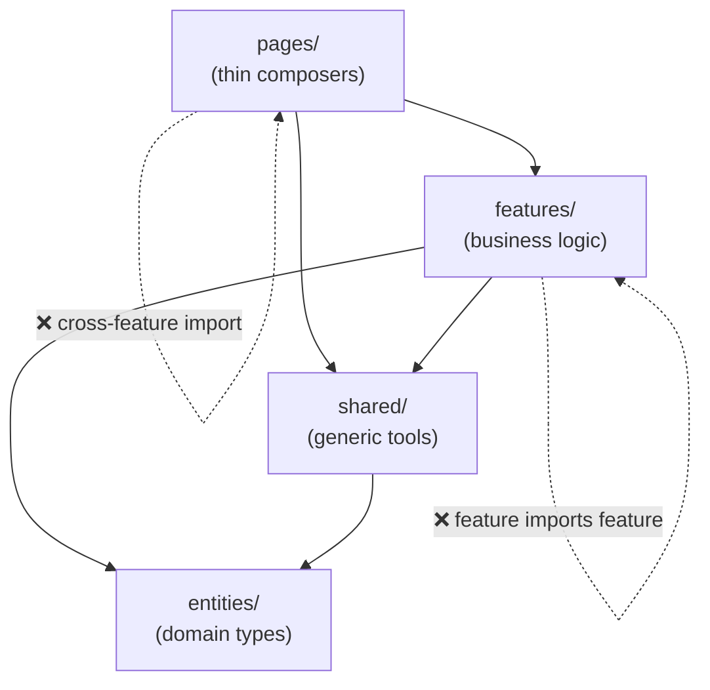

# SolidJS 12 — Performance & Testing: Profiling, Vitest, Architecture

#solidjs #frontend #performance #testing #architecture #phase-3-enterprise

> **Mục tiêu:** Đo và tối ưu performance SolidJS với DevTools reactive graph inspector, tránh các anti-pattern gây unnecessary subscriptions, viết unit/integration test với Vitest + @solidjs/testing-library, và tổ chức codebase enterprise theo Feature-Slice Design.

---

## 🧠 Mental Model — Performance trong SolidJS khác React

### React: optimize để tránh re-render
```
React default: mọi thứ re-render
→ useMemo, useCallback, memo() để opt-out
→ Performance = giảm số lần component function chạy lại
```

### SolidJS: không có re-render, nhưng subscriptions có chi phí

```
SolidJS default: chỉ những subscriber của signal thay đổi mới re-run
→ Không cần memo/callback để tránh re-render
→ Performance concerns khác:
   1. Subscriptions không cần thiết (đọc signal không dùng)
   2. Memo chain quá sâu (tính toán expensive chưa được cache)
   3. Effect chạy quá nhiều (dependencies rộng hơn cần)
   4. Reactive graph quá lớn (store với nhiều path signals)
```

---

## ⚙️ Reactive Graph Analysis — Tìm bottleneck

### DevTools: SolidJS DevTools extension

SolidJS DevTools (Chrome/Firefox extension) hiển thị reactive graph live:
- Xem tất cả Signals, Memos, Effects đang tồn tại
- Track owner tree
- Highlight subscribers của từng signal
- Xem effect re-run count

### Manual profiling — đo re-run count

```typescript
// Wrapper để đếm computation runs trong development
function traced<T>(name: string, fn: () => T): () => T {
  if (import.meta.env.PROD) return fn;
  
  let runCount = 0;
  return () => {
    runCount++;
    console.debug(`[Solid Trace] ${name} run #${runCount}`);
    return fn();
  };
}

// Áp dụng:
const monthlyPayment = createMemo(traced('monthlyPayment', () => {
  const P = principal();
  const r = monthlyRate();
  const n = tenor();
  return calculatePMT(P, r, n);
}));

// Effect với tracking:
createEffect(traced('fetchLoanEffect', () => {
  const id = selectedLoanId();
  if (id) fetchLoan(id).then(setLoanData);
}));
```

### Identify unnecessary subscriptions

```typescript
// ❌ Vấn đề: đọc toàn bộ store nhưng chỉ cần 1 field
createEffect(() => {
  const allData = loanStore; // subscribe vào mọi field trong store!
  console.log(allData.status); // chỉ cần status
});

// ✅ ĐÚNG: đọc chính xác field cần thiết
createEffect(() => {
  const status = loanStore.status; // chỉ subscribe vào status
  console.log(status);
});
```

---

## ⚙️ Performance Patterns

### 1. Granular reads — tránh over-subscription

```tsx
// ❌ SAI: component đọc toàn bộ loan object
function LoanStatusBadge(props: { loan: Loan }) {
  // Nếu loan là store/signal object, đọc nguyên sẽ subscribe tất cả
  return <span class={statusClass(props.loan)}>{props.loan.status}</span>;
}

// ✅ ĐÚNG: chỉ truyền field cần thiết — component chỉ re-run khi status đổi
function LoanStatusBadge(props: { status: LoanStatus }) {
  return <span class={STATUS_CLASSES[props.status]}>{STATUS_LABELS[props.status]}</span>;
}

// Ở parent: truyền field cụ thể
<LoanStatusBadge status={loan.status} />
```

### 2. createMemo để cache expensive computation

```typescript
// Không có Memo: tính lại mỗi lần đọc
function getBadLoansByBranch() {
  // O(n²) không cache
  return loans.items.filter(l =>
    l.daysOverdue > 90 && getBranchRiskScore(l.branchId) > 0.7
  );
}

// Với Memo: tính 1 lần, cache, chỉ tính lại khi loans thay đổi
const badLoansByBranch = createMemo(() => {
  return loans.items.filter(l =>
    l.daysOverdue > 90 && getBranchRiskScore(l.branchId) > 0.7
  );
});
// O(n) chỉ khi cần, tái dùng kết quả cache mọi nơi
```

### 3. Tránh signal reads trong callbacks không cần reactive

```typescript
// ❌ SAI: effect re-run mỗi khi branchId hoặc loanId thay đổi
createEffect(() => {
  const branchId = currentBranchId(); // tracked!
  const loanId = selectedLoanId();    // tracked!
  
  // Nhưng thực ra chỉ muốn track loanId, branchId chỉ dùng lúc gọi
  fetchLoanWithContext(loanId, branchId);
});

// ✅ ĐÚNG: untrack dependency không cần reactive
createEffect(() => {
  const loanId = selectedLoanId();            // tracked
  const branchId = untrack(currentBranchId); // không tracked
  fetchLoanWithContext(loanId, branchId);
});
```

### 4. Batch updates trong event handlers ngoài JSX

```typescript
// Tất cả updates từ server response → batch để tránh nhiều re-runs
ws.onmessage = (e) => {
  const update = JSON.parse(e.data);
  batch(() => {
    setLoanStatus(update.status);
    setLoanAmount(update.amount);
    setLastUpdated(update.timestamp);
    setApproverName(update.approverName);
  }); // → 1 re-run thay vì 4
};
```

### 5. Suspense để tránh render cascade

```tsx
// ❌ Render ngay dù chưa có data → nhiều micro-renders khi data arrives
function Dashboard() {
  const [a] = createResource(fetchA);
  const [b] = createResource(fetchB);
  
  return (
    <div>
      {a() ? <ComponentA data={a()!} /> : null}
      {b() ? <ComponentB data={b()!} /> : null}
    </div>
  );
}

// ✅ Suspense: chờ data → render 1 lần
function Dashboard() {
  const [a] = createResource(fetchA);
  const [b] = createResource(fetchB);
  
  return (
    <Suspense fallback={<Skeleton />}>
      <ComponentA data={a()!} />
      <ComponentB data={b()!} />
    </Suspense>
  );
}
```

### 6. reconcile() cho large list updates

```typescript
// ❌ Replace toàn bộ list → mọi <For> items re-mount
setStore('loans', newLoansFromServer);

// ✅ reconcile: chỉ update diffs
setStore('loans', reconcile(newLoansFromServer, { key: 'id', merge: true }));
// → Chỉ DOM nodes thực sự thay đổi được update
```

---

## ⚙️ Bundle Optimization

### Code splitting strategy

```typescript
// Lazy load heavy components
const LoanAnalyticsChart = lazy(() =>
  import('./components/charts/LoanAnalyticsChart')
);

const DocumentViewer = lazy(() =>
  import('./components/documents/DocumentViewer')
);

// Route-level splitting (automatic với file-based routing)
// src/routes/reports/portfolio.tsx → separate chunk

// Manual chunk grouping trong vite.config.ts:
export default defineConfig({
  build: {
    rollupOptions: {
      output: {
        manualChunks: {
          'chart-vendor': ['chart.js', '@tanstack/solid-virtual'],
          'form-vendor': ['zod'],
          'date-vendor': ['date-fns'],
        }
      }
    }
  }
});
```

### Tree-shaking friendly imports

```typescript
// ❌ Import toàn bộ — không tree-shakeable
import * as SolidJS from 'solid-js';

// ✅ Named imports — tree-shakeable
import { createSignal, createMemo, createEffect } from 'solid-js';
import { createStore, produce } from 'solid-js/store';
import { For, Show, Suspense } from 'solid-js';
```

---

## ⚙️ Testing với Vitest + @solidjs/testing-library

### Setup

```bash
npm install -D vitest @solidjs/testing-library @testing-library/jest-dom jsdom
```

```typescript
// vitest.config.ts
import { defineConfig } from 'vitest/config';
import solidPlugin from 'vite-plugin-solid';

export default defineConfig({
  plugins: [solidPlugin()],
  test: {
    environment: 'jsdom',
    globals: true,
    setupFiles: ['./src/test/setup.ts'],
    transformMode: { web: [/\.[jt]sx?$/] },
  },
});

// src/test/setup.ts
import '@testing-library/jest-dom';
import { cleanup } from '@solidjs/testing-library';
import { afterEach } from 'vitest';

afterEach(cleanup);
```

### Unit testing: Signal và Memo logic

```typescript
// test/hooks/createForm.test.ts
import { describe, it, expect, vi } from 'vitest';
import { createRoot } from 'solid-js';
import { createForm } from '~/hooks/createForm';
import { creditApplicationSchema } from '~/schemas/creditApplicationSchema';

describe('createForm', () => {
  it('khởi tạo với initialValues', () => {
    createRoot(dispose => {
      const form = createForm({
        schema: creditApplicationSchema,
        initialValues: {
          applicantName: '',
          requestedAmount: 0,
          tenor: 12,
          // ...
        },
        onSubmit: vi.fn(),
      });

      expect(form.values.applicantName).toBe('');
      expect(form.values.tenor).toBe(12);
      expect(form.isDirty()).toBe(false);
      dispose();
    });
  });

  it('validate field khi blur', () => {
    createRoot(dispose => {
      const form = createForm({
        schema: creditApplicationSchema,
        initialValues: { applicantName: '', requestedAmount: 0, tenor: 12 },
        onSubmit: vi.fn(),
      });

      // Trigger blur với giá trị invalid
      form.field('applicantName').onBlur();

      expect(form.errors.applicantName).toBeTruthy();
      expect(form.touched.applicantName).toBe(true);
      dispose();
    });
  });

  it('clear error khi field được sửa thành valid', () => {
    createRoot(dispose => {
      const form = createForm({
        schema: creditApplicationSchema,
        initialValues: { applicantName: '', requestedAmount: 0, tenor: 12 },
        onSubmit: vi.fn(),
      });

      // Trigger validation error
      form.field('applicantName').onBlur();
      expect(form.errors.applicantName).toBeTruthy();

      // Fix giá trị
      form.field('applicantName').onChange('Nguyễn Văn A');
      expect(form.errors.applicantName).toBeFalsy();
      dispose();
    });
  });
});
```

### Unit testing: Store logic

```typescript
// test/store/creditCaseStore.test.ts
import { describe, it, expect, beforeEach } from 'vitest';
import { createRoot } from 'solid-js';
import { createStore, reconcile } from 'solid-js/store';

describe('Credit Case Store', () => {
  it('reconcile chỉ update items thay đổi', () => {
    createRoot(dispose => {
      const [store, setStore] = createStore({
        items: [
          { id: '1', status: 'PENDING', amount: 100 },
          { id: '2', status: 'APPROVED', amount: 200 },
        ]
      });

      let renderCount = 0;
      const item1Ref = store.items[0]; // lấy reference ban đầu

      // Track updates vào item 2 specifically
      createEffect(() => {
        store.items[1].status; // track
        renderCount++;
      });

      // Reconcile với data mới — item 1 không đổi, item 2 status đổi
      setStore('items', reconcile([
        { id: '1', status: 'PENDING', amount: 100 }, // giống hệt
        { id: '2', status: 'DISBURSED', amount: 200 }, // status thay đổi
      ], { key: 'id' }));

      expect(store.items[1].status).toBe('DISBURSED');
      expect(renderCount).toBe(2); // initial + 1 update
      dispose();
    });
  });
});
```

### Component testing với render()

```tsx
// test/components/LoanStatusBadge.test.tsx
import { describe, it, expect } from 'vitest';
import { render, screen } from '@solidjs/testing-library';
import { LoanStatusBadge } from '~/components/LoanStatusBadge';

describe('LoanStatusBadge', () => {
  it('hiển thị đúng label cho từng status', () => {
    const { unmount } = render(() => (
      <LoanStatusBadge status="PENDING_APPROVAL" />
    ));
    expect(screen.getByText('Chờ phê duyệt')).toBeInTheDocument();
    unmount();
  });

  it('áp dụng CSS class đúng cho status APPROVED', () => {
    const { unmount } = render(() => (
      <LoanStatusBadge status="APPROVED" />
    ));
    const badge = screen.getByText('Đã phê duyệt');
    expect(badge).toHaveClass('badge-success');
    unmount();
  });
});
```

### Integration test: Form submit flow

```tsx
// test/components/CreditApplicationForm.test.tsx
import { describe, it, expect, vi } from 'vitest';
import { render, screen, fireEvent, waitFor } from '@solidjs/testing-library';
import userEvent from '@testing-library/user-event';
import { CreditApplicationForm } from '~/components/CreditApplicationForm';

describe('CreditApplicationForm integration', () => {
  it('submit thành công khi tất cả fields hợp lệ', async () => {
    const user = userEvent.setup();
    const mockSubmit = vi.fn().mockResolvedValue({ caseId: 'CC-001' });

    render(() => <CreditApplicationForm onSubmit={mockSubmit} />);

    // Fill form
    await user.type(screen.getByLabelText('Họ và tên'), 'Nguyễn Văn A');
    await user.type(screen.getByLabelText('CMND/CCCD'), '001090012345');
    await user.type(screen.getByLabelText('Số điện thoại'), '0987654321');
    await user.type(screen.getByLabelText('Thu nhập hàng tháng'), '30000000');
    await user.type(screen.getByLabelText('Số tiền đề nghị vay'), '100000000');
    
    await user.click(screen.getByRole('button', { name: /tạo hồ sơ/i }));

    await waitFor(() => expect(mockSubmit).toHaveBeenCalledOnce());
    expect(mockSubmit).toHaveBeenCalledWith(expect.objectContaining({
      applicantName: 'Nguyễn Văn A',
      idNumber: '001090012345',
    }));
  });

  it('hiển thị lỗi khi submit với fields rỗng', async () => {
    const user = userEvent.setup();
    render(() => <CreditApplicationForm onSubmit={vi.fn()} />);

    await user.click(screen.getByRole('button', { name: /tạo hồ sơ/i }));

    await waitFor(() => {
      expect(screen.getByText(/họ tên tối thiểu 2 ký tự/i)).toBeInTheDocument();
    });
  });
});
```

### Test reactive behavior — signal updates

```tsx
// test/reactive/createDataTable.test.ts
import { describe, it, expect } from 'vitest';
import { createRoot, createSignal } from 'solid-js';
import { createDataTable } from '~/hooks/createDataTable';

describe('createDataTable reactive behavior', () => {
  it('filter cập nhật rows khi searchQuery thay đổi', () => {
    createRoot(dispose => {
      const [loans, setLoans] = createSignal([
        { id: '1', applicantName: 'Nguyễn Văn A', status: 'PENDING' },
        { id: '2', applicantName: 'Trần Thị B', status: 'APPROVED' },
        { id: '3', applicantName: 'Lê Văn C', status: 'PENDING' },
      ]);

      const table = createDataTable(loans, {
        searchFields: ['applicantName'],
        defaultPageSize: 10,
      });

      // Initial: all 3 rows
      expect(table.totalRows()).toBe(3);

      // Filter by name
      table.setSearchQuery('Nguyễn');
      expect(table.totalRows()).toBe(1);
      expect(table.rows()[0].applicantName).toBe('Nguyễn Văn A');

      // Clear filter
      table.clearFilters();
      expect(table.totalRows()).toBe(3);

      dispose();
    });
  });
});
```

---

## ⚙️ Feature-Slice Design — Enterprise Architecture

### Cấu trúc cho large-scale SolidJS app

```
src/
├── app/                          # App-level setup
│   ├── index.tsx                 # Entry: providers, router
│   ├── providers.tsx             # Global providers
│   └── styles/

├── pages/                        # Route pages (thin, compose features)
│   ├── dashboard/
│   ├── loans/
│   └── credit-cases/

├── features/                     # Business features (self-contained)
│   ├── loan-application/
│   │   ├── ui/                   # Components
│   │   │   ├── LoanForm.tsx
│   │   │   ├── LoanTable.tsx
│   │   │   └── LoanStatusBadge.tsx
│   │   ├── model/                # State, business logic
│   │   │   ├── createLoanStore.ts
│   │   │   ├── loanSchema.ts
│   │   │   └── loanCalculations.ts
│   │   ├── api/                  # Server functions
│   │   │   └── loanApi.ts        # "use server" fns
│   │   └── index.ts              # Public API (barrel)
│   │
│   ├── credit-approval/
│   │   ├── ui/
│   │   ├── model/
│   │   ├── api/
│   │   └── index.ts
│   │
│   └── auth/
│       ├── ui/
│       ├── model/
│       ├── api/
│       └── index.ts

├── shared/                       # Cross-feature shared code
│   ├── ui/                       # Generic UI components
│   │   ├── Button.tsx
│   │   ├── DataTable.tsx
│   │   ├── VirtualList.tsx
│   │   └── FormField.tsx
│   ├── hooks/                    # Generic hooks
│   │   ├── createForm.ts
│   │   ├── createDataTable.ts
│   │   └── createVirtualList.ts
│   ├── lib/                      # Utilities
│   │   ├── formatters.ts
│   │   ├── validators.ts
│   │   └── constants.ts
│   └── contexts/                 # Cross-feature contexts
│       ├── AuthContext.tsx
│       └── NotificationContext.tsx

└── entities/                     # Domain entities (types + base logic)
    ├── loan/
    │   ├── types.ts
    │   └── loanHelpers.ts
    ├── credit-case/
    │   ├── types.ts
    │   └── statusMachine.ts
    └── user/
        ├── types.ts
        └── permissionHelpers.ts
```

### Import rules (dependency direction)



**Rule:** Features không được import từ features khác. Nếu cần share → extract lên `shared/` hoặc `entities/`.

---

## ⚙️ Performance Checklist

```markdown
## SolidJS Performance Checklist

### Reactive Graph
- [ ] Không destructure Store/Props (mất reactivity)
- [ ] Đọc signals ở leaf level (không toàn object)
- [ ] Dùng createMemo cho expensive computations dùng nhiều nơi
- [ ] Dùng untrack() cho reads không cần reactive
- [ ] batch() cho nhiều signal updates cùng lúc

### List Rendering
- [ ] <For> cho objects với identity (có id)
- [ ] <Index> cho primitive arrays
- [ ] reconcile() khi update list từ server
- [ ] Virtual list cho > 200 rows
- [ ] fallback trong <For> thay vì Show bên ngoài

### Async & Loading
- [ ] Suspense boundaries đúng granularity
- [ ] Parallel resource fetching (không waterfall)
- [ ] Optimistic updates với rollback cho UX tốt
- [ ] Error boundaries bọc Suspense

### Bundle
- [ ] lazy() cho heavy components
- [ ] Named imports (không import *)
- [ ] manualChunks cho vendor libs lớn
- [ ] Server functions cho API calls (SolidStart)

### Testing
- [ ] Unit test cho form validation logic
- [ ] Unit test cho store actions
- [ ] Integration test cho form submit flow
- [ ] Test reactive behavior trong createRoot
```

---

## 💡 Pattern: Performance monitoring trong production

```typescript
// lib/performance.ts
export function measureSignalUpdate(name: string, fn: () => void) {
  if (import.meta.env.PROD) {
    performance.mark(`${name}-start`);
    fn();
    performance.mark(`${name}-end`);
    performance.measure(name, `${name}-start`, `${name}-end`);

    const measure = performance.getEntriesByName(name).at(-1);
    if (measure && measure.duration > 16) { // > 1 frame (16ms)
      console.warn(`[Perf] Slow update: ${name} took ${measure.duration.toFixed(1)}ms`);
    }
  } else {
    fn();
  }
}

// Dùng trong critical paths:
function handleBulkApproval(loanIds: string[]) {
  measureSignalUpdate('bulk-approval-update', () => {
    batch(() => {
      loanIds.forEach(id => {
        setLoanStore('items', item => item.id === id, 'status', 'APPROVED');
      });
    });
  });
}
```

---

## ⚠️ Pitfalls & Anti-patterns

### ❌ Pitfall 1: Tạo Signal/Effect trong loop

```typescript
// ❌ SAI: số lượng signals không ổn định
for (const id of loanIds) {
  const [status, setStatus] = createSignal('PENDING'); // leak nếu loanIds thay đổi
}

// ✅ ĐÚNG: dùng Store với dynamic keys
const [statuses, setStatuses] = createStore<Record<string, string>>({});
loanIds.forEach(id => setStatuses(id, 'PENDING'));
```

### ❌ Pitfall 2: Test không cleanup reactive context

```typescript
// ❌ SAI: reactive computations tồn tại sau test
it('test signal', () => {
  const [count, setCount] = createSignal(0);
  createEffect(() => console.log(count())); // không được cleanup!
});

// ✅ ĐÚNG: wrap trong createRoot để auto-cleanup
it('test signal', () => {
  createRoot(dispose => {
    const [count, setCount] = createSignal(0);
    createEffect(() => console.log(count()));
    // ... test logic
    dispose(); // cleanup tất cả reactive computations
  });
});
```

### ❌ Pitfall 3: Store quá lớn, quá phẳng

```typescript
// ❌ SAI: mọi thứ trong một store → khó maintain, khó test
const [appStore, setAppStore] = createStore({
  user: {...}, loans: [...], cases: [...],
  ui: {...}, notifications: [...], // 20+ top-level keys
});

// ✅ ĐÚNG: domain stores riêng biệt, compose qua Context
const [loanStore, setLoanStore] = createStore({...});
const [caseStore, setCaseStore] = createStore({...});
const [uiStore, setUiStore] = createStore({...});
```

---

## 🔗 Liên kết

← [[SolidJS-Series/SolidJS-11-SolidStart-SSR|11 · SolidStart & SSR]]

**Ôn lại:**
- [[SolidJS-Series/SolidJS-01-Reactivity-Internals|01 · Reactivity]] — nền tảng của mọi optimization
- [[SolidJS-Series/SolidJS-06-Stores-Nested-State|06 · Stores]] — reconcile() và performance
- [[SolidJS-Series/SolidJS-MOC|🗺️ Master Index]] — toàn bộ series

---

*Series: [[SolidJS-Series/SolidJS-MOC|SolidJS Master Index]] · Phase 3 hoàn thành ✅*
