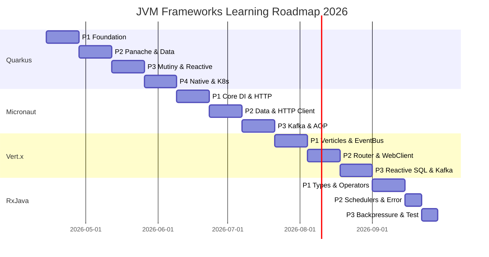

# ⚡ JVM Modern Frameworks — MOC

> Master Map of Content cho lộ trình học Quarkus · Micronaut · Vert.x · RxJava 2026

---

## 🗺️ Lộ Trình Tổng Quan

---

## 📊 Progress Dashboard

| Framework | Phase | Status | Tuần |
|-----------|-------|--------|------|
| [[01-Quarkus/00 Quarkus Overview\|⬡ Quarkus]] | P1 Foundation | 🔄 In Progress | 1-2 |
| [[01-Quarkus/00 Quarkus Overview\|⬡ Quarkus]] | P2 Panache | ⏳ Upcoming | 3-4 |
| [[01-Quarkus/00 Quarkus Overview\|⬡ Quarkus]] | P3 Reactive | ⏳ Upcoming | 5-6 |
| [[01-Quarkus/00 Quarkus Overview\|⬡ Quarkus]] | P4 Native | ⏳ Upcoming | 7-8 |
| [[02-Micronaut/00 Micronaut Overview\|◈ Micronaut]] | P1 Core | ⏳ Upcoming | 9-10 |
| [[02-Micronaut/00 Micronaut Overview\|◈ Micronaut]] | P2 Data | ⏳ Upcoming | 11-12 |
| [[02-Micronaut/00 Micronaut Overview\|◈ Micronaut]] | P3 Reactive | ⏳ Upcoming | 13-14 |
| [[03-Vertx/00 Vertx Overview\|△ Vert.x]] | P1 EventLoop | ⏳ Upcoming | 15-16 |
| [[03-Vertx/00 Vertx Overview\|△ Vert.x]] | P2 HTTP | ⏳ Upcoming | 17-18 |
| [[03-Vertx/00 Vertx Overview\|△ Vert.x]] | P3 Data | ⏳ Upcoming | 19-20 |
| [[04-RxJava/00 RxJava Overview\|◎ RxJava]] | P1 Types | ⏳ Upcoming | 21-22 |
| [[04-RxJava/00 RxJava Overview\|◎ RxJava]] | P2 Operators | ⏳ Upcoming | 22-23 |
| [[04-RxJava/00 RxJava Overview\|◎ RxJava]] | P3 Advanced | ⏳ Upcoming | 23-24 |

---

## ⬡ Quarkus

### Overview & Setup
- [[01-Quarkus/00 Quarkus Overview]]
- [[01-Quarkus/P1-Foundation/01 CDI vs Spring IoC]]
- [[01-Quarkus/P1-Foundation/02 JAX-RS vs Spring MVC]]
- [[01-Quarkus/P1-Foundation/03 Config & Dev Mode]]

### Data Layer
- [[01-Quarkus/P2-Data/01 Panache Active Record]]
- [[01-Quarkus/P2-Data/02 Panache Repository Pattern]]
- [[01-Quarkus/P2-Data/03 Quarkus Transactions]]

### Reactive
- [[01-Quarkus/P3-Reactive/01 Mutiny - Uni và Multi]]
- [[01-Quarkus/P3-Reactive/02 RESTEasy Reactive]]
- [[01-Quarkus/P3-Reactive/03 SmallRye Kafka]]

### Production
- [[01-Quarkus/P4-Native/01 GraalVM Native Image]]
- [[01-Quarkus/P4-Native/02 Kubernetes & Health Checks]]

---

## ◈ Micronaut

### Overview & Core
- [[02-Micronaut/00 Micronaut Overview]]
- [[02-Micronaut/P1-Core/01 Compile-time DI vs Runtime DI]]
- [[02-Micronaut/P1-Core/02 Controller và HTTP Layer]]

### Data & Integration
- [[02-Micronaut/P2-Data/01 Micronaut Data JPA]]
- [[02-Micronaut/P2-Data/02 Declarative HTTP Client]]

### Reactive & Messaging
- [[02-Micronaut/P3-Reactive/01 Micronaut Kafka]]
- [[02-Micronaut/P3-Reactive/02 Compile-time AOP]]

---

## △ Vert.x

### Core Concepts
- [[03-Vertx/00 Vertx Overview]]
- [[03-Vertx/P1-Core/01 Event Loop và Verticles]]
- [[03-Vertx/P1-Core/02 Event Bus]]

### HTTP & Client
- [[03-Vertx/P2-HTTP/01 Router và Route Handlers]]
- [[03-Vertx/P2-HTTP/02 WebClient]]

### Data & Kafka
- [[03-Vertx/P3-Data/01 Reactive SQL Client]]
- [[03-Vertx/P3-Data/02 Vertx với Quarkus]]

---

## ◎ RxJava

### Types & Basics
- [[04-RxJava/00 RxJava Overview]]
- [[04-RxJava/P1-Types/01 Observable vs Flowable]]
- [[04-RxJava/P1-Types/02 Single, Maybe, Completable]]

### Operators & Schedulers
- [[04-RxJava/P2-Operators/01 Core Operators]]
- [[04-RxJava/P2-Operators/02 Schedulers - subscribeOn vs observeOn]]

### Advanced
- [[04-RxJava/P3-Advanced/01 Backpressure Strategy]]
- [[04-RxJava/P3-Advanced/02 Testing với TestObserver]]

---

## 🔗 Liên kết Cross-Framework

| Concept | Spring Boot | Quarkus | Micronaut | Vert.x |
|---------|-------------|---------|-----------|--------|
| DI Container | ApplicationContext | ArC (CDI) | BeanContext | Manual / CDI add-on |
| HTTP Layer | @RestController | @Path (JAX-RS) | @Controller | Router API |
| Reactive Type | Mono/Flux | Uni/Multi | Mono/Flux/Single | Future/Promise |
| ORM | Spring Data JPA | Panache | Micronaut Data | Reactive SQL Client |
| Messaging | Spring Kafka | SmallRye Reactive | Micronaut Kafka | Vert.x Kafka |
| Config | @ConfigurationProperties | @ConfigProperty | @ConfigurationProperties | Vert.x Config |

---

## 🔗 Liên quan
- [[MOC-Java]] — Spring Boot foundation
- [[MOC-Distributed-Systems]] — Kafka, messaging patterns
- [[MOC-Concurrency]] — Async, reactive programming model
- [[Microservices-Patterns/]] — Architecture patterns áp dụng

---

## ⚡ Reactive & Async — Atomic Concepts
- [[concepts/reactive-programming-fundamentals|Reactive Programming Fundamentals]] — Observer pattern, stream, subscribe
- [[concepts/event-loop-model|Event Loop Model]] — single-thread non-blocking, KHÔNG BLOCK rule
- [[concepts/backpressure-explained|Backpressure Explained]] — flow control, BUFFER/DROP/LATEST strategies
- [[concepts/compile-time-vs-runtime-di|Compile-time vs Runtime DI]] — tại sao Quarkus/Micronaut startup nhanh hơn Spring
- [[concepts/native-image-aot-jit|Native Image, AOT vs JIT]] — GraalVM, startup 40ms, RAM 20MB

---

## 🧭 Reference & Decision
- [[JVM-Frameworks-2026/Framework-Decision-Matrix|Framework Decision Matrix]] — khi nào chọn framework nào
- [[JVM-Frameworks-2026/Spring-to-Quarkus-Cheatsheet|Spring → Quarkus Cheatsheet]] — 12 layers annotation mapping
- [[JVM-Frameworks-2026/Spring-to-Micronaut-Cheatsheet|Spring → Micronaut Cheatsheet]] — annotation mapping, @Client, Kafka
