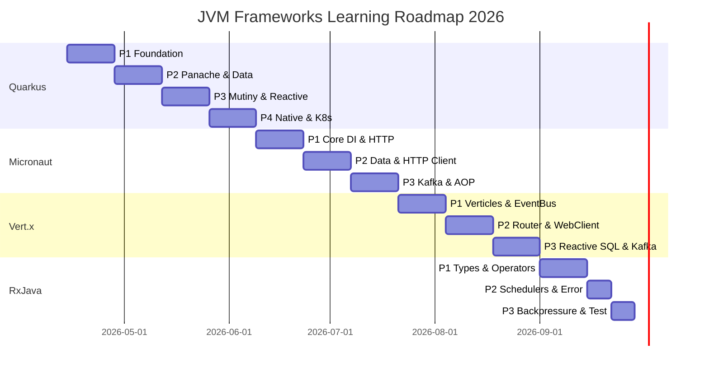

# ⚡ JVM Modern Frameworks — MOC

> Master Map of Content cho lộ trình học Quarkus · Micronaut · Vert.x · RxJava 2026

---

## 🗺️ Lộ Trình Tổng Quan

```mermaid
gantt
    title JVM Frameworks Learning Roadmap 2026
    dateFormat  YYYY-MM-DD
    section Quarkus
    P1 Foundation           :q1, 2026-04-14, 14d
    P2 Panache & Data       :q2, after q1, 14d
    P3 Mutiny & Reactive    :q3, after q2, 14d
    P4 Native & K8s         :q4, after q3, 14d
    section Micronaut
    P1 Core DI & HTTP       :m1, after q4, 14d
    P2 Data & HTTP Client   :m2, after m1, 14d
    P3 Kafka & AOP          :m3, after m2, 14d
    section Vert.x
    P1 Verticles & EventBus :v1, after m3, 14d
    P2 Router & WebClient   :v2, after v1, 14d
    P3 Reactive SQL & Kafka :v3, after v2, 14d
    section RxJava
    P1 Types & Operators    :r1, after v3, 14d
    P2 Schedulers & Error   :r2, after r1, 7d
    P3 Backpressure & Test  :r3, after r2, 7d
```

---

## 📊 Progress Dashboard

| Framework | Phase | Status | Tuần |
|-----------|-------|--------|------|
| [[00 Quarkus Overview\|⬡ Quarkus]] | P1 Foundation | 🔄 In Progress | 1-2 |
| [[00 Quarkus Overview\|⬡ Quarkus]] | P2 Panache | ⏳ Upcoming | 3-4 |
| [[00 Quarkus Overview\|⬡ Quarkus]] | P3 Reactive | ⏳ Upcoming | 5-6 |
| [[00 Quarkus Overview\|⬡ Quarkus]] | P4 Native | ⏳ Upcoming | 7-8 |
| [[00 Micronaut Overview\|◈ Micronaut]] | P1 Core | ⏳ Upcoming | 9-10 |
| [[00 Micronaut Overview\|◈ Micronaut]] | P2 Data | ⏳ Upcoming | 11-12 |
| [[00 Micronaut Overview\|◈ Micronaut]] | P3 Reactive | ⏳ Upcoming | 13-14 |
| [[00 Vertx Overview\|△ Vert.x]] | P1 EventLoop | ⏳ Upcoming | 15-16 |
| [[00 Vertx Overview\|△ Vert.x]] | P2 HTTP | ⏳ Upcoming | 17-18 |
| [[00 Vertx Overview\|△ Vert.x]] | P3 Data | ⏳ Upcoming | 19-20 |
| [[00 RxJava Overview\|◎ RxJava]] | P1 Types | ⏳ Upcoming | 21-22 |
| [[00 RxJava Overview\|◎ RxJava]] | P2 Operators | ⏳ Upcoming | 22-23 |
| [[00 RxJava Overview\|◎ RxJava]] | P3 Advanced | ⏳ Upcoming | 23-24 |

---

## ⬡ Quarkus

### Overview & Setup
- [[00 Quarkus Overview]]
- [[01 CDI vs Spring IoC]]
- [[02 JAX-RS vs Spring MVC]]
- [[03 Config & Dev Mode]]

### Data Layer
- [[01 Panache Active Record]]
- [[02 Panache Repository Pattern]]
- [[03 Quarkus Transactions]]

### Reactive
- [[01 Mutiny - Uni và Multi]]
- 02 RESTEasy Reactive *(planned)*
- [[03 SmallRye Kafka]]

### Production
- [[01 GraalVM Native Image]]
- [[02 Kubernetes & Health Checks]]

---

## ◈ Micronaut

### Overview & Core
- [[00 Micronaut Overview]]
- [[01 Compile-time DI vs Runtime DI]]
- 02 Controller và HTTP Layer *(planned)*

### Data & Integration
- 01 Micronaut Data JPA *(planned)*
- [[02 Declarative HTTP Client]]

### Reactive & Messaging
- [[01 Micronaut Kafka]]
- 02 Compile-time AOP *(planned)*

---

## △ Vert.x

### Core Concepts
- [[00 Vertx Overview]]
- [[01 Event Loop và Verticles]]
- 02 Event Bus *(planned)*

### HTTP & Client
- [[01 Router và Route Handlers]]
- 02 WebClient *(planned)*

### Data & Kafka
- [[01 Reactive SQL Client]]
- 02 Vertx với Quarkus *(planned)*

---

## ◎ RxJava

### Types & Basics
- [[00 RxJava Overview]]
- [[01 Observable vs Flowable]]
- 02 Single, Maybe, Completable *(planned)*

### Operators & Schedulers
- [[01 Core Operators]]
- [[02 Schedulers - subscribeOn vs observeOn]]

### Advanced
- [[01 Backpressure Strategy]]
- [[02 Testing với TestObserver]]

---

## 🔗 Liên kết Cross-Framework

| Concept | Spring Boot | Quarkus | Micronaut | Vert.x |
|---------|-------------|---------|-----------|--------|
| DI Container | ApplicationContext | ArC (CDI) | BeanContext | Manual / CDI add-on |
| HTTP Layer | @RestController | @Path (JAX-RS) | @Controller | Router API |
| Reactive Type | Mono/Flux | Uni/Multi | Mono/Flux/Single | Future/Promise |
| ORM | Spring Data JPA | Panache | Micronaut Data | Reactive SQL Client |
| Messaging | Spring Kafka | SmallRye Reactive | Micronaut Kafka | Vert.x Kafka |
| Config | @ConfigurationProperties | @ConfigProperty | @ConfigurationProperties | Vert.x Config |

---

## 🔗 Liên quan
- [[MOC-Java]] — Spring Boot foundation
- [[MOC-Distributed-Systems]] — Kafka, messaging patterns
- [[MOC-Concurrency]] — Async, reactive programming model
-  *(planned)* — Architecture patterns áp dụng

---

## ⚡ Reactive & Async — Atomic Concepts
- [[reactive-programming-fundamentals|Reactive Programming Fundamentals]] — Observer pattern, stream, subscribe
- [[event-loop-model|Event Loop Model]] — single-thread non-blocking, KHÔNG BLOCK rule
- [[backpressure-explained|Backpressure Explained]] — flow control, BUFFER/DROP/LATEST strategies
- [[compile-time-vs-runtime-di|Compile-time vs Runtime DI]] — tại sao Quarkus/Micronaut startup nhanh hơn Spring
- [[native-image-aot-jit|Native Image, AOT vs JIT]] — GraalVM, startup 40ms, RAM 20MB

---

## 🧭 Reference & Decision
- [[Framework-Decision-Matrix|Framework Decision Matrix]] — khi nào chọn framework nào
- [[Spring-to-Quarkus-Cheatsheet|Spring → Quarkus Cheatsheet]] — 12 layers annotation mapping
- [[Spring-to-Micronaut-Cheatsheet|Spring → Micronaut Cheatsheet]] — annotation mapping, @Client, Kafka
