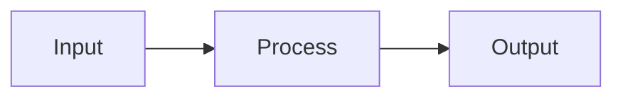

# {{title}}

## 📌 One-liner
> _Giải thích trong một câu, dành cho người đã biết Spring Boot_

## 🆚 So Sánh với Spring Boot

| Khía cạnh | Spring Boot | {{framework}} |
|-----------|-------------|---------------|
| | | |
| | | |

## 🧠 Core Concept

<!-- Giải thích ngắn gọn, ưu tiên hình ảnh/diagram nếu concept trừu tượng -->



## 💻 Code Example

### Spring Boot cách cũ
```java
// Code Spring Boot quen thuộc
```

### {{framework}} cách mới
```java
// Code với framework mới
```

> [!tip] Key Insight
> Điểm khác biệt quan trọng nhất cần nhớ

## ⚠️ Gotchas & Pitfalls

> [!warning] Common Mistake
> Mô tả lỗi phổ biến và cách tránh

## 🛠️ Khi nào dùng
- ✅ Nên dùng khi: ...
- ❌ Không nên khi: ...

## ✅ Practice Checklist
- [ ] Đọc hiểu concept
- [ ] Viết code example đầu tiên
- [ ] Áp dụng vào mini-project
- [ ] So sánh với Spring Boot equivalent

## 🔗 Liên quan
- 
- 

## 📖 Nguồn
- 
