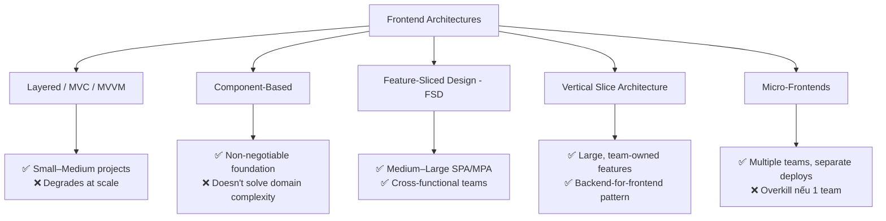
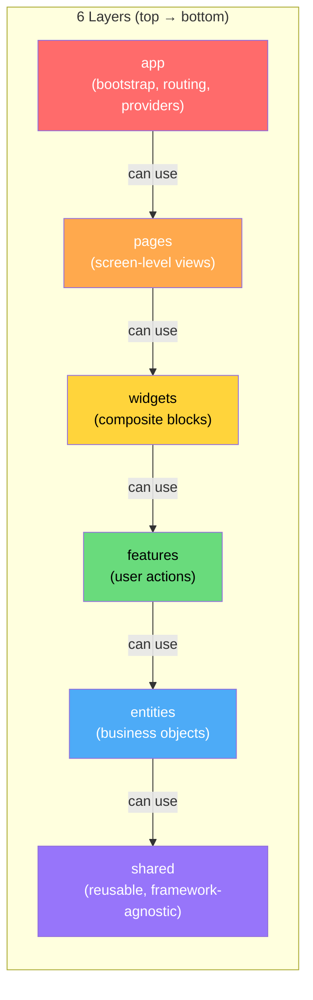
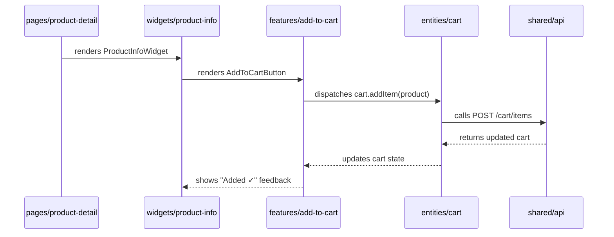
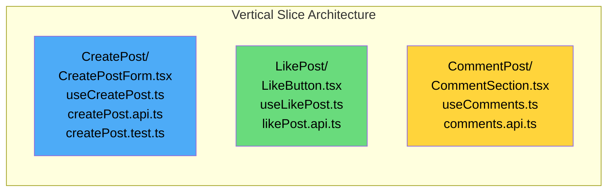
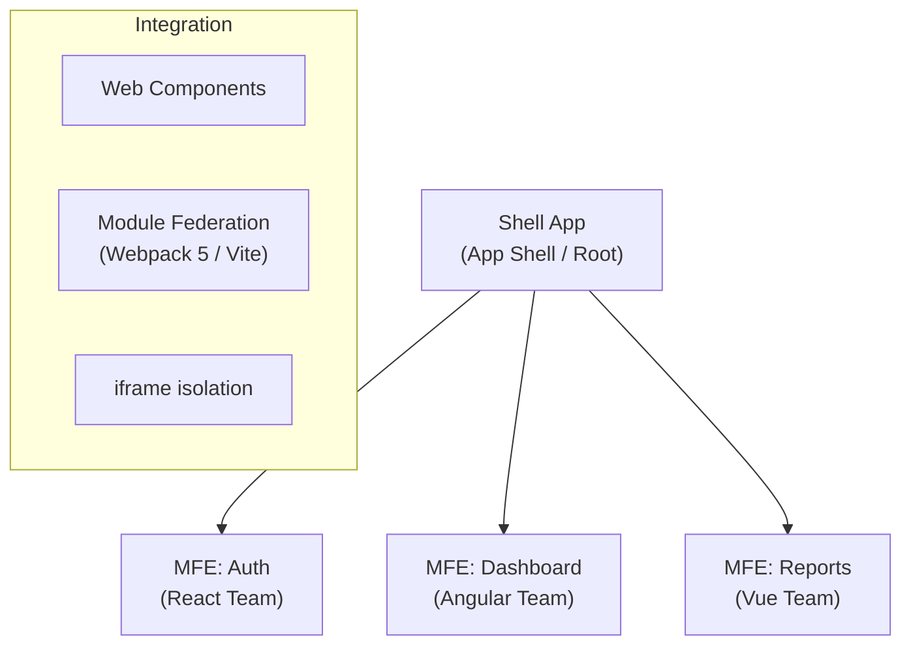
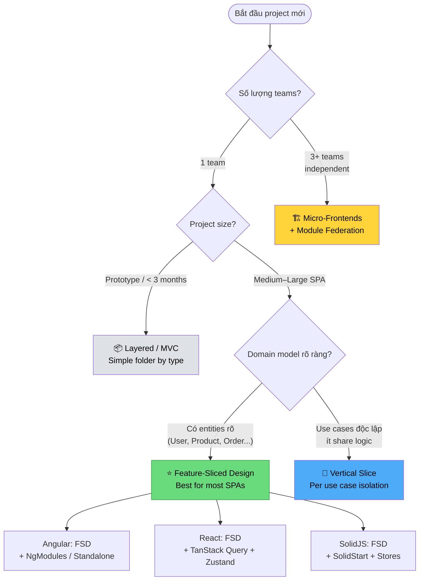
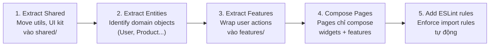

# Frontend Project Architecture 2026 — Kiến Trúc Nào Cho Usecase Nào?

> **Status:** 🟢 Active  
> **Tags:** #frontend #architecture #react #angular #solidjs #FSD #scalability  
> **Related:** [[React-Latest-Series/15-Enterprise-Best-Practices]] · [[Angular-Latest-Series/14-Enterprise-Architecture-and-Standalone]] · [[SolidJS-Series/06-Enterprise-Architecture]] · [[concepts/]]

---

## 🗺️ Tại Sao Cần Quan Tâm Đến Project Structure?

Hầu hết dev khi start project đều tổ chức theo **technical role** — tức là nhóm theo loại file:

```
src/
  components/
  hooks/
  utils/
  services/
  types/
```

Cách này hoạt động ổn khi project nhỏ. Nhưng khi team lớn lên và features tăng, nó biến thành **spaghetti code** — một component `UserCard` phụ thuộc vào một hook trong `hooks/`, một service trong `services/`, một type trong `types/`, và một util trong `utils/`. Để hiểu một feature, bạn phải nhảy qua 5 folder khác nhau.

> **Nguyên tắc cốt lõi:** Complexity không biến mất — nó chỉ *dịch chuyển*. Kiến trúc tốt là kiến trúc kiểm soát được nơi complexity trú ngụ.

---

## 📐 Tổng Quan Các Kiến Trúc Phổ Biến 2025–2026



---

## 1️⃣ Layered Architecture (MVC / MVVM)

### Khái niệm

Tổ chức code theo **trách nhiệm kỹ thuật** (technical concern). MVVM đặc biệt phổ biến trong Angular và Vue vì có reactive binding sẵn.

```
src/
  models/        # Data models, interfaces
  views/         # UI components
  controllers/   # Business logic / ViewModels
  services/      # API calls, side effects
```

### Khi nào dùng?

| Tiêu chí | Phù hợp |
|----------|---------|
| Team size | Solo → 3 devs |
| Project size | < 20 features |
| Vòng đời | Short-lived, prototype |
| Framework | Angular (có sẵn DI + service layer) |

### Hạn chế

Khi features tăng lên 30+, `services/` folder trở thành một "thùng rác" không có ranh giới rõ ràng giữa các domain.

---

## 2️⃣ Feature-Sliced Design (FSD) ⭐ — *Xu hướng chính 2025–2026*

### Khái niệm

FSD là methodology được thiết kế riêng cho frontend, tổ chức code theo 3 chiều: **Layer → Slice → Segment**.



> **Quy tắc vàng:** Layer chỉ được import từ layer **thấp hơn** nó. `features` không được import từ `pages`. `shared` không được import từ bất kỳ layer nào khác.

### Cấu trúc thư mục thực tế

```
src/
├── app/                    # Layer 1: App bootstrap
│   ├── providers/          # Redux store, ThemeProvider, AuthProvider
│   ├── router/             # Root routing config
│   └── styles/             # Global CSS / design tokens
│
├── pages/                  # Layer 2: Route-level screens
│   ├── dashboard/
│   │   ├── ui/             # DashboardPage.tsx
│   │   └── index.ts        # Public API (barrel export)
│   └── profile/
│       ├── ui/
│       └── index.ts
│
├── widgets/                # Layer 3: Composite blocks
│   ├── header/
│   │   ├── ui/             # Header.tsx (combines features + entities)
│   │   └── index.ts
│   └── sidebar/
│
├── features/               # Layer 4: User interactions
│   ├── auth-by-email/      # "Login with email" feature
│   │   ├── ui/             # LoginForm.tsx
│   │   ├── model/          # useLoginForm.ts, authSlice.ts
│   │   ├── api/            # loginUser.ts (API call)
│   │   └── index.ts
│   └── add-to-cart/
│
├── entities/               # Layer 5: Business domain objects
│   ├── user/
│   │   ├── ui/             # UserCard.tsx, UserAvatar.tsx
│   │   ├── model/          # userSlice.ts, User type
│   │   └── index.ts
│   └── product/
│
└── shared/                 # Layer 6: Pure reusable code
    ├── ui/                 # Button, Input, Modal (design system)
    ├── api/                # axios instance, API client
    ├── config/             # env variables, constants
    ├── lib/                # Generic helpers (formatDate, cn())
    └── types/              # Shared TypeScript types
```

### Ví dụ: Flow của feature "Add to Cart"



### Segments trong mỗi Slice

```
feature/auth-by-email/
├── ui/       # React/Angular/Solid components
├── model/    # State, business logic, hooks
├── api/      # API calls riêng cho feature này
├── lib/      # Helpers chỉ dùng trong feature này
├── config/   # Constants riêng
└── index.ts  # PUBLIC API — chỉ export những gì cần thiết!
```

> **`index.ts` là "public API contract"** — bên ngoài chỉ được import từ `features/auth-by-email`, không được đi thẳng vào `features/auth-by-email/model/authSlice`. Đây là cơ chế encapsulation của FSD.

### Khi nào dùng FSD?

| Tiêu chí | Phù hợp |
|----------|---------|
| Team size | 2–20 devs |
| Project size | Medium → Large SPA |
| Features | 10+ business features rõ ràng |
| Framework | React, Angular, SolidJS, Vue — framework-agnostic |
| Onboarding | Cần onboard member mới nhanh |

---

## 3️⃣ Vertical Slice Architecture (VSA)

### Khái niệm

Mỗi **"use case"** hoặc **"user story"** là một slice hoàn toàn độc lập, chứa toàn bộ stack từ UI → business logic → API call.



### So sánh với FSD

| | FSD | Vertical Slice |
|--|-----|---------------|
| Tổ chức theo | Layer + Domain | Use case / User story |
| Code sharing | Qua `entities` và `shared` | Cẩn thận, dễ duplicate |
| Team ownership | Feature team own một slice | Use case team own một slice |
| Phù hợp | SPA có domain model rõ | BFF, server-driven UI |
| Backend analogy | DDD + Layered | CQRS + Vertical Slice |

### Khi nào dùng VSA?

- App có các use case **hoàn toàn độc lập** với nhau
- Backend-for-Frontend (BFF) pattern — mỗi screen có API endpoint riêng
- Team lớn, mỗi team sở hữu một flow end-to-end

---

## 4️⃣ Micro-Frontends

### Khái niệm

Tách frontend thành các **ứng dụng nhỏ độc lập**, mỗi cái có thể deploy riêng, viết bằng framework khác nhau.



### Khi nào dùng?

| Tiêu chí | Phù hợu |
|----------|---------|
| Team size | 5+ independent teams |
| Deploy | Cần deploy độc lập từng phần |
| Tech diversity | Nhiều framework khác nhau |
| Org structure | Conway's Law — team structure = architecture |

> ⚠️ **Cảnh báo:** Micro-frontends giải quyết **organizational scale**, không phải code complexity. Nếu chỉ có 1–2 team, FSD là đủ và nhẹ hơn nhiều.

---

## 🔄 Decision Tree — Chọn Kiến Trúc Nào?



---

## ⚡ Áp Dụng FSD Cho Từng Framework

### React + FSD

```tsx
// features/auth-by-email/ui/LoginForm.tsx
import { Button } from "@/shared/ui";          // ✅ import from shared
import { UserCard } from "@/entities/user";    // ✅ import from entities (lower layer)
// import { Header } from "@/widgets/header";  // ❌ FORBIDDEN — widgets is higher layer

export const LoginForm = () => {
  const { mutate: login, isPending } = useLogin(); // from features/auth-by-email/model

  return (
    <form onSubmit={login}>
      <Button loading={isPending}>Sign In</Button>
    </form>
  );
};
```

```
// tsconfig.json — path aliases để enforce FSD imports
{
  "compilerOptions": {
    "paths": {
      "@/app/*":      ["./src/app/*"],
      "@/pages/*":    ["./src/pages/*"],
      "@/widgets/*":  ["./src/widgets/*"],
      "@/features/*": ["./src/features/*"],
      "@/entities/*": ["./src/entities/*"],
      "@/shared/*":   ["./src/shared/*"]
    }
  }
}
```

### Angular + FSD

Angular có sẵn module system — map rất tự nhiên sang FSD:

```
src/
├── app/                    # AppModule / bootstrapApplication
├── pages/                  # Lazy-loaded route components
│   └── dashboard/
│       ├── dashboard.component.ts
│       └── index.ts
├── features/
│   └── filter-products/
│       ├── filter-form.component.ts
│       ├── filter.service.ts          # Angular DI service
│       └── index.ts
├── entities/
│   └── product/
│       ├── product-card.component.ts
│       ├── product.model.ts           # Interface + Zod schema
│       └── index.ts
└── shared/
    ├── ui/                # Reusable Angular components
    └── api/               # HttpClient wrapper
```

> Angular với **Standalone Components** (Angular 17+) fit FSD cực tốt — mỗi slice là một tập standalone components với DI riêng.

### SolidJS + FSD

SolidJS's fine-grained reactivity maps cleanly vào FSD model layer:

```tsx
// entities/user/model/user.store.ts
import { createStore } from "solid-js/store";

export const [userStore, setUserStore] = createStore({
  currentUser: null as User | null,
  isLoading: false,
});

// features/edit-profile/ui/EditProfileForm.tsx  
import { userStore } from "@/entities/user";  // ✅ lower layer
import { Button } from "@/shared/ui";          // ✅ lower layer
```

---

## 🛠️ Tooling Hỗ Trợ FSD

| Tool | Mục đích |
|------|---------|
| `@feature-sliced/eslint-config` | ESLint rules enforce import rules |
| `steiger` | Linter kiểm tra toàn bộ FSD conventions |
| `npx fsd` | CLI tạo folder/slice structure |
| VSCode plugin | Steiger integration trong editor |
| `eslint-plugin-boundaries` | Alternative enforce module boundaries |

```bash
# Tạo FSD structure với CLI
npx fsd pages dashboard profile settings --segments ui model
npx fsd features auth-by-email add-to-cart --segments ui model api
npx fsd entities user product order --segments ui model
```

---

## 📊 So Sánh Tổng Hợp


| Kiến trúc | Team | Project Size | Learning Curve | Flexibility |
|-----------|------|-------------|---------------|------------|
| Layered/MVC | Solo–3 | Small | ⭐ Thấp | ⭐⭐⭐ Cao |
| FSD | 2–20 | Medium–Large | ⭐⭐⭐ Trung bình | ⭐⭐ Trung bình |
| Vertical Slice | 3–10 | Large | ⭐⭐ Thấp-TB | ⭐⭐⭐ Cao |
| Micro-Frontends | 5+ teams | Very Large | ⭐⭐⭐⭐⭐ Cao | ⭐⭐⭐⭐ Rất cao |

---

## 🚀 Migration Path — Refactor Dần Không Đau

Nếu bạn có codebase cũ theo style "folders by type", không cần rewrite toàn bộ:



> Làm từng bước, feature by feature. Không cần "big rewrite".

---

## 💡 Kết Luận — Lựa Chọn Của Tôi

Cho stack **React / Angular / SolidJS** trong context **enterprise/medium-large SPA**:

> **⭐ Feature-Sliced Design là default choice cho 2025–2026.**

Lý do:
1. **Framework-agnostic** — cùng methodology cho React, Angular, SolidJS
2. **Domain-driven** — structure phản ánh business, không phải technical concerns  
3. **Onboarding nhanh** — member mới đọc folder name là hiểu app làm gì
4. **Tooling tốt** — ESLint, CLI, steiger linter
5. **Scale gracefully** — không cần rewrite khi team lớn lên

Chỉ chuyển sang Micro-Frontends khi có **nhiều team độc lập cần deploy riêng**.

---

## 🔗 Tài Liệu Tham Khảo

- [Feature-Sliced Design Official Docs](https://feature-sliced.design/)
- [FSD Tutorial — Conduit App](https://feature-sliced.design/docs/get-started/tutorial)
- [FSD with Angular — Medium](https://medium.com/@fed4wet/feature-sliced-design-modern-architectural-methodology-on-angular-d0ef705ef598)
- [[React-Latest-Series/15-Enterprise-Best-Practices]]
- [[Angular-Latest-Series/14-Enterprise-Architecture-and-Standalone]]
- [[SolidJS-Series/06-Enterprise-Architecture]]
- [[concepts/]]
