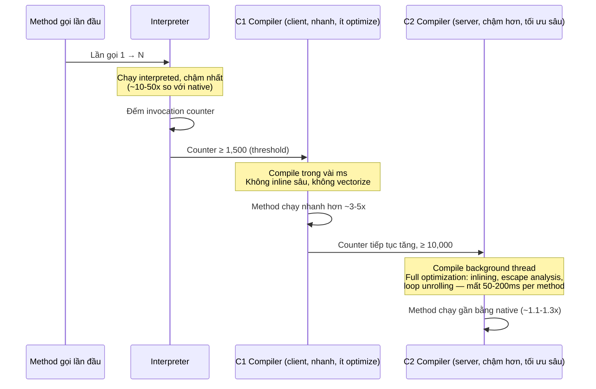
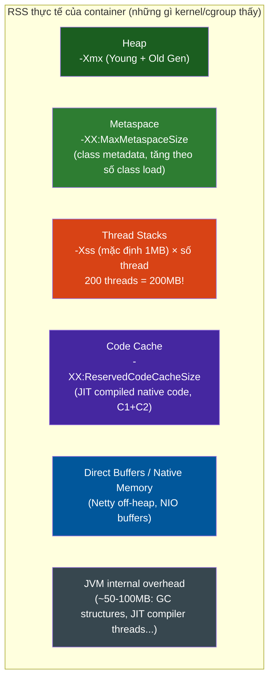
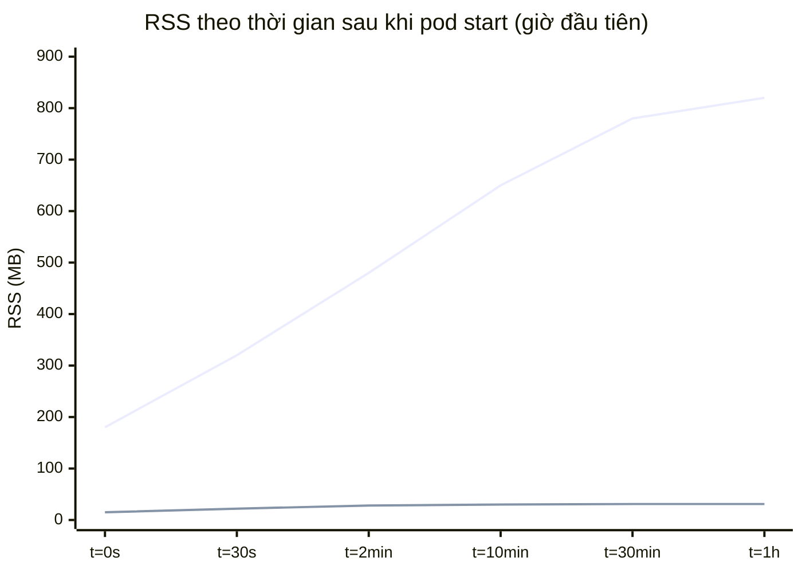
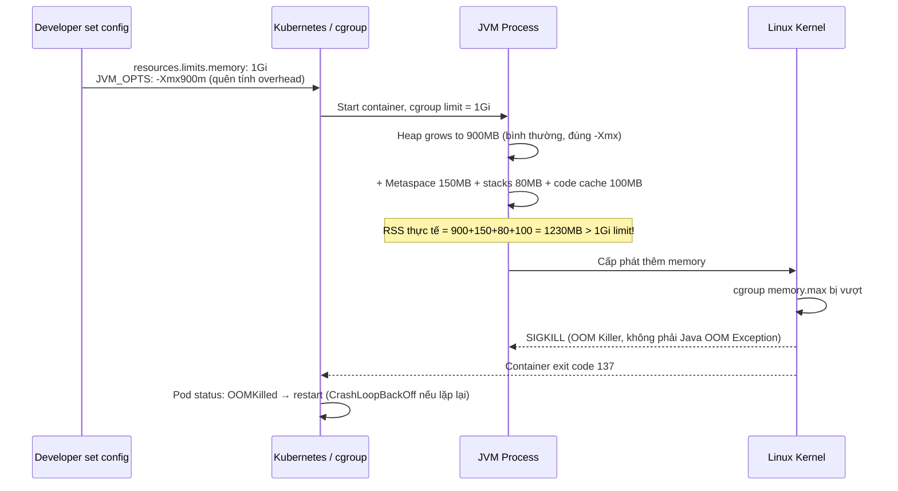

# Rust vs Java — Build/Compile/Interpret Timeline & Bộ Nhớ Khi Deploy

> **Vì sao cần article này riêng?** [[rust-java-go-comparison]] đã có bảng so sánh compilation model, và [[gc-llvm-runtime-cpu-memory-internals]] đã đi sâu cơ chế GC/LLVM ở mức CPU. Nhưng cả hai đều **chưa trả lời 2 câu hỏi thực dụng nhất khi vận hành PDMS trên EKS**:
> 1. Build/compile/warm-up **tốn bao nhiêu giây thực tế**, theo từng bước?
> 2. Khi container chạy production, **RAM đi đâu**, và tại sao pod bị `OOMKilled`?
>
> Bối cảnh đo: Java 21 (ZGC/G1) + Spring Boot 3.x, so với Rust + Axum/Tokio, cùng deploy trên AWS EKS.

---

## 1. Build & Compile Timeline — Theo Từng Giây

### 1.1 Rust — `cargo build` pipeline đầy đủ

```mermaid
gantt
    title Rust: cargo build --release (project ~50K LOC, PDMS-scale service)
    dateFormat X
    axisFormat %Ss
    section Frontend
    Lexing + Parsing           :a1, 0, 2s
    Macro expansion (proc-macro derive) :a2, after a1, 3s
    Type check + Borrow check  :a3, after a2, 8s
    HIR → MIR                  :a4, after a3, 2s
    section LLVM
    MIR → LLVM IR              :b1, after a4, 3s
    Optimization passes (~70+) :b2, after b1, 25s
    Codegen (per-crate, song song) :b3, after b2, 20s
    section Link
    Linking (static, LTO)      :c1, after b3, 12s
```



| Bước | `cargo check` | `cargo build` (debug) | `cargo build --release` |
|---|---|---|---|
| Full build (cold cache) | 3-8s | 15-40s | 60-300s |
| Incremental (1 file đổi) | 1-3s | 2-8s | 10-40s |
| LTO (`lto = "fat"`, cho binary tối ưu nhất) | — | — | +30-120s |

**Điểm quan trọng:** `--release` chậm hơn debug **5-10x** vì LLVM chạy đầy đủ optimization passes (inlining, vectorization, escape analysis — xem chi tiết ở [[gc-llvm-runtime-cpu-memory-internals]]). Đây là chi phí **trả một lần lúc build**, đổi lại **zero cost lúc runtime**.

### 1.2 Java — `mvn package` → JVM chạy → JIT warm-up

```mermaid
gantt
    title Java: mvn package + JVM startup + warm-up (Spring Boot service tương tự)
    dateFormat X
    axisFormat %Ss
    section Build
    javac compile (bytecode gen, không optimize) :a1, 0, 8s
    Annotation processing (Lombok/MapStruct)  :a2, after a1, 3s
    Packaging (fat jar, Spring Boot repackage) :a3, after a2, 6s
    section Startup runtime
    JVM bootstrap (load libjvm, init heap)     :b1, after a3, 1s
    Class loading + bytecode verification      :b2, after b1, 2s
    Spring context init (bean scan, DI wiring)  :b3, after b2, 4s
    section JIT warm-up
    Interpreter phase (mọi method chạy chậm)    :c1, after b3, 5s
    C1 kicks in (~1500 invocations/method)      :c2, after c1, 10s
    C2 kicks in (~10000 invocations, background):c3, after c2, 20s
```



**Cơ chế Tiered Compilation chi tiết** (đã nhắc sơ ở gc-llvm article, đây là timeline cụ thể):



| Giai đoạn | Thời gian điển hình | Throughput tương đối |
|---|---|---|
| Interpreter only (mới start) | 0-2s đầu | ~30-40% |
| C1 compiled (hot paths) | 2-15s | ~70-80% |
| C2 compiled (steady state) | 15-40s | ~95-100% (peak) |

**Hệ quả trực tiếp cho PDMS:** một pod Spring Boot mới start (rolling deploy, autoscale scale-out) chạy ở **~40% throughput trong 15-20 giây đầu**. Đây là lý do `readinessProbe` với `initialDelaySeconds` quá ngắn có thể route traffic vào pod chưa "ấm", gây latency spike ngay sau deploy.

### 1.3 So sánh trực tiếp: từ `git push` đến "sẵn sàng nhận traffic ở peak throughput"

```mermaid
gantt
    title CI/CD → Ready-for-peak-traffic (thực tế, bao gồm Docker build)
    dateFormat X
    axisFormat %Ss
    section Rust service
    cargo build --release      :r1, 0, 120s
    docker build (multi-stage, distroless) :r2, after r1, 15s
    Pod start + bind port       :r3, after r2, 1s
    Peak throughput ngay lập tức :milestone, after r3, 0s
    section Java service
    mvn package                :j1, 0, 40s
    docker build (JRE base image) :j2, after j1, 20s
    Pod start + Spring context  :j3, after j2, 8s
    JIT warm-up đến peak        :j4, after j3, 30s
```



**Kết luận thực dụng:**
- Rust: build chậm hơn (~2-3x), nhưng **peak throughput ngay khi container start**.
- Java: build nhanh hơn, nhưng cần **~35-40s sau khi pod Ready mới đạt throughput ổn định** — quan trọng khi tune HPA (Horizontal Pod Autoscaler) scale-out reaction time trên EKS.

---

## 2. Bộ Nhớ Khi Deploy — Thực Tế Trên Container/K8s

Phần [[gc-llvm-runtime-cpu-memory-internals]] mục 5.2 đã cho số liệu RSS baseline ("Hello World"). Ở đây đi sâu vào **cách RAM biến động theo thời gian trong container**, và **cách set resource limits đúng** — đây là chỗ hay gây sự cố production nhất.

### 2.1 Docker image size — ảnh hưởng cold-start & node bandwidth

| | Image | Size |
|---|---|---|
| Rust | `scratch` / `gcr.io/distroless/static` + static binary | 8-25MB |
| Java (JRE base) | `eclipse-temurin:21-jre` + fat jar | 250-380MB |
| Java (GraalVM Native Image) | `distroless` + native binary | 80-150MB |

Image lớn → pull chậm hơn khi node mới join cluster hoặc scale-out gấp (đáng chú ý khi PDMS cần scale nhanh giờ cao điểm).

### 2.2 Anatomy bộ nhớ JVM trong container — cái mà `-Xmx` KHÔNG bao gồm



**Sai lầm phổ biến nhất:** set `-Xmx1500m` cho pod có `resources.limits.memory: 1536Mi`, quên rằng Metaspace + Thread Stacks + Code Cache + JVM overhead có thể cộng thêm **300-600MB** ngoài heap → RSS vượt limit → kernel OOM killer giết process (`SIGKILL`, không phải Java `OutOfMemoryError` — log JVM không hề thấy exception, chỉ pod restart đột ngột).

### 2.3 JVM flags quan trọng cho container (Java 17+/21)

```bash
# Kể từ Java 10+, mặc định đã bật UseContainerSupport
-XX:+UseContainerSupport          # JVM đọc cgroup limit, không đọc RAM vật lý của node

# Khuyến nghị: dùng % thay vì số cố định, để JVM tự scale theo container limit
-XX:MaxRAMPercentage=70.0         # Heap tối đa = 70% container memory limit
-XX:InitialRAMPercentage=50.0

# Giới hạn Metaspace (mặc định unbounded — có thể leak nếu dynamic class loading nhiều)
-XX:MaxMetaspaceSize=256m

# Giảm thread stack nếu có nhiều thread (Tomcat thread pool mặc định 200!)
-Xss512k                          # Giảm từ 1MB mặc định — tiết kiệm ~100MB với 200 threads

# Giới hạn code cache (mặc định 240MB ở tiered compilation)
-XX:ReservedCodeCacheSize=128m

# ZGC cho low-latency (PDMS profile: banking, cần P99 ổn định)
-XX:+UseZGC -XX:+ZGenerational
```

**Công thức sizing an toàn cho `resources.limits.memory`:**

```
Container limit ≥ Xmx + MaxMetaspaceSize + (Xss × thread_count) + ReservedCodeCacheSize + 150MB (buffer JVM overhead)

Ví dụ PDMS Spring Boot service, 200 threads:
  Xmx = 1024MB
  Metaspace = 256MB
  Thread stacks = 512KB × 200 = 100MB
  Code cache = 128MB
  Buffer = 150MB
  ────────────────────────────
  Tổng tối thiểu = 1658MB → làm tròn resources.limits.memory: 2Gi
```

### 2.4 RSS creep — bộ nhớ tăng dần sau khi deploy (không phải leak, là hành vi bình thường)



Lý do Java RSS tăng dần dù không có "leak":
- **Metaspace** tăng khi lazy-load thêm class (Spring proxy classes, Hibernate entity, JSON serializer sinh động)
- **Heap** tăng vì JVM ưu tiên tránh GC pause hơn là trả RAM ngay — G1/ZGC chỉ giảm heap khi rảnh dài, không aggressive giải phóng
- **Code Cache** tăng khi C2 compile nhiều method hơn theo traffic pattern thực tế
- Rust: heap allocation = actual data structures, không có "buffer trước cho tương lai" → RSS phẳng gần như ngay từ đầu

**Hệ quả vận hành:** không nên set `resources.requests.memory` bằng RSS đo lúc mới start (t=0s) — pod sẽ bị đánh giá sai schedulable, rồi bị pressure/evict khi RSS leo lên theo giờ. Nên đo RSS ở **steady state (≥30 phút)**, không phải lúc cold start.

### 2.5 OOMKilled — sự cố thực tế, root cause thường gặp



**Điểm cần nhớ:** `kubectl describe pod` báo `OOMKilled (exit code 137)` — đây là kernel giết process, **JVM logs sẽ KHÔNG có `java.lang.OutOfMemoryError`** vì JVM chưa kịp tự phát hiện thiếu heap, cgroup đã giết trước. Đây là lý do dễ debug sai hướng (đi tìm memory leak trong code, trong khi vấn đề là sizing `-Xmx` vs container limit).

### 2.6 Rust — góc nhìn đối lập

```
Rust container memory profile:
  RSS = data structures thực sự cần (Vec, HashMap, struct...) 
      + thread stacks (mặc định 2MB/thread trên Linux nhưng thường ít thread hơn nhờ async/Tokio)
      + runtime overhead (~vài trăm KB, không có GC, không JIT code cache)

  → Không cần công thức phức tạp. Đo RSS thực tế lúc load test peak,
    cộng buffer ~20-30% cho spike, xong.

  → Không có khái niệm "warm-up" ảnh hưởng resource limit.
  → Không có RSS creep theo giờ — flat từ phút đầu tiên.
```

---

## 3. Khuyến Nghị Thực Tế Cho PDMS Trên EKS

| Loại service | Ngôn ngữ hiện tại | `resources.requests/limits.memory` gợi ý | Ghi chú |
|---|---|---|---|
| CRUD API (I/O-bound, Spring Boot + Virtual Threads) | Java 21 + ZGC | requests: 1Gi / limits: 2Gi | Set `MaxRAMPercentage=70`, đo RSS ở steady-state trước khi chốt số |
| Batch ETL / Excel validation (CPU-bound, 5K-200K records) | Java hiện tại | requests: 1.5Gi / limits: 3Gi | Cân nhắc tách sang Rust/Go worker nếu CPU-bound nặng (xem mục 7 của gc-llvm article) |
| Kafka consumer xử lý nặng | Java | limits: 2-2.5Gi | Metaspace + code cache lớn hơn do nhiều class Avro/schema generated |
| Hypothetical Rust batch worker | Rust + Tokio | requests = limits ≈ RSS đo thực tế × 1.2 | Không cần buffer lớn cho JVM overhead |

**Checklist trước khi set memory limit cho bất kỳ service Java nào trên PDMS:**
1. Đo RSS ở steady-state (≥30 phút chạy load thực tế), không phải lúc cold start.
2. Cộng: Metaspace + (Xss × thread pool size) + Code Cache + 150MB buffer.
3. Luôn dùng `MaxRAMPercentage` thay vì `-Xmx` cố định — tránh phải update lại khi đổi instance type node.
4. Set `readinessProbe.initialDelaySeconds` đủ để qua giai đoạn JIT warm-up (mục 1.2) trước khi nhận traffic thật.

---

## 4. Tổng Kết

| | Rust | Java |
|---|---|---|
| Build time (release) | 1-5 phút | 10-40s |
| Thời gian đạt peak throughput sau start | ~0s (ngay lập tức) | 15-40s (JIT warm-up) |
| Docker image size | 8-25MB | 250-380MB (JRE) / 80-150MB (Native Image) |
| RSS baseline | Vài chục MB, flat | 150-800MB, tăng dần theo giờ đầu |
| Rủi ro OOMKilled | Thấp (RSS dễ đoán) | Cao nếu sizing `-Xmx` sai so với container limit |
| Công sức tune memory | Gần như không cần | Cần hiểu Metaspace/Stack/CodeCache/overhead |

---

## 5. References
- `[[rust-java-go-comparison]]` — bảng so sánh tổng quan compilation model
- `[[gc-llvm-runtime-cpu-memory-internals]]` — cơ chế GC/LLVM/native code ở mức CPU
- `[[MOC-Memory-Model]]`
- [JEP 346: Container-Aware JVM](https://openjdk.org/jeps/346)
- [Oracle Docs — JVM Container Support](https://docs.oracle.com/en/java/javase/21/gctuning/)
- [Kubernetes — Resource Management for Pods](https://kubernetes.io/docs/concepts/configuration/manage-resources-containers/)
