# Data Binding — One-Way vs Two-Way: React & Angular Internals

> **Tags:** #frontend #react #angular #data-binding #state-management #architecture  
> **Related:** [[ssr-vs-csr-deep-dive]], [[SolidJS-02-Signals-Deep-Dive]], [[reactive-programming-fundamentals]]

---

## 🗺️ Tổng Quan

**Data binding** là cơ chế đồng bộ hóa dữ liệu giữa **Model** (JavaScript state/data) và **View** (DOM/Template). Cách React và Angular tiếp cận vấn đề này hoàn toàn khác nhau về triết lý, dẫn đến trade-offs quan trọng trong real-world development.

```
Câu hỏi cốt lõi: "Khi data thay đổi, ai chịu trách nhiệm cập nhật UI?
                  Và khi UI thay đổi, ai cập nhật data?"
```

---

## 1. Định Nghĩa Chính Xác

### 1.1 One-Way Binding (Đơn chiều)

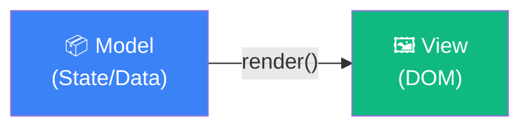

> **Data chỉ chảy theo MỘT chiều:** Model → View.  
> Khi View thay đổi (user gõ vào input), **không tự động** cập nhật Model — phải có event handler explicit.

### 1.2 Two-Way Binding (Hai chiều)

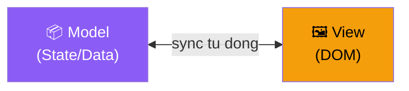

> **Data chảy cả hai chiều:** Model ↔ View.  
> Khi Model thay đổi → View tự cập nhật.  
> Khi View thay đổi (user input) → Model tự cập nhật.

---

## 2. React — One-Way Data Binding (Unidirectional Flow)

### 2.1 Triết Lý Cốt Lõi

React áp dụng **Unidirectional Data Flow** — được lấy cảm hứng từ kiến trúc **Flux** (Facebook). Đây là **lựa chọn có chủ đích**, không phải hạn chế.

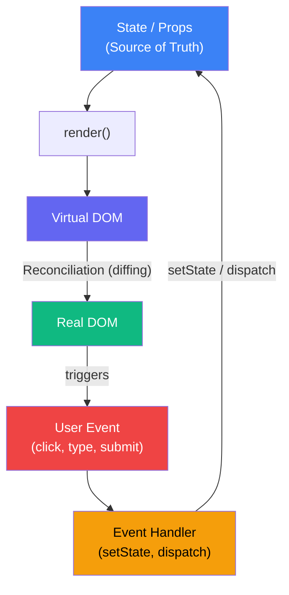

### 2.2 Cơ Chế Input trong React (Controlled Component)

```jsx
// ✅ React Controlled Component — ONE-WAY binding
function SearchBox() {
  const [query, setQuery] = useState('')
  //          ↑ State là nguồn sự thật duy nhất

  return (
    <input
      value={query}               // ← Model → View: state drives the display
      onChange={(e) => {
        setQuery(e.target.value)  // ← View → Model: MANUAL, explicit
        // Phải có handler này, không thì input bị "frozen"
      }}
      placeholder="Search..."
    />
  )
}
```

**Điều gì xảy ra khi user gõ?**

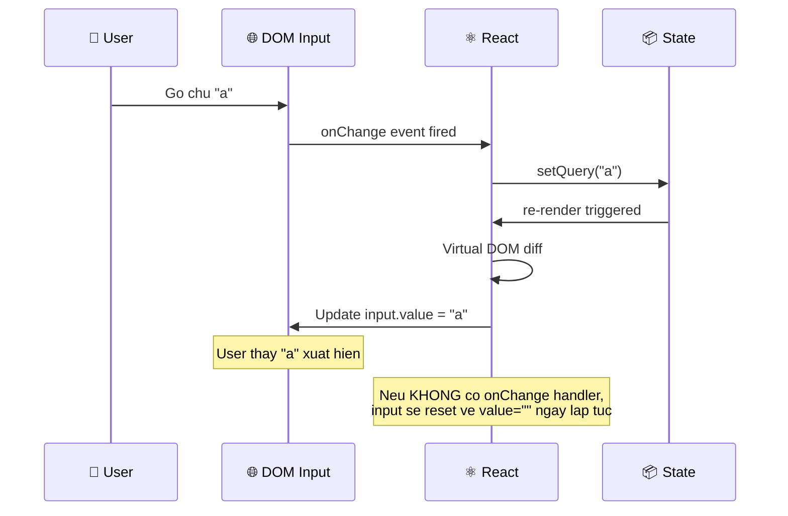

### 2.3 Uncontrolled Component (Special cases)

```jsx
// ⚠️ Uncontrolled Component — bỏ qua React, dùng DOM trực tiếp
function SearchBox() {
  const inputRef = useRef(null)

  const handleSubmit = () => {
    console.log(inputRef.current.value)  // Đọc trực tiếp từ DOM
  }

  return (
    <div>
      <input ref={inputRef} />  {/* React không control giá trị này */}
      <button onClick={handleSubmit}>Search</button>
    </div>
  )
  // ✅ Dùng cho: file upload, third-party DOM libs
  // ❌ Tránh cho: validation, conditional rendering dựa trên input
}
```

### 2.4 Props — One-Way từ Parent đến Child

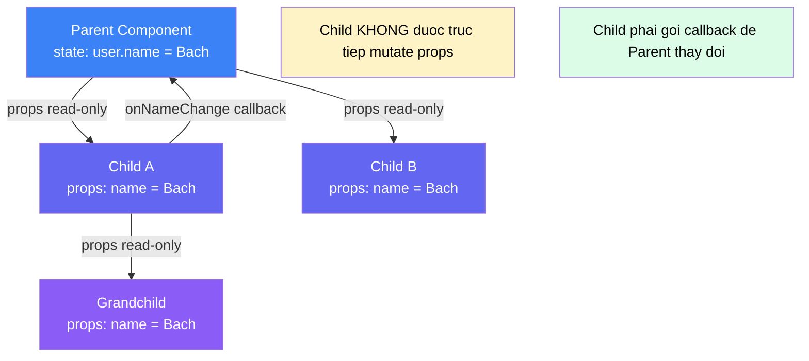

---

## 3. Angular — Two-Way Data Binding

### 3.1 Triết Lý Cốt Lõi

Angular kế thừa từ AngularJS (2010) với mục tiêu giúp developer ít viết code boilerplate hơn. Two-way binding được implement qua **Zone.js** và **Change Detection**.

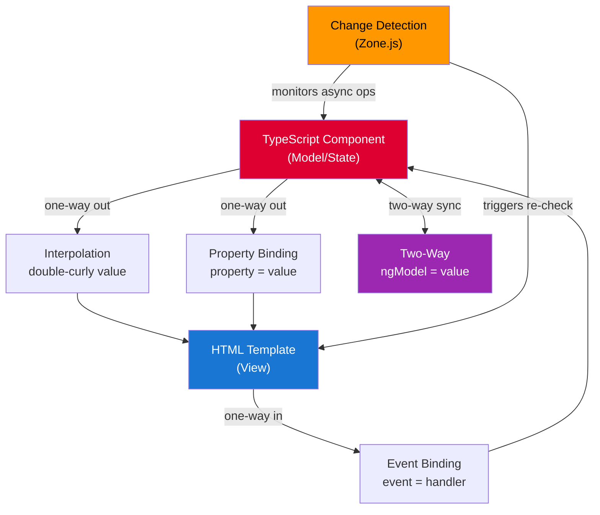

### 3.2 Các Loại Binding trong Angular

#### Interpolation — `{{ value }}`
```html
<!-- Model → View: Hiển thị giá trị -->
<h1>Hello, {{ user.name }}!</h1>
<p>Total: {{ price * quantity | currency }}</p>
```

#### Property Binding — `[property]`
```html
<!-- Model → View: Gán giá trị cho DOM property -->

<button [disabled]="isLoading">Submit</button>
```

#### Event Binding — `(event)`
```html
<!-- View → Model: Lắng nghe DOM events -->
<button (click)="handleClick()">Click me</button>
<input (input)="onInput($event)" (keyup.enter)="onEnter()">
```

#### Two-Way Binding — `[(ngModel)]` (Banana in a Box 🍌📦)
```html
<!-- View ↔ Model: Đồng bộ cả hai chiều -->
<input [(ngModel)]="searchQuery">

<!-- Tương đương viết dài: -->
<input [value]="searchQuery" (input)="searchQuery = $event.target.value">
```

### 3.3 Cơ Chế `[(ngModel)]` Thực Sự

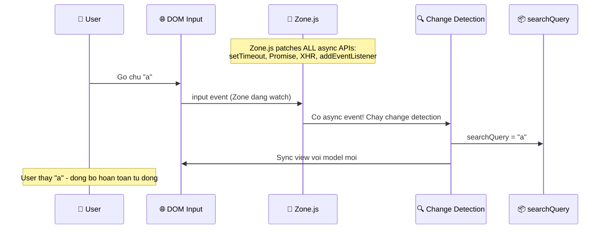

### 3.4 Zone.js — "Phép Thuật" Phía Sau

```
Zone.js hoạt động bằng cách MONKEY-PATCH các native APIs:

Trước Zone.js:
  setTimeout(fn, 1000)  →  fn() sau 1 giây, Angular không biết

Sau Zone.js:
  setTimeout(fn, 1000)  →  Zone.run(fn) sau 1 giây
                            → Angular biết có gì đó xảy ra
                            → Trigger Change Detection
                            → UI được cập nhật
```

```typescript
// Angular component — tự động detect changes
@Component({
  selector: 'app-search',
  template: `
    <input [(ngModel)]="query">
    <p>Searching for: {{ query }}</p>
  `
})
export class SearchComponent {
  query = '';  // Thay đổi cái này → template tự động cập nhật
              // Không cần setState(), không cần dispatch()
}
```

---

## 4. So Sánh Chi Tiết: React vs Angular Binding

### 4.1 Workflow Side-by-Side

```mermaid
flowchart TD
    subgraph REACT_FLOW["⚛️ React — Explicit Updates"]
        RS["State: query=''"]
        RV["View: input value=''"]
        RE["Event: onChange"]
        RH["Handler: setQuery(e.value)"]

        RS -->|"controlled render"| RV
        RV -->|"user types"| RE
        RE -->|"explicit call"| RH
        RH -->|"setState re-render"| RS
    end

    subgraph ANGULAR_FLOW["🅰️ Angular — Automatic Sync"]
        AS["Model: query=''"]
        AV["View: input ngModel"]
        AZ["Zone.js intercepts"]
        ACD["Change Detection runs"]

        AS <-->|"ngModel sync"| AV
        AV -->|"user types"| AZ
        AZ -->|"triggers"| ACD
        ACD -->|"auto-update"| AS
    end

    style REACT_FLOW fill:#f0f9ff,stroke:#3b82f6
    style ANGULAR_FLOW fill:#fdf2f8,stroke:#dd0031
```

### 4.2 Form Handling Comparison

**React (Controlled Form):**
```jsx
function LoginForm() {
  const [form, setForm] = useState({ email: '', password: '' })

  const handleChange = (field) => (e) => {
    setForm(prev => ({ ...prev, [field]: e.target.value }))
    // PHẢI viết handler cho mỗi field
  }

  return (
    <form onSubmit={handleSubmit}>
      <input value={form.email} onChange={handleChange('email')} />
      <input type="password" value={form.password} onChange={handleChange('password')} />
      <button type="submit">Login</button>
    </form>
  )
}
```

**Angular (Two-Way Binding):**
```typescript
@Component({
  template: `
    <form (submit)="onSubmit()">
      <input [(ngModel)]="form.email" name="email">
      <!-- Không cần viết onChange handler -->

      <input [(ngModel)]="form.password" name="password" type="password">
      <!-- Angular tự sync cả hai chiều -->

      <button type="submit">Login</button>
    </form>
  `
})
export class LoginComponent {
  form = { email: '', password: '' }
  // form.email tự động cập nhật khi user gõ
}
```

### 4.3 Bảng So Sánh Tổng Hợp

| Tiêu chí | React (One-Way) | Angular (Two-Way) |
|----------|-----------------|-------------------|
| **Boilerplate** | ❌ Nhiều hơn (handlers) | ✅ Ít hơn (auto-sync) |
| **Predictability** | ✅ Rất cao (explicit flow) | ⚠️ Thấp hơn (magic) |
| **Debugging** | ✅ Dễ trace (follow data) | ❌ Khó hơn (Zone.js magic) |
| **Performance** | ✅ Kiểm soát tốt | ⚠️ CD có thể over-run |
| **Learning curve** | ⚠️ Cao ban đầu | ✅ Thấp ban đầu |
| **Testing** | ✅ Dễ (pure functions) | ⚠️ Cần TestBed setup |
| **Large apps** | ✅ Scale tốt | ⚠️ CD có thể bottleneck |
| **Bundle size** | ✅ Nhỏ hơn | ❌ Zone.js adds ~36KB |

---

## 5. Performance Implications

### 5.1 React Re-render Flow

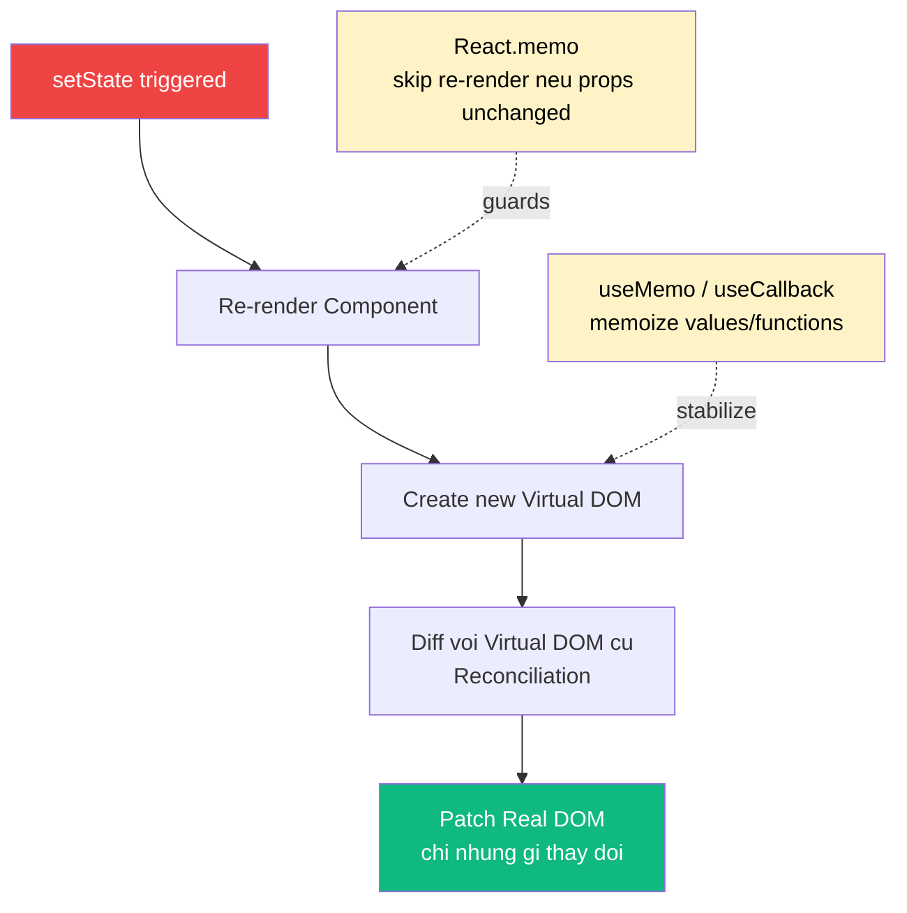

### 5.2 Angular Change Detection Strategies

```typescript
// Default: Mỗi event → check toàn bộ component tree ❌
@Component({
  changeDetection: ChangeDetectionStrategy.Default
})

// OnPush: Chỉ check khi Input props thay đổi ✅
@Component({
  changeDetection: ChangeDetectionStrategy.OnPush
})
export class ProductCard {
  @Input() product: Product  // Chỉ re-check khi product reference thay đổi
}
```

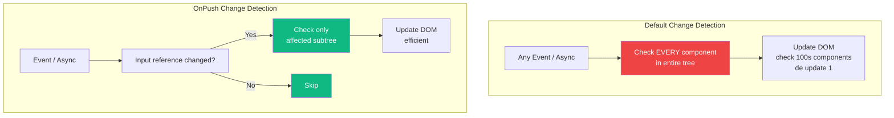

### 5.3 Angular Signals (v16+) — Thoát Khỏi Zone.js

Angular 16+ giới thiệu **Signals** — tiếp cận gần với React hơn, không cần Zone.js:

```typescript
import { signal, computed } from '@angular/core';

@Component({
  template: `
    <input [value]="query()" (input)="query.set($event.target.value)">
    <p>Results: {{ filteredItems().length }}</p>
  `
})
export class SearchComponent {
  query = signal('');  // Fine-grained reactive value

  filteredItems = computed(() =>
    this.allItems.filter(item => item.name.includes(this.query()))
  )
  // Chỉ template nào dùng query() mới re-render khi thay đổi
  // Không cần CD toàn cây
}
```

---

## 6. Patterns & Best Practices

### 6.1 React: Lifting State Up

Vì React dùng one-way binding, khi hai sibling components cần share state:

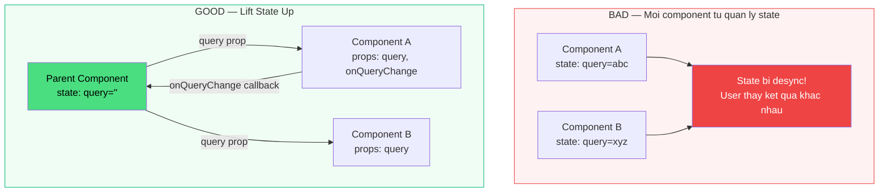

### 6.2 Angular: Smart vs Dumb Components

```typescript
// Smart Component — quản lý state, có side effects
@Component({
  template: `<search-box [query]="query" (search)="onSearch($event)"></search-box>`
})
class SearchPageComponent {
  query = '';
  onSearch(q: string) { this.query = q; this.loadResults(q); }
}

// Dumb Component — chỉ nhận Input, emit Output (giống React one-way!)
@Component({
  selector: 'search-box',
  template: `<input [(ngModel)]="localQuery" (keyup.enter)="search.emit(localQuery)">`,
  changeDetection: ChangeDetectionStrategy.OnPush  // ← Performance
})
class SearchBoxComponent {
  @Input() query: string = '';
  @Output() search = new EventEmitter<string>();
  localQuery = '';
}
```

### 6.3 Controlled vs Uncontrolled Summary (React)

```
Controlled (Recommended):
  ✅ value={state} + onChange={handler}
  ✅ Single source of truth
  ✅ Easy validation, conditional disable

Uncontrolled (Special cases):
  ✅ ref + ref.current.value
  ✅ Simpler for file inputs
  ✅ Integration với non-React DOM libs
  ❌ Hard to validate/control
```

---

## 7. Common Pitfalls

### React Pitfalls

```jsx
// ❌ PITFALL 1: Mutating state directly
const [items, setItems] = useState([])
items.push(newItem)           // WRONG: React không biết state thay đổi
setItems([...items, newItem]) // CORRECT: tạo array mới

// ❌ PITFALL 2: Stale closures trong useEffect
useEffect(() => {
  const id = setInterval(() => {
    console.log(count)  // Luôn log giá trị cũ của count!
  }, 1000)
  return () => clearInterval(id)
}, [])  // ← MISSING dependency

// ✅ Fix: dùng functional update
useEffect(() => {
  const id = setInterval(() => setCount(c => c + 1), 1000)
  return () => clearInterval(id)
}, [])
```

### Angular Pitfalls

```typescript
// ❌ PITFALL 1: Mutation không trigger change detection với OnPush
@Component({ changeDetection: ChangeDetectionStrategy.OnPush })
class ListComponent {
  @Input() items: string[] = []

  addItem(item: string) {
    this.items.push(item)  // Mutation! Reference không đổi → không re-render
  }

  // ✅ Fix: Tạo array mới
  addItemCorrect(item: string) {
    this.items = [...this.items, item]  // New reference → trigger re-render
  }
}

// ❌ PITFALL 2: Subscribe mà không unsubscribe → Memory leak
class MyComponent implements OnInit, OnDestroy {
  private destroy$ = new Subject<void>()

  ngOnInit() {
    this.service.getData()
      .pipe(takeUntil(this.destroy$))  // ✅ Auto-unsubscribe
      .subscribe(data => this.data = data)
  }

  ngOnDestroy() { this.destroy$.next(); this.destroy$.complete() }
}
```

---

## 8. Modern Convergence — React & Angular Đang Tiến Gần Nhau

| Năm | React | Angular |
|-----|-------|---------|
| 2013 | Ra đời, one-way binding, Virtual DOM | — |
| 2016 | — | Angular 2: two-way binding, Zone.js, TypeScript-first |
| 2018 | React Hooks: ít boilerplate hơn, functional components | — |
| 2020 | — | Ivy Renderer: tree-shaking tốt hơn |
| 2022 | React Server Components: zero client JS possible | — |
| 2023 | — | Signals v16: fine-grained reactivity, Zone.js optional |
| 2024 | — | Zoneless v18: signal-based two-way, tiệm cận React |

**Angular Signals two-way binding (v17+):**
```typescript
// Mới: Signal-based two-way, không cần Zone.js
@Component({
  template: `<input [(value)]="query">`
})
class SearchComponent {
  query = model('')  // model() = writable signal
  // Hiệu năng tương đương React, nhưng ít boilerplate hơn
}
```

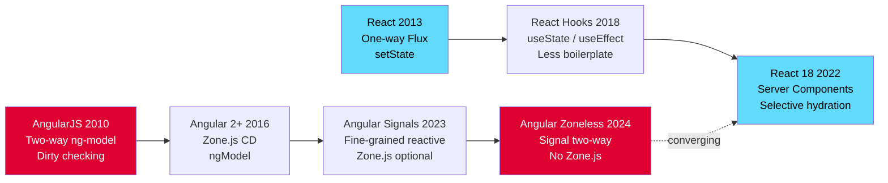

---

## 📝 Summary

```
ONE-WAY (React):
  Data Flow:    Model → View (explicit updates only)
  Updates:      Developer calls setState() / dispatch()
  Strength:     Predictable, debuggable, testable
  Weakness:     Boilerplate for forms, verbose handlers
  Best for:     Complex UIs, large teams, strict data flow

TWO-WAY (Angular):
  Data Flow:    Model ↔ View (automatic sync via Zone.js)
  Updates:      Zone.js intercepts events, triggers CD
  Strength:     Less boilerplate, productive for forms
  Weakness:     "Magic" makes debugging harder, CD overhead
  Best for:     Form-heavy apps, rapid prototyping

TREND (2024+):
  Angular Signals = Fine-grained reactivity (tiệm cận React)
  React Server Components = Zero-JS possible (tiệm cận SSR)
  Cả hai hướng đến: Explicit, fine-grained, efficient reactivity
```

---

*Created: 2026-05-08*  
*Source: React Documentation, Angular Documentation, Angular RFC Signals, Zone.js source*
