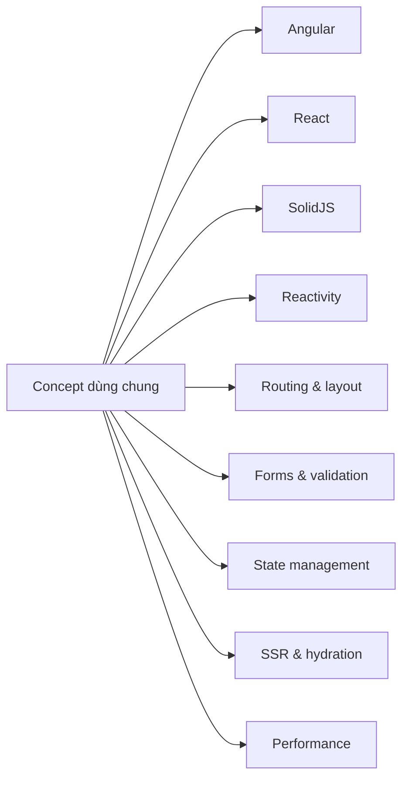

# Frontend Concept Map

> Bản đồ nối các learning series với concept dùng chung. Nội dung chi tiết vẫn nằm trong từng article gốc.

## Reactivity

- [[reactive-programming-fundamentals|Reactive programming fundamentals]]
- [[data-binding-one-way-vs-two-way|One-way vs two-way data binding]]
- [[SolidJS-vs-React-Reactivity-Model|SolidJS vs React reactivity]]
- [[08-Signals-The-Modern-Reactivity|Angular Signals]]
- [[25-vDOM-vs-SolidJS-Reactivity|React vDOM vs SolidJS]]
- [[SolidJS-01-Reactivity-Internals|SolidJS reactivity internals]]

## Routing và layout

- [[22-Routing-Layout-SearchState|Angular routing, layout, search state]]
- [[23-Routing-Layout-SearchState|React routing, layout, search state]]
- [[SolidJS-13-Routing-Layout-SearchState|SolidJS routing, layout, search state]]

## Forms và validation

- [[09-Reactive-Forms-Mastery|Angular reactive forms]]
- [[21-Multi-Step-Forms-Complex-Validation|React complex forms]]
- [[Bai-43-Form-Validation|Rust full-stack form validation]]

## State management

- [[16-NgRx-State-Management|Angular NgRx]]
- [[17-Zustand-State-Management|React Zustand]]
- [[SolidJS-06-Stores-Nested-State|SolidJS stores]]

## SSR, hydration và rendering

- [[ssr-vs-csr-deep-dive|SSR vs CSR]]
- [[20-Lazy-Loading-and-Code-Splitting|Angular lazy loading]]
- [[13-React-Server-Components-and-NextJS-Intro|React Server Components]]
- [[SolidJS-11-SolidStart-SSR|SolidStart SSR]]

## Performance

- [[React-Compiler-Internals-Memoization|React Compiler internals]]
- [[15-Change-Detection-and-OnPush|Angular change detection]]
- [[11-Performance-Optimization|React performance]]
- [[SolidJS-12-Performance-Testing|SolidJS performance testing]]

