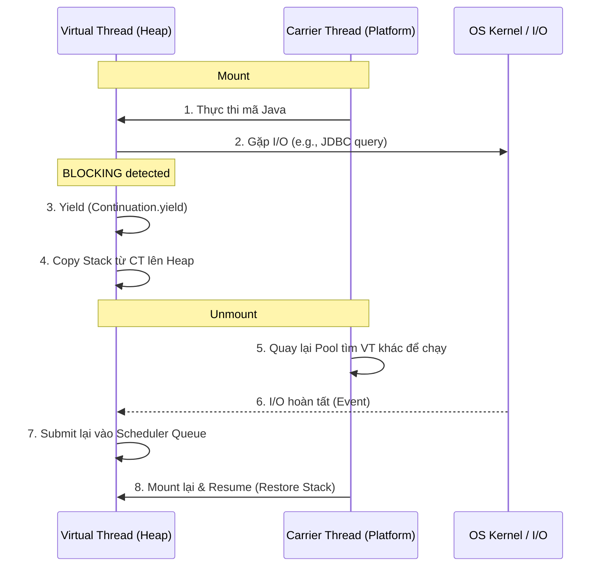

# Java Virtual Threads: Bản chất và Cơ chế hoạt động (Deep Dive)

## 📌 One-liner
> Virtual Threads (Project Loom) là các lightweight threads giúp Java vượt qua giới hạn về throughput của mô hình "one-thread-per-request" bằng cách tách rời định nghĩa Thread logic khỏi Thread hệ điều hành (Platform Thread).

---

## 🚀 1. Tại sao cần Virtual Threads? (The Problem)

Trước Java 21, mô hình concurrency của Java dựa trên **Platform Threads** (1:1 mapping với OS Threads).
- **Chi phí đắt đỏ:** Mỗi OS Thread tốn ~1MB stack memory. Một server thông thường chỉ chịu được vài nghìn thread.
- **Lãng phí tài nguyên:** Trong các ứng dụng I/O-bound (gọi DB, API), thread thường xuyên ở trạng thái *Blocking*. OS Thread vẫn phải giữ nguyên stack, lãng phí RAM và CPU cycles cho việc context switch.
- **Little's Law:** $L = \lambda W$. Để tăng throughput ($\lambda$), bạn phải tăng số lượng concurrency ($L$) hoặc giảm latency ($W$). Khi $W$ cố định (do network/DB), cách duy nhất là tăng $L$. Nhưng Platform Thread lại giới hạn $L$.

---

## 🧠 2. Mô hình M:N và Cơ chế hoạt động (The Essence)

Virtual Threads giới thiệu mô hình **M:N Mapping**: Rất nhiều Virtual Threads ($M$) được chạy trên một số lượng ít Platform Threads ($N$).

### 🧬 Thành phần cốt lõi:
1.  **Virtual Thread (VT):** Chỉ là một Object trên Heap. Nó chứa metadata và stack riêng của nó.
2.  **Carrier Thread (CT):** Là một Platform Thread thực thụ, đóng vai trò "người vận chuyển" để chạy VT.
3.  **Scheduler:** Một `ForkJoinPool` (mặc định) có nhiệm vụ điều phối các VT vào các CT nhàn rỗi.

### 🔄 Quá trình Mount/Unmount (Cơ chế "Nhảy" Thread)

Đây là bí mật giúp Virtual Threads cực kỳ hiệu quả:

**Bản chất:** Thay vì để OS Thread ngồi đợi I/O, Java "đóng gói" trạng thái của Virtual Thread đó lại, cất lên Heap, và giải phóng Platform Thread để làm việc khác. Khi I/O xong, nó lại "dán" (mount) Virtual Thread đó vào một Platform Thread bất kỳ để chạy tiếp.

---

## 🖼️ 3. Hình ảnh minh họa: Platform vs Virtual

### Platform Threads (1:1) - "Mỗi xe một làn"
Mỗi yêu cầu là một chiếc xe hơi to lớn. Nếu xe phía trước dừng lại (I/O), cả làn đường bị tắc, dù động cơ vẫn đang nổ.

### Virtual Threads (M:N) - "Mô hình Xe bus/Hàng không"
Hành khách (Virtual Threads) rất đông. Chỉ có vài chiếc xe bus (Carrier Threads).
- Khi hành khách cần làm thủ tục lâu (I/O), họ xuống xe, ngồi đợi ở phòng chờ (Heap).
- Xe bus đón người khác đi tiếp.
- Khi xong thủ tục, hành khách lại lên chuyến xe bus tiếp theo có chỗ trống.

---

## 🔁 Java / Rust Analog

| Đặc điểm | Java (Virtual Threads) | Rust (Async/Await - Tokio) |
|---|---|---|
| **Programming Model** | **Imperative (Blocking)**. Bạn viết code như thể nó block, nhưng thực tế là non-blocking ngầm. | **Explicit Async**. Phải dùng từ khóa `async/await`, trả về `Future`. |
| **Stack Management** | Managed bởi JVM (Stack copy to Heap). | Managed bởi Compiler (State machine transformation). |
| **Ergonomics** | Rất cao. Không cần đổi signature method, không bị "function coloring". | Cần học về `Future`, `Send`, `Sync`, `Poll`. |
| **Performance** | Tốt, nhưng có overhead nhỏ do GC quản lý stack objects. | Tối ưu tuyệt đối (Zero-cost abstraction). |

---

## 💡 Khi nào dùng

- **NÊN DÙNG:** Ứng dụng I/O-heavy (REST APIs, Microservices gọi DB, Proxy). Giúp tăng throughput lên hàng chục lần với cùng một lượng phần cứng.
- **KHÔNG NÊN DÙNG:** Các tác vụ CPU-bound nặng (Mã hóa, xử lý ảnh). Vì Virtual Threads vẫn cần CPU để chạy, nếu CPU luôn bận thì việc tạo nhiều thread chỉ làm tăng overhead quản lý.

---

## ⚠️ Pitfalls (Bẫy chết người)

1.  **Thread Pinning (Găm Thread):**
    - Xảy ra khi dùng `synchronized` block hoặc gọi Native code (JNI) bên trong VT.
    - Hậu quả: VT không thể unmount khỏi CT, dẫn đến CT bị block hoàn toàn.
    - **Giải pháp:** Thay `synchronized` bằng `ReentrantLock`.
2.  **ThreadLocal Abuse:**
    - Vì bạn có thể có hàng triệu VT, nếu mỗi VT giữ một Object nặng trong `ThreadLocal`, bạn sẽ sớm bị `OutOfMemoryError`.
3.  **Don't Pool Virtual Threads:**
    - Virtual Threads rẻ như Object. Đừng bao giờ dùng `ExecutorService` có pool cố định cho VT. Cứ `newVirtualThreadPerTaskExecutor()`.

---

## 📖 Nguồn tham khảo & Đọc thêm
- [[_moc/MOC-Concurrency|MOC Concurrency]]
- [JEP 444: Virtual Threads](https://openjdk.org/jeps/444)
- [Project Loom: Understand the internals](https://inside.java/tag/loom/)

---
**Note cho VPBank PDMS:** Khi migrate sang Quarkus, hãy bật `quarkus.virtual-threads.enabled=true` để tận dụng cơ chế này cho các endpoint REST.
