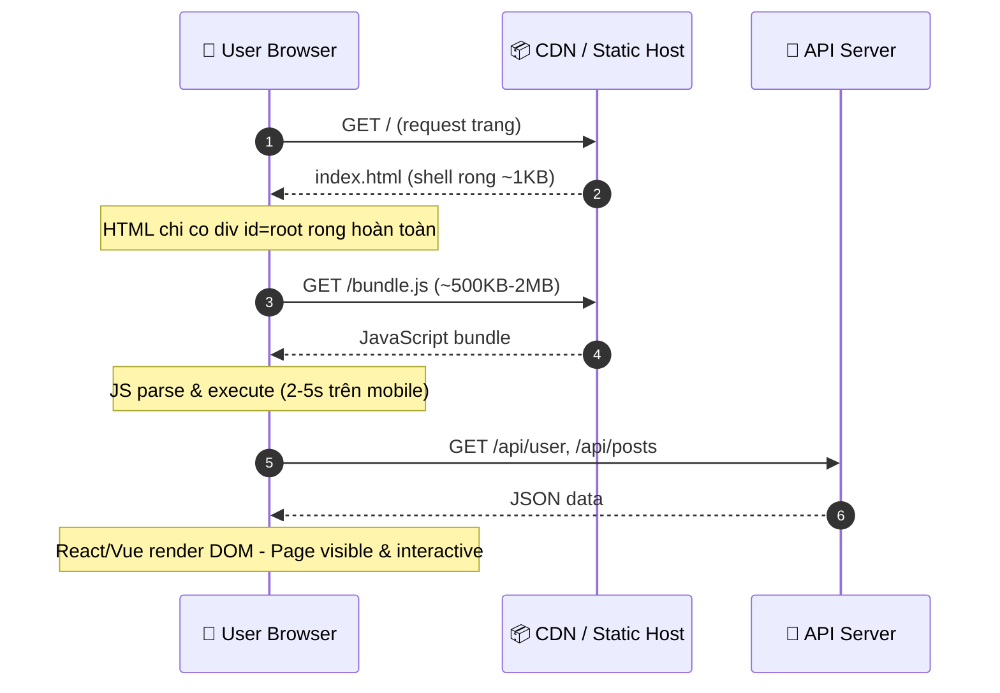
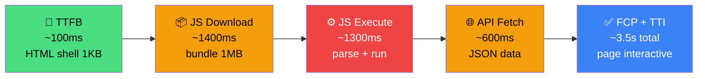
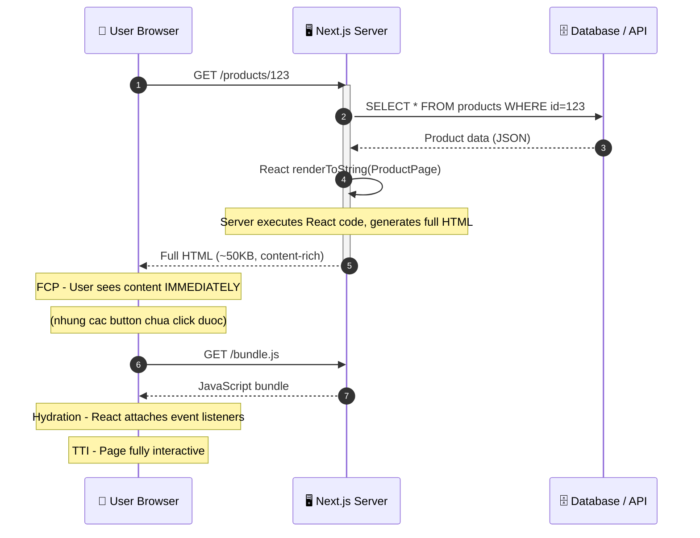
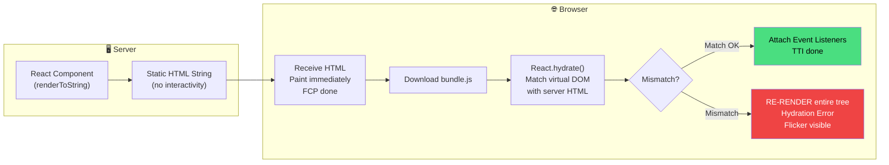
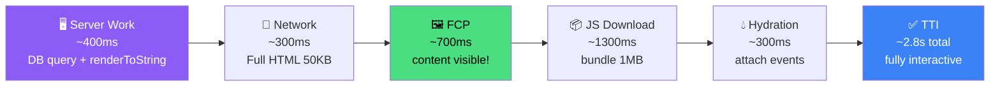
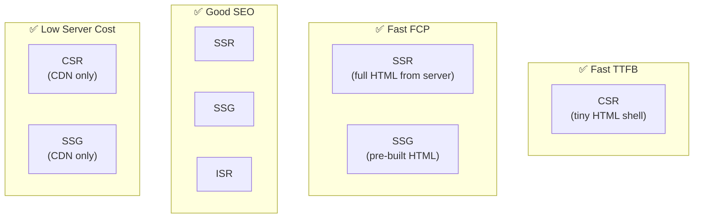
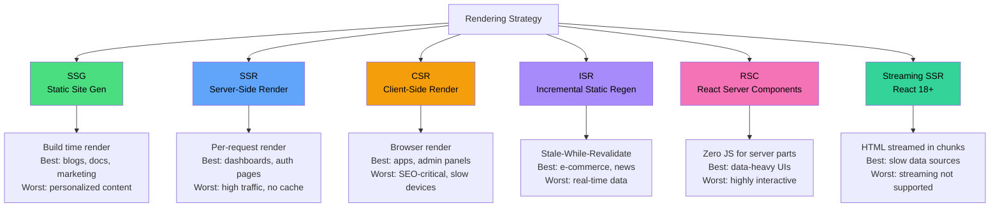
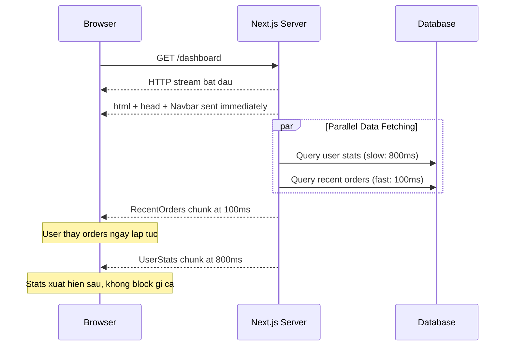
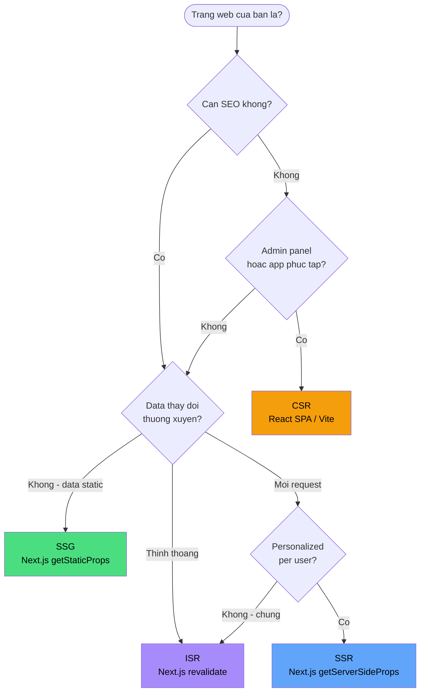

# SSR vs CSR — Cơ Chế Thực Sự, Workflow & Những Hiểu Lầm Phổ Biến

> **Tags:** #frontend #web-rendering #SSR #CSR #performance #architecture  
> **Related:** [[React-Internals]], [[Next.js-Patterns]], [[Web-Performance-Optimization]]

---

## 🗺️ Tổng Quan

Hai thuật ngữ **SSR (Server-Side Rendering)** và **CSR (Client-Side Rendering)** thường bị hiểu sai hoặc dùng lẫn lộn. Thực tế, chúng mô tả **nơi và khi nào** HTML được tạo ra — không chỉ đơn giản là "render ở server" hay "render ở browser".

```
Câu hỏi cốt lõi: "Tại thời điểm nào, và ở đâu, HTML được tạo ra?"
```

---

## 1. CSR — Client-Side Rendering

### 1.1 Cơ Chế Thực Sự

CSR là mô hình mà **browser tải về một HTML shell rỗng**, sau đó JavaScript chịu trách nhiệm fetch data và dựng toàn bộ DOM.



**Thực tế HTML server trả về:**
```html
<!-- Đây là toàn bộ HTML từ server trong CSR -->
<!DOCTYPE html>
<html>
  <head>
    <title>My App</title>
    <link rel="stylesheet" href="/main.css">
  </head>
  <body>
    <div id="root"></div>  <!-- ← RỖNG HOÀN TOÀN -->
    <script src="/bundle.js"></script>
  </body>
</html>
```

### 1.2 Timeline Thực Tế (CSR — Mobile 3G)



**Metrics trong CSR:**
| Metric | Giá trị điển hình | Ý nghĩa |
|--------|------------------|---------|
| **TTFB** | ~50-200ms | Nhanh (chỉ trả HTML shell) |
| **FCP** | ~2-5s | Chậm (JS chưa chạy xong) |
| **TTI** | ~3-7s | Chậm nhất (phải hydrate xong) |
| **LCP** | ~3-6s | Thường là content cuối cùng load |

---

## 2. SSR — Server-Side Rendering

### 2.1 Cơ Chế Thực Sự

SSR là mô hình mà **server chạy JavaScript/Template engine**, tạo ra HTML đầy đủ content, rồi mới gửi về browser. Browser nhận được HTML **có thể đọc ngay** — nhưng chưa interactive cho đến khi **hydration** hoàn tất.



**HTML server trả về trong SSR:**
```html
<!-- HTML đầy đủ content từ server -->
<!DOCTYPE html>
<html>
  <body>
    <div id="root">
      <!-- React đã render sẵn trên server -->
      <nav class="navbar">
        <a href="/">Home</a>
        <a href="/products">Products</a>
      </nav>
      <main>
        <h1>iPhone 15 Pro</h1>
        <p class="price">$999</p>
        <button data-reactroot="">Add to Cart</button>
        <!-- Button NHÌN thấy được nhưng chưa có event listener -->
      </main>
    </div>
    <script src="/bundle.js"></script>
  </body>
</html>
```

### 2.2 Hydration — Phần Hay Bị Bỏ Qua

> **Hydration** là quá trình React "tiếp quản" HTML tĩnh do server tạo ra, gắn event listeners và biến nó thành app động.



**Hydration Mismatch — Bug phổ biến nhất:**
```jsx
// ❌ SAI — Date khác nhau giữa server và client
function Post() {
  return <span>Posted: {new Date().toLocaleString()}</span>
  // Server: "10:00 AM"  |  Client: "10:00:02 AM"  →  MISMATCH
}

// ✅ ĐÚNG — Dùng useEffect để render time chỉ ở client
function Post() {
  const [time, setTime] = useState(null)
  useEffect(() => setTime(new Date().toLocaleString()), [])
  return <span>Posted: {time ?? 'Loading...'}</span>
}
```

### 2.3 Timeline SSR (Mobile 3G)



---

## 3. So Sánh Trực Tiếp



| Tiêu chí | CSR | SSR |
|----------|-----|-----|
| **TTFB** | ✅ Nhanh (shell nhỏ) | ⚠️ Chậm hơn (server cần render) |
| **FCP** | ❌ Chậm | ✅ Nhanh |
| **TTI** | ❌ Chậm nhất | ⚠️ Vẫn cần hydration |
| **SEO** | ❌ Khó (Googlebot cần JS) | ✅ Tốt (HTML đầy đủ) |
| **Server Cost** | ✅ Thấp (static files) | ❌ Cao (CPU per request) |
| **Caching** | ✅ CDN cache toàn bộ | ⚠️ Phức tạp (vary by user) |
| **Real-time data** | ✅ Dễ (client fetch) | ⚠️ Cần revalidate |
| **UX sau load** | ✅ Mượt như app native | ✅ Tương đương |

---

## 4. Những Hiểu Lầm Phổ Biến ⚠️

### Misconception 1: "SSR thì không cần JavaScript ở client"
```
❌ SAI: SSR vẫn gửi JS bundle về client để hydration
✅ ĐÚNG: SSR giúp HTML render nhanh, nhưng JS vẫn cần thiết để interactive

Ngoại lệ: Server Components (React 18+) có thể THỰC SỰ 
không gửi JS về client cho những component thuần display.
```

### Misconception 2: "CSR thì xấu cho SEO hoàn toàn"
```
❌ SAI: Googlebot hiện tại CÓ THỂ execute JavaScript và index CSR apps
✅ ĐÚNG: 
  - Googlebot crawl CSR chậm hơn SSR (delayed indexing)
  - Social crawlers (Facebook, Twitter) KHÔNG chạy JS → no preview
  - SSR vẫn tốt hơn cho critical SEO pages
```

### Misconception 3: "SSR luôn nhanh hơn CSR"
```
❌ SAI: SSR có TTFB cao hơn (server cần xử lý trước khi trả HTML)
✅ ĐÚNG:
  - SSR nhanh hơn ở FCP và LCP (content visible sớm hơn)
  - CSR nhanh hơn ở TTFB và subsequent navigation
  - SSR có thể CHẬM hơn CSR nếu server bị overload
```

### Misconception 4: "Next.js = SSR"
```
❌ SAI: Next.js hỗ trợ nhiều rendering strategies
✅ ĐÚNG: Next.js có:
  - SSR: getServerSideProps (per request)
  - SSG: getStaticProps (build time)  
  - ISR: revalidate option (hybrid)
  - CSR: useEffect + SWR (pure client)
  - RSC: React Server Components (zero JS)
```

### Misconception 5: "Hydration là miễn phí (không có cost)"
```
❌ SAI: Hydration là expensive — phải chạy toàn bộ component tree
✅ ĐÚNG:
  - Page có thể NHÌN thấy nhưng KHÔNG tương tác được trong thời gian hydration
  - Giai đoạn này gọi là "uncanny valley" — user click nhưng không có gì xảy ra
  - React 18 giải quyết với Selective Hydration (ưu tiên component user interact)
```

---

## 5. Modern Rendering Patterns (Beyond SSR/CSR)



### Streaming SSR (React 18) — Game Changer



---

## 6. Decision Tree — Chọn Strategy Nào?



---

## 7. Use Cases Thực Tế

### Nên dùng CSR khi:
```
✅ Dashboard nội bộ (không cần SEO)
✅ Admin panels, CRM systems
✅ Apps cần real-time updates liên tục (trading, chat)
✅ PWA (Progressive Web App)
✅ Sau login — personalized content không cache được
```

### Nên dùng SSR khi:
```
✅ E-commerce product pages (SEO critical + fresh price/stock)
✅ News articles, blog posts (SEO + fresh content)
✅ Social media feeds (personalized + SEO share preview)
✅ Landing pages cần fast FCP trên mobile
✅ Pages cần Open Graph tags chính xác (Facebook/Twitter preview)
```

### Nên dùng SSG/ISR khi:
```
✅ Marketing sites, landing pages (cực ít thay đổi)
✅ Documentation (Docusaurus, VitePress)
✅ Blog với nhiều bài (Gatsby)
✅ E-commerce catalog (ISR — revalidate mỗi 60s)
```

---

## 8. Core Web Vitals & Rendering Impact

| Strategy | LCP | FID | CLS | Overall Score |
|----------|-----|-----|-----|---------------|
| CSR | ❌ Poor | ✅ Good | ✅ Good | ~40/100 |
| CSR + Code Split | ⚠️ Needs Improvement | ✅ Good | ✅ Good | ~60/100 |
| SSR | ✅ Good | ⚠️ Needs Improvement | ✅ Good | ~78/100 |
| SSG | ✅ Excellent | ✅ Good | ✅ Good | ~95/100 |
| ISR | ✅ Excellent | ✅ Good | ✅ Good | ~88/100 |

---

## 📝 Summary

```
CSR:      Browser làm tất cả → Fast TTFB, Slow FCP, Bad SEO, Low server cost
SSR:      Server render HTML  → Slow TTFB, Fast FCP, Good SEO, High server cost
SSG:      Build-time render   → Fastest everything, Bad for dynamic content
ISR:      SSG + auto revalidate → Best of SSG + fresh data
RSC:      Zero client JS for server parts → Future of SSR
Streaming: HTML in chunks → Eliminates blocking, best UX
```

---

*Created: 2026-05-08*  
*Source: MDN Web Docs, web.dev, Next.js Documentation, React 18 RFC*
